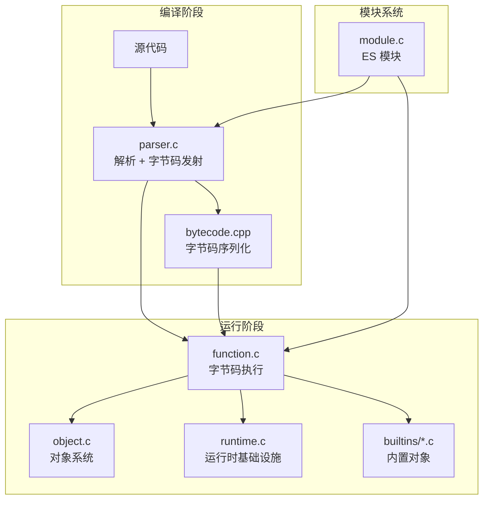
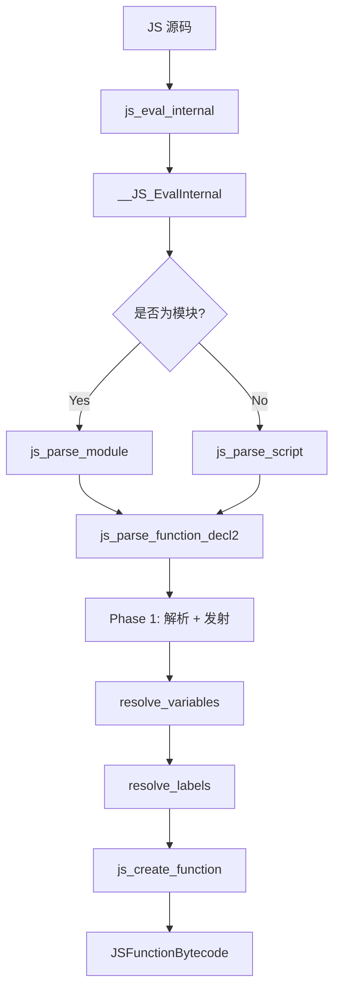
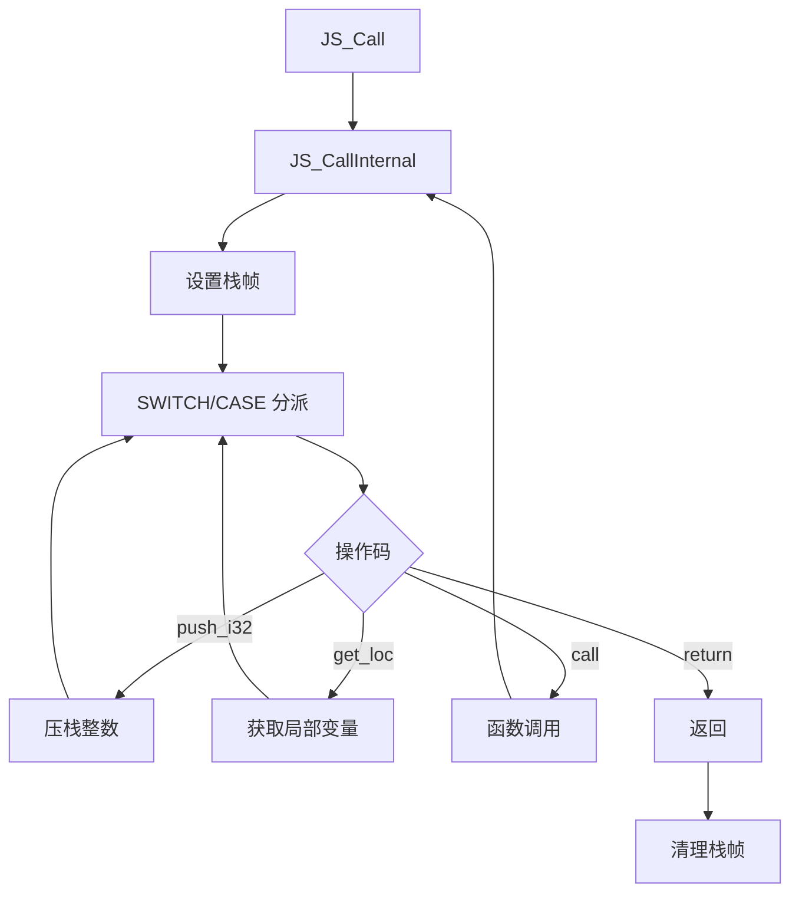
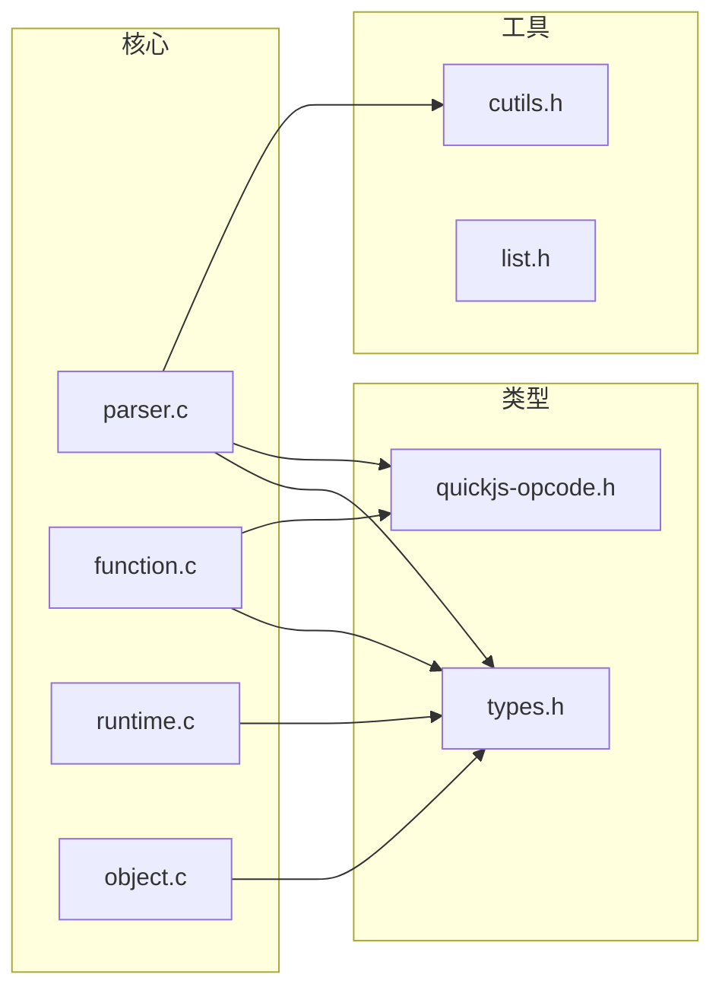

# QuickJS 整体架构

## 概述

QuickJS 采用**单遍编译**（one-pass compilation）策略，直接从源码生成字节码，不生成中间 AST 表示。这种设计的优点是：
- 内存占用低
- 编译速度快
- 实现简洁

缺点是：
- 代码耦合度高（解析与字节码生成交织）
- 某些优化需要多遍处理

## 核心模块关系



## 核心源文件

| 文件 | 行数 | 主要功能 |
|------|------|---------|
| `src/core/parser.c` | 13,783 | 词法分析、语法分析、字节码发射、变量解析、标签解析 |
| `src/core/function.c` | 3,330 | 字节码执行主循环 (`JS_CallInternal`) |
| `src/core/bytecode.cpp` | 2,068 | 字节码序列化/反序列化 |
| `src/core/module.c` | 2,084 | ES Module 加载、链接、执行 |
| `src/core/runtime.c` | 3,770 | 运行时初始化、内存管理、GC 接口 |
| `src/core/object.c` | 2,592 | 对象创建、属性访问 |
| `src/core/gc.c` | ~800 | 垃圾回收实现 |
| `include/QuickJS/quickjs-opcode.h` | 375 | 操作码定义（254 个） |

## 关键数据结构

### JSRuntime

运行时环境，管理内存和 GC。一个进程可以有多个 `JSRuntime`。

```c
struct JSRuntime {
    JSMallocFunctions mf;        // 内存分配函数
    JSMallocState malloc_state;  // 内存状态
    struct list_head context_list; // 所有 JSContext
    struct list_head gc_obj_list;  // GC 对象链表
    // ... 更多字段
};
```

**位置**: `src/core/types.h`

### JSContext

JavaScript 执行上下文，包含全局对象等。多个 `JSContext` 可以共享同一个 `JSRuntime`。

```c
struct JSContext {
    JSRuntime* rt;               // 所属 Runtime
    JSValue global_obj;          // 全局对象
    JSValue current_exception;   // 当前异常
    JSStackFrame* current_stack_frame; // 当前栈帧
    // ... 更多字段
};
```

**位置**: `src/core/types.h`

### JSFunctionDef

函数定义，解析阶段用于收集函数信息。

```c
typedef struct JSFunctionDef {
    JSContext* ctx;
    struct JSFunctionDef* parent;      // 父函数（闭包链）
    
    // 函数属性
    BOOL is_eval;
    BOOL is_func_expr;
    BOOL has_home_object;
    JSFunctionKindEnum func_kind;      // 普通/Generator/Async
    JSAtom func_name;
    
    // 变量系统
    JSVarDef* vars;                    // 局部变量
    int var_count;
    JSVarDef* args;                    // 参数
    int arg_count;
    int scope_level;                   // 当前作用域层级
    JSVarScope* scopes;                // 作用域数组
    JSGlobalVar* global_vars;          // 全局变量
    JSClosureVar* closure_var;         // 闭包变量
    
    // 字节码生成
    DynBuf byte_code;                  // 字节码缓冲区
    int last_opcode_pos;               // 最后操作码位置
    
    // 标签系统
    LabelSlot* label_slots;            // 标签槽
    int label_count;
    BlockEnv* top_break;               // break/continue 栈
    
    // 常量池
    JSValue* cpool;                    // 常量池
    int cpool_count;
    
    // 调试信息
    LineNumberSlot* line_number_slots;
    BOOL strip_debug;
    DynBuf pc2line;
    
    // 模块
    JSModuleDef* module;
    InlineCache* ic;                   // 内联缓存
} JSFunctionDef;
```

**位置**: `src/core/parser.h:217`

### JSParseState

解析状态，贯穿整个解析过程。

```c
typedef struct JSParseState {
    JSContext* ctx;
    JSToken token;                     // 当前 token
    BOOL got_lf;                       // 是否遇到换行
    const uint8_t* buf_ptr;            // 源码指针
    const uint8_t* buf_end;            // 源码结束
    
    JSFunctionDef* cur_func;           // 当前正在解析的函数
    
    BOOL is_module;                    // 是否为模块
    uint8_t allow_html_comments;
} JSParseState;
```

**位置**: `src/core/parser.h:376`

### JSFunctionBytecode

编译后的函数字节码。

```c
typedef struct JSFunctionBytecode {
    JSGCHeader header;
    uint8_t js_mode;
    uint8_t has_prototype : 1;
    uint8_t is_generator : 1;
    uint8_t is_async : 1;
    
    uint8_t arg_count;
    uint8_t var_count;
    uint8_t stack_size;                // 最大栈深度
    
    uint8_t* byte_code_buf;            // 字节码
    int byte_code_len;
    
    JSValue* cpool;                    // 常量池
    int cpool_count;
    
    JSClosureVar* closure_var;         // 闭包变量
    int closure_var_count;
    
    // 调试信息
    JSAtom filename;
    uint8_t* pc2line_buf;
} JSFunctionBytecode;
```

**位置**: `src/core/types.h`

## 编译流程

### 整体流程



### Phase 1: 解析与初始字节码发射

在这一阶段，解析器同时进行词法分析、语法分析和字节码发射。

**主要函数**:
- `next_token()` @ parser.c:689 - 词法分析
- `js_parse_expr()` @ parser.c:6331 - 表达式解析
- `js_parse_statement()` @ parser.c:6513 - 语句解析
- `emit_op()` @ parser.c:1796 - 发射操作码

**特点**:
- 发射**临时字节码**（如 `scope_get_var`、`label`）
- 标签使用占位符，尚未解析为实际偏移

### Phase 2: 变量解析 (resolve_variables)

解析临时的作用域字节码，确定变量的实际访问方式。

**主要函数**:
- `resolve_variables()` @ parser.c:10495

**处理内容**:
- `scope_get_var` → `get_loc` / `get_var` / `get_var_ref`
- `scope_put_var` → `put_loc` / `put_var` / `put_var_ref`
- `scope_*_private_field` → 私有字段访问
- 闭包变量捕获

### Phase 3: 标签解析与优化 (resolve_labels)

解析标签为实际偏移，并进行窥孔优化。

**主要函数**:
- `resolve_labels()` @ parser.c:11139

**处理内容**:
- `label` 临时码 → 实际字节偏移
- 窥孔优化（peephole optimization）
- 短操作码转换（如 `get_loc` → `get_loc0`）

## 执行流程



**主要函数**:
- `JS_CallInternal()` @ function.c:207 - 字节码解释器主循环

## 模块依赖图



## 下一步

- 了解操作码系统：[opcode-reference.md](./opcode-reference.md)
- 深入解析器：[parser-internals.md](./parser-internals.md)
- 了解字节码发射：[bytecode-emission.md](./bytecode-emission.md)
