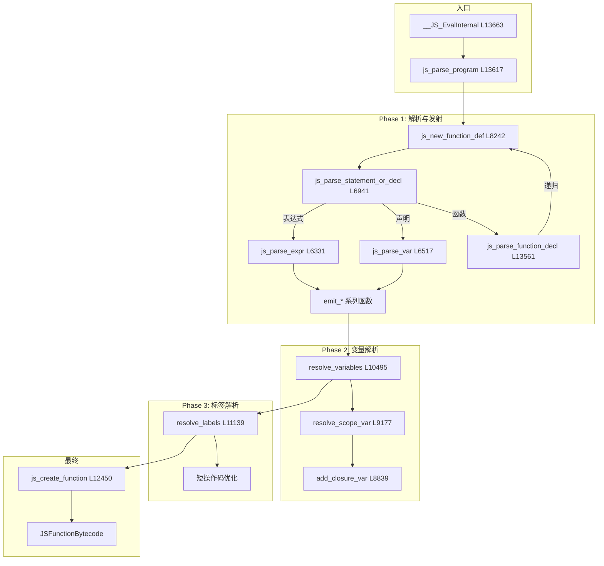
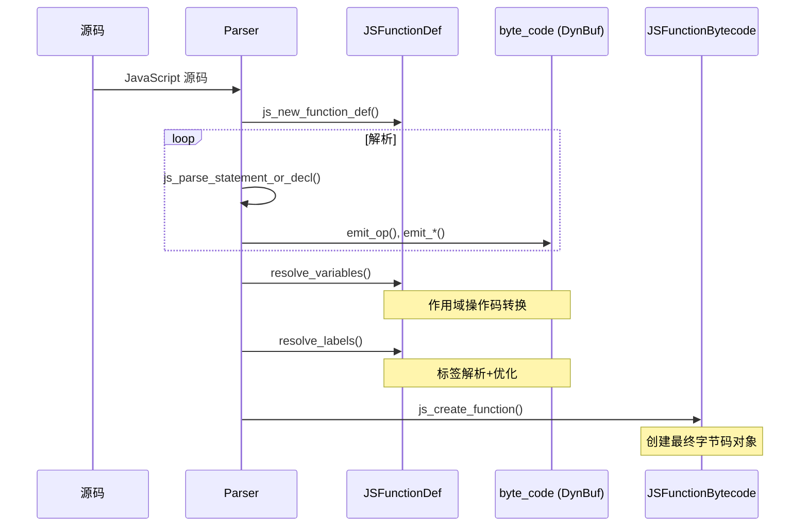

# 字节码生成函数分析

> **文档版本**: 基于 QuickJS 2025-04-26  
> **源码 Commit**: `70e83ae71b637592f2c4ad4171fc9db66782c027`  
> **主要源文件**: [parser.c](../../third_party/QuickJS/src/core/parser.c) (13,784 行)

## 概述

本目录详细分析 QuickJS 字节码生成过程中涉及的关键函数，包括函数实现逻辑、流程图和源码行号。

## 核心函数索引

### 编译入口

| 函数 | 行号 | 说明 |
|------|------|------|
| `__JS_EvalInternal` | L13663 | 编译和执行的主入口 |
| `js_parse_program` | L13617 | 程序/模块解析入口 |

### 函数定义

| 函数 | 行号 | 说明 |
|------|------|------|
| `js_new_function_def` | L8242 | 创建函数定义结构 |
| `js_parse_function_decl` | L13561 | 解析函数声明 |
| `js_parse_function_decl2` | L12979 | 函数解析核心实现 |
| `js_create_function` | L12450 | 创建函数字节码 |

### 语句解析

| 函数 | 行号 | 说明 |
|------|------|------|
| `js_parse_statement_or_decl` | L6941 | 语句/声明分发 |
| `js_parse_block` | L6875 | 块语句解析 |
| `js_parse_var` | L6517 | 变量声明解析 |

### 表达式解析

| 函数 | 行号 | 说明 |
|------|------|------|
| `js_parse_expr` | L6331 | 表达式解析入口 |
| `js_parse_expr2` | L6308 | 表达式解析（带标志） |
| `js_parse_assign_expr` | L5741 | 赋值表达式解析 |
| `js_parse_cond_expr` | L5650 | 条件表达式解析 |
| `js_parse_unary` | L4227 | 一元表达式解析 |
| `js_parse_postfix_expr` | L3019 | 后缀表达式解析 |

### 字节码发射

| 函数 | 行号 | 说明 |
|------|------|------|
| `emit_op` | L1796 | 发射操作码 |
| `emit_u8` | L1768 | 发射 8 位数据 |
| `emit_u16` | L1773 | 发射 16 位数据 |
| `emit_u32` | L1778 | 发射 32 位数据 |
| `emit_atom` | L1805 | 发射原子引用 |
| `emit_label` | L1866 | 发射标签引用 |

### 编译阶段

| 函数 | 行号 | 说明 |
|------|------|------|
| `resolve_variables` | L10495 | Phase 2: 变量解析 |
| `resolve_scope_var` | L9177 | 作用域变量解析 |
| `resolve_labels` | L11139 | Phase 3: 标签解析 |

### 辅助函数

| 函数 | 行号 | 说明 |
|------|------|------|
| `add_closure_var` | L8839 | 添加闭包变量 |
| `add_closure_variables` | L10063 | 批量添加闭包变量 |
| `new_label` | L1830 | 创建新标签 |
| `emit_goto` | L1880 | 发射跳转指令 |

## 文档索引

| 文档 | 说明 |
|------|------|
| [emit-functions.md](emit-functions.md) | 字节码发射函数详解 |
| [parse-expr.md](parse-expr.md) | 表达式解析函数详解 |
| [parse-stmt.md](parse-stmt.md) | 语句解析函数详解 |
| [parse-function.md](parse-function.md) | 函数解析详解 |
| [resolve-variables.md](resolve-variables.md) | 变量解析函数详解 |
| [resolve-labels.md](resolve-labels.md) | 标签解析函数详解 |
| [closure.md](closure.md) | 闭包处理函数详解 |

## 编译流程全景图

## 核心数据流

## 相关文档

- [架构概述](../architecture.md)
- [编译阶段](../compilation-phases.md)
- [操作码参考](../opcode-reference.md)
