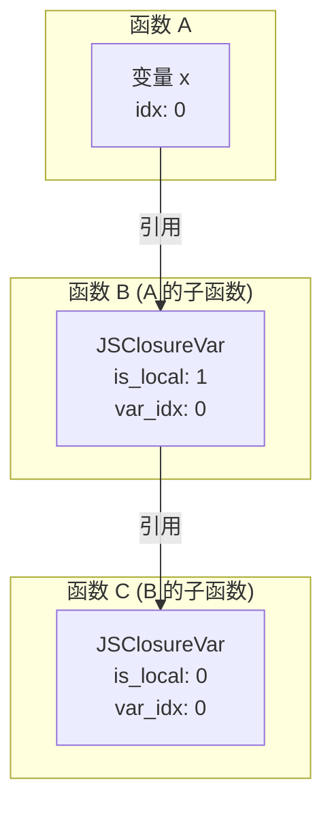
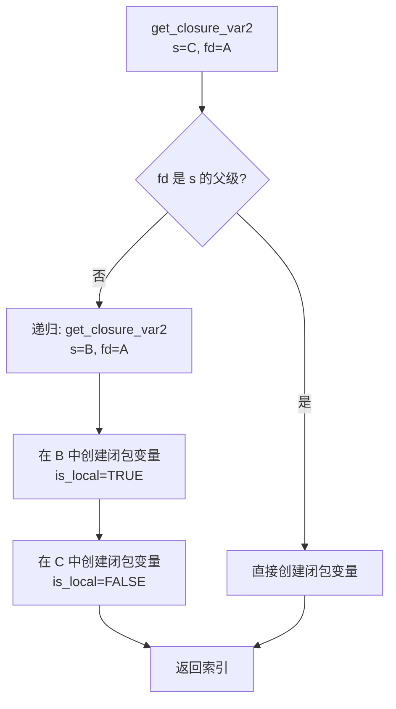
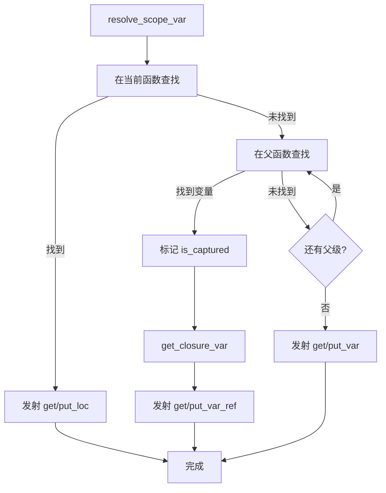
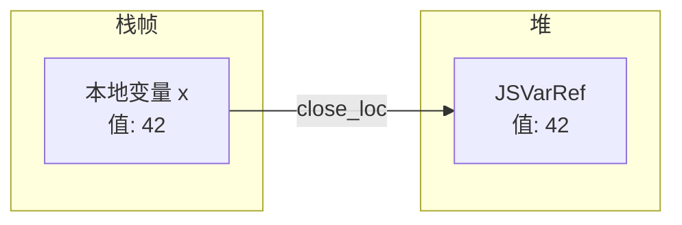
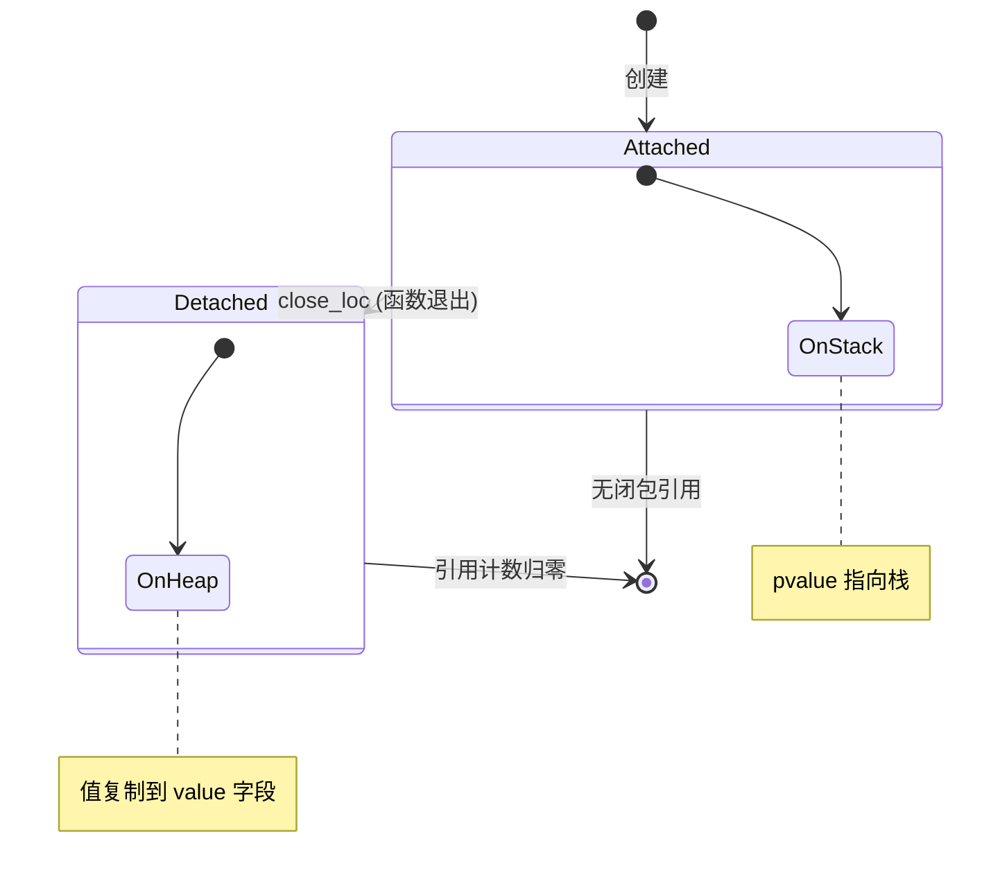

# 闭包处理详解

> **文档版本**: 基于 QuickJS 2025-04-26  
> **源码 Commit**: `70e83ae71b637592f2c4ad4171fc9db66782c027`  
> **源文件**: [parser.c](../../third_party/QuickJS/src/core/parser.c)

## 概述

闭包是 JavaScript 的核心特性，允许内部函数访问外部函数的变量。QuickJS 通过 `JSClosureVar` 结构和 `OP_get_var_ref`/`OP_put_var_ref` 操作码实现闭包。

## 1. 核心数据结构

### 1.1 JSClosureVar

**位置**: [quickjs.h](../../third_party/QuickJS/include/quickjs/quickjs.h)

```c
typedef struct JSClosureVar {
    uint8_t is_local : 1;    // 1 = 父函数的本地变量，0 = 父函数的闭包变量
    uint8_t is_arg : 1;      // 是否为参数
    uint8_t is_const : 1;    // 是否为 const
    uint8_t is_lexical : 1;  // 是否为 let/const
    uint8_t var_kind : 4;    // 变量类型
    uint16_t var_idx;        // 在父级中的索引
    JSAtom var_name;         // 变量名
} JSClosureVar;
```

### 1.2 闭包变量引用链



## 2. 闭包创建

### 2.1 add_closure_var

**位置**: [parser.c L8839-L8872](../../third_party/QuickJS/src/core/parser.c#L8839)

```c
static int add_closure_var(
    JSContext* ctx,
    JSFunctionDef* s,
    BOOL is_local,
    BOOL is_arg,
    int var_idx,
    JSAtom var_name,
    BOOL is_const,
    BOOL is_lexical,
    JSVarKindEnum var_kind
) {
    JSClosureVar* cv;
    
    // 闭包变量索引限制为 16 位
    if (s->closure_var_count >= JS_MAX_LOCAL_VARS) {
        JS_ThrowInternalError(ctx, "too many closure variables");
        return -1;
    }
    
    // 扩展闭包变量数组
    if (js_resize_array(ctx, (void**)&s->closure_var,
                       sizeof(s->closure_var[0]),
                       &s->closure_var_size,
                       s->closure_var_count + 1))
        return -1;
    
    cv = &s->closure_var[s->closure_var_count++];
    cv->is_local = is_local;
    cv->is_arg = is_arg;
    cv->is_const = is_const;
    cv->is_lexical = is_lexical;
    cv->var_kind = var_kind;
    cv->var_idx = var_idx;
    cv->var_name = JS_DupAtom(ctx, var_name);
    
    return s->closure_var_count - 1;
}
```

### 2.2 find_closure_var

**位置**: [parser.c L8874-L8884](../../third_party/QuickJS/src/core/parser.c#L8874)

```c
static int find_closure_var(
    JSContext* ctx, 
    JSFunctionDef* s, 
    JSAtom var_name
) {
    int i;
    for (i = 0; i < s->closure_var_count; i++) {
        JSClosureVar* cv = &s->closure_var[i];
        if (cv->var_name == var_name)
            return i;
    }
    return -1;
}
```

### 2.3 get_closure_var2

**位置**: [parser.c L8886-L8930](../../third_party/QuickJS/src/core/parser.c#L8886)

递归创建闭包变量链：

```c
static int get_closure_var2(
    JSContext* ctx,
    JSFunctionDef* s,          // 当前函数
    JSFunctionDef* fd,         // 定义变量的函数
    BOOL is_local,
    BOOL is_arg,
    int var_idx,
    JSAtom var_name,
    BOOL is_const,
    BOOL is_lexical,
    JSVarKindEnum var_kind
) {
    int i;
    
    // 如果 fd 不是 s 的直接父级，需要递归创建中间闭包
    if (fd != s->parent) {
        var_idx = get_closure_var2(
            ctx, s->parent, fd,
            is_local, is_arg, var_idx, var_name,
            is_const, is_lexical, var_kind);
        if (var_idx < 0)
            return -1;
        is_local = FALSE;  // 中间层的闭包变量引用父级闭包
    }
    
    // 检查是否已存在
    for (i = 0; i < s->closure_var_count; i++) {
        JSClosureVar* cv = &s->closure_var[i];
        if (cv->var_idx == var_idx && 
            cv->is_arg == is_arg &&
            cv->is_local == is_local)
            return i;
    }
    
    // 创建新的闭包变量
    return add_closure_var(ctx, s, is_local, is_arg, var_idx,
                          var_name, is_const, is_lexical, var_kind);
}
```

### 2.4 闭包变量链创建流程



## 3. 变量查找

### 3.1 resolve_scope_var 中的闭包处理

**位置**: [parser.c L9177-L9600](../../third_party/QuickJS/src/core/parser.c#L9177)

```c
static int resolve_scope_var(
    JSContext *ctx,
    JSFunctionDef *s,
    JSAtom var_name,
    int scope,
    int op,
    DynBuf *bc,
    uint8_t *bc_buf,
    LabelSlot *ls,
    int pos_next
) {
    JSFunctionDef *fd;
    int var_idx;
    JSVarDef *vd;
    
    // 1. 在当前函数的作用域链中查找
    for (scope_idx = scope; scope_idx >= 0; scope_idx--) {
        var_idx = find_var_in_scope(s, var_name, scope_idx);
        if (var_idx >= 0) {
            // 找到本地变量
            emit_local_var_access(bc, op, var_idx);
            return pos_next;
        }
    }
    
    // 2. 在父函数中查找
    fd = s;
    while ((fd = fd->parent) != NULL) {
        // 在父函数的变量中查找
        var_idx = find_var(ctx, fd, var_name);
        if (var_idx >= 0) {
            // 创建闭包变量
            vd = &fd->vars[var_idx];
            vd->is_captured = TRUE;  // 标记被捕获
            
            int closure_idx = get_closure_var(
                ctx, s, fd, FALSE, var_idx, var_name,
                vd->is_const, vd->is_lexical, vd->var_kind);
            
            // 发射闭包变量访问
            emit_closure_var_access(bc, op, closure_idx);
            return pos_next;
        }
        
        // 在父函数的参数中查找
        for (arg_idx = 0; arg_idx < fd->arg_count; arg_idx++) {
            if (fd->args[arg_idx].var_name == var_name) {
                // 创建闭包变量
                int closure_idx = get_closure_var(
                    ctx, s, fd, TRUE, arg_idx, var_name,
                    FALSE, FALSE, JS_VAR_NORMAL);
                
                emit_closure_var_access(bc, op, closure_idx);
                return pos_next;
            }
        }
    }
    
    // 3. 全局变量
    emit_global_var_access(bc, op, var_name);
    return pos_next;
}
```

### 3.2 变量查找流程图



## 4. is_captured 标志

当变量被内部函数捕获时，设置 `is_captured` 标志：

```c
// 在 resolve_scope_var 中
if (var_idx >= 0 && fd != s) {
    fd->vars[var_idx].is_captured = TRUE;
}
```

### 4.1 is_captured 的作用

在 `resolve_labels` 阶段，被捕获的变量需要特殊处理：

```c
// L11xxx
if (vd->is_captured) {
    // 作用域结束时，发射 close_loc 而不是简单的 leave_scope
    emit_op(s, OP_close_loc);
    emit_u16(s, var_idx);
}
```

### 4.2 close_loc 操作

```
OP_close_loc idx
```

将本地变量 `idx` 的值移到堆上，以便闭包可以继续访问：



## 5. 运行时结构

### 5.1 JSVarRef

运行时的闭包变量引用：

```c
typedef struct JSVarRef {
    union {
        JSGCObjectHeader header;
        struct {
            int __gc_ref_count;  // 引用计数
            uint8_t __gc_mark;
            uint8_t is_detached : 1;
            uint8_t is_arg : 1;
            uint16_t var_idx;
        };
    };
    JSValue* pvalue;  // 指向值的位置
    union {
        JSValue value;           // detached 后的值
        struct JSVarRef** link;  // 链表链接
    };
} JSVarRef;
```

### 5.2 生命周期



## 6. 操作码映射

### 6.1 scope 到 var_ref 的转换

| 输入操作码 | 输出（本地） | 输出（闭包） |
|-----------|-------------|-------------|
| `scope_get_var` | `get_loc` / `get_arg` | `get_var_ref` |
| `scope_put_var` | `put_loc` / `put_arg` | `put_var_ref` |
| `scope_put_var_init` | `put_loc` | `put_var_ref` + `set_loc_uninitialized` |
| `scope_delete_var` | `push_false` | `push_false` |

### 6.2 短指令优化

```c
// resolve_labels 中
case OP_get_var_ref:
    idx = get_u16(bc_buf + pos + 1);
    if (idx < 4) {
        // 使用短指令
        emit_op(bc_out, OP_get_var_ref0 + idx);
    } else if (idx < 256) {
        emit_op(bc_out, OP_get_var_ref8);
        emit_u8(bc_out, idx);
    } else {
        emit_op(bc_out, OP_get_var_ref);
        emit_u16(bc_out, idx);
    }
    break;
```

## 7. 完整示例

### 7.1 JavaScript 代码

```javascript
function outer() {
    let x = 1;
    let y = 2;
    
    function middle() {
        let z = 3;
        
        function inner() {
            return x + y + z;
        }
        
        return inner;
    }
    
    return middle();
}
```

### 7.2 闭包变量结构

```mermaid
flowchart TD
    subgraph "outer"
        X[x: idx=0]
        Y[y: idx=1]
    end
    
    subgraph "middle"
        Z[z: idx=0]
        CV_M_X[closure_var[0]<br/>x, is_local=1, var_idx=0]
        CV_M_Y[closure_var[1]<br/>y, is_local=1, var_idx=1]
    end
    
    subgraph "inner"
        CV_I_X[closure_var[0]<br/>x, is_local=0, var_idx=0]
        CV_I_Y[closure_var[1]<br/>y, is_local=0, var_idx=1]
        CV_I_Z[closure_var[2]<br/>z, is_local=1, var_idx=0]
    end
    
    X --> CV_M_X
    Y --> CV_M_Y
    CV_M_X --> CV_I_X
    CV_M_Y --> CV_I_Y
    Z --> CV_I_Z
```

### 7.3 字节码

```
// outer 函数
push_1
put_loc 0              // let x = 1
push_2
put_loc 1              // let y = 2
fclosure [middle]
call 0
close_loc 0            // 关闭 x
close_loc 1            // 关闭 y
return

// middle 函数
push_3
put_loc 0              // let z = 3
fclosure [inner]
close_loc 0            // 关闭 z
return

// inner 函数
get_var_ref 0          // x (通过 middle 的 closure_var[0])
get_var_ref 1          // y (通过 middle 的 closure_var[1])
add
get_var_ref 2          // z (通过 middle 的 closure_var[2])
add
return
```

## 8. eval 中的闭包

### 8.1 直接 eval

直接 eval 可以访问调用上下文的所有变量：

```c
// L9870-L10020
/* eval 可以使用所有包围函数的变量，所以它们必须都放入闭包 */
if (s->is_eval) {
    fd = s;
    for (;;) {
        scope_level = fd->parent_scope_level;
        fd = fd->parent;
        if (!fd)
            break;
        
        // 添加所有词法变量
        scope_idx = fd->scopes[scope_level].first;
        while (scope_idx >= 0) {
            vd = &fd->vars[scope_idx];
            vd->is_captured = 1;
            get_closure_var(ctx, s, fd, FALSE, scope_idx,
                           vd->var_name, vd->is_const,
                           vd->is_lexical, vd->var_kind);
            scope_idx = vd->scope_next;
        }
        
        // 添加所有参数和变量
        // ...
    }
}
```

### 8.2 间接 eval

间接 eval 在全局作用域执行，不创建闭包变量。

## 9. with 语句中的闭包

`with` 语句需要特殊处理，因为变量查找可能需要在运行时决定：

```c
// 生成的代码
OP_with_get_var atom, label, is_with
// 如果在 with 对象中找到，使用对象属性
// 否则跳转到 label 继续查找
```

---

## 相关文档

- [resolve_variables 函数](resolve-variables.md)
- [函数解析函数](parse-function.md)
- [函数编译文档](../syntax-to-bytecode/functions.md)
