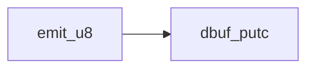
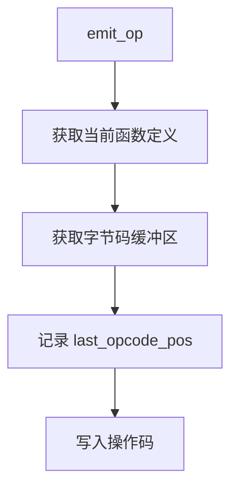
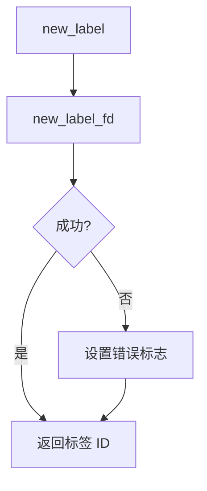
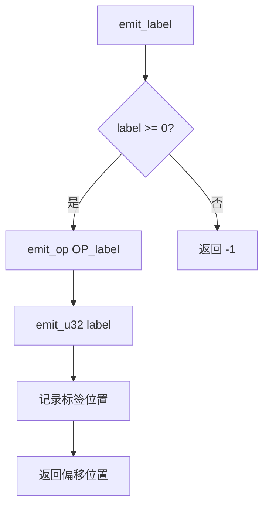
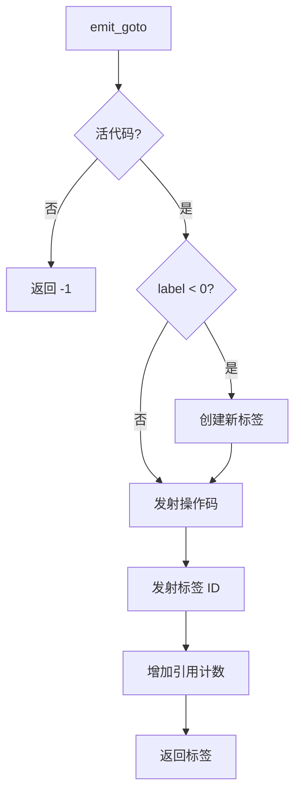
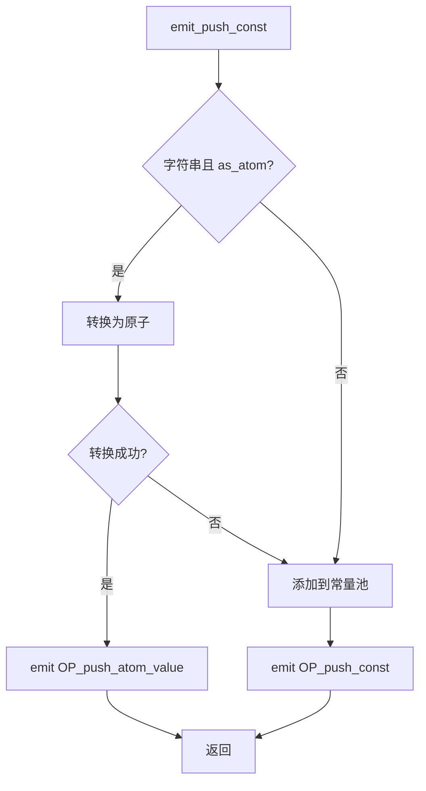
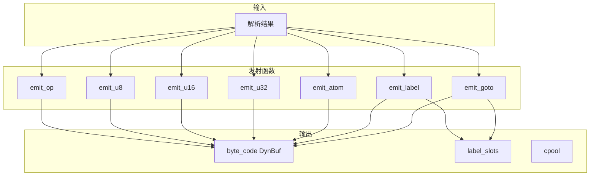

# 字节码发射函数详解

> **文档版本**: 基于 QuickJS 2025-04-26  
> **源码 Commit**: `70e83ae71b637592f2c4ad4171fc9db66782c027`  
> **源文件**: [parser.c](../../third_party/QuickJS/src/core/parser.c)

## 概述

字节码发射函数负责将解析结果转换为字节码序列，写入 `JSFunctionDef.byte_code` 缓冲区。

## 1. 基础发射函数

### 1.1 emit_u8

**位置**: [parser.c L1768-L1771](../../third_party/QuickJS/src/core/parser.c#L1768)

```c
static void emit_u8(JSParseState* s, uint8_t val) {
  dbuf_putc(&s->cur_func->byte_code, val);
}
```

**功能**: 发射单字节数据

**调用关系**:


---

### 1.2 emit_u16

**位置**: [parser.c L1773-L1776](../../third_party/QuickJS/src/core/parser.c#L1773)

```c
static void emit_u16(JSParseState* s, uint16_t val) {
  dbuf_put_u16(&s->cur_func->byte_code, val);
}
```

**功能**: 发射 16 位数据（小端序）

---

### 1.3 emit_u32

**位置**: [parser.c L1778-L1781](../../third_party/QuickJS/src/core/parser.c#L1778)

```c
static void emit_u32(JSParseState* s, uint32_t val) {
  dbuf_put_u32(&s->cur_func->byte_code, val);
}
```

**功能**: 发射 32 位数据（小端序）

---

### 1.4 emit_op

**位置**: [parser.c L1796-L1804](../../third_party/QuickJS/src/core/parser.c#L1796)

```c
static void emit_op(JSParseState* s, uint8_t val) {
  JSFunctionDef* fd = s->cur_func;
  DynBuf* bc = &fd->byte_code;

  fd->last_opcode_pos = bc->size;  // 记录位置（用于窥孔优化）
  dbuf_putc(bc, val);
}
```

**功能**: 发射操作码

**流程图**:


**关键点**:
- `last_opcode_pos` 用于窥孔优化，可以回溯修改最后一条指令

---

### 1.5 emit_atom

**位置**: [parser.c L1805-L1813](../../third_party/QuickJS/src/core/parser.c#L1805)

```c
static void emit_atom(JSParseState* s, JSAtom name) {
  DynBuf* bc = &s->cur_func->byte_code;
  if (dbuf_realloc(bc, bc->size + 4))
    return; /* not enough memory : don't duplicate the atom */
  put_u32(bc->buf + bc->size, JS_DupAtom(s->ctx, name));
  bc->size += 4;
}
```

**功能**: 发射原子字符串引用

**关键点**:
- 原子引用需要增加引用计数（`JS_DupAtom`）
- 在字节码中存储为 32 位值

---

## 2. 标签相关函数

### 2.1 new_label

**位置**: [parser.c L1845-L1852](../../third_party/QuickJS/src/core/parser.c#L1845)

```c
static int new_label(JSParseState* s) {
  int label;
  label = new_label_fd(s->cur_func);
  if (unlikely(label < 0)) {
    dbuf_set_error(&s->cur_func->byte_code);
  }
  return label;
}
```

**功能**: 创建新标签

**流程图**:


---

### 2.2 new_label_fd

**位置**: [parser.c L1824-L1843](../../third_party/QuickJS/src/core/parser.c#L1824)

```c
static int new_label_fd(JSFunctionDef* fd) {
  int label;
  LabelSlot* ls;

  // 扩展标签数组
  if (js_resize_array(fd->ctx, (void*)&fd->label_slots,
          sizeof(fd->label_slots[0]),
          &fd->label_size, fd->label_count + 1))
    return -1;
    
  label = fd->label_count++;
  ls = &fd->label_slots[label];
  ls->ref_count = 0;
  ls->pos = -1;
  ls->pos2 = -1;
  ls->addr = -1;
  ls->first_reloc = NULL;
  return label;
}
```

**功能**: 在函数定义中创建新标签槽

**LabelSlot 结构**:
| 字段 | 说明 |
|------|------|
| `ref_count` | 引用计数（跳转指令数） |
| `pos` | 标签在 Phase 1 字节码中的位置 |
| `addr` | 标签在最终字节码中的地址 |
| `first_reloc` | 重定位链表头 |

---

### 2.3 emit_label

**位置**: [parser.c L1866-L1876](../../third_party/QuickJS/src/core/parser.c#L1866)

```c
static int emit_label(JSParseState* s, int label) {
  if (label >= 0) {
    emit_op(s, OP_label);
    emit_u32(s, label);
    s->cur_func->label_slots[label].pos = s->cur_func->byte_code.size;
    return s->cur_func->byte_code.size - 4;
  } else {
    return -1;
  }
}
```

**功能**: 发射标签定义

**流程图**:


---

### 2.4 emit_goto

**位置**: [parser.c L1880-L1894](../../third_party/QuickJS/src/core/parser.c#L1880)

```c
static int emit_goto(JSParseState* s, int opcode, int label) {
  if (js_is_live_code(s)) {
    if (label < 0) {
      label = new_label(s);
      if (label < 0)
        return -1;
    }
    emit_op(s, opcode);
    emit_u32(s, label);
    s->cur_func->label_slots[label].ref_count++;
    return label;
  }
  return -1;
}
```

**功能**: 发射跳转指令

**流程图**:


**关键点**:
- `js_is_live_code(s)` 检查是否是可达代码（死代码消除）
- 自动创建标签（如果 label < 0）
- 增加标签引用计数

---

## 3. 常量发射函数

### 3.1 cpool_add

**位置**: [parser.c L1896-L1906](../../third_party/QuickJS/src/core/parser.c#L1896)

```c
static int cpool_add(JSParseState* s, JSValue val) {
  JSFunctionDef* fd = s->cur_func;

  if (js_resize_array(s->ctx, (void*)&fd->cpool,
          sizeof(fd->cpool[0]),
          &fd->cpool_size, fd->cpool_count + 1))
    return -1;
  fd->cpool[fd->cpool_count++] = val;
  return fd->cpool_count - 1;
}
```

**功能**: 添加值到常量池

**返回**: 常量池索引

---

### 3.2 emit_push_const

**位置**: [parser.c L1908-L1928](../../third_party/QuickJS/src/core/parser.c#L1908)

```c
static __exception int
emit_push_const(JSParseState* s, JSValueConst val, BOOL as_atom) {
  int idx;

  // 字符串优化：尝试作为原子发射
  if (JS_VALUE_GET_TAG(val) == JS_TAG_STRING && as_atom) {
    JSAtom atom;
    JS_DupValue(s->ctx, val);
    atom = JS_NewAtomStr(s->ctx, JS_VALUE_GET_STRING(val));
    if (atom != JS_ATOM_NULL && !__JS_AtomIsTaggedInt(atom)) {
      emit_op(s, OP_push_atom_value);
      emit_u32(s, atom);
      return 0;
    }
  }

  // 添加到常量池
  idx = cpool_add(s, JS_DupValue(s->ctx, val));
  if (idx < 0)
    return -1;
  emit_op(s, OP_push_const);
  emit_u32(s, idx);
  return 0;
}
```

**功能**: 发射常量压栈指令

**流程图**:


---

## 4. 源码位置函数

### 4.1 emit_source_pos

**位置**: [parser.c L1783-L1794](../../third_party/QuickJS/src/core/parser.c#L1783)

```c
static void emit_source_pos(JSParseState* s, const uint8_t* source_ptr) {
  JSFunctionDef* fd = s->cur_func;
  DynBuf* bc = &fd->byte_code;

  if (unlikely(fd->last_opcode_source_ptr != source_ptr)) {
    dbuf_putc(bc, OP_line_num);
    dbuf_put_u32(bc, source_ptr - s->buf_start);
    fd->last_opcode_source_ptr = source_ptr;
  }
}
```

**功能**: 发射源码位置信息（用于调试）

**关键点**:
- 只在位置变化时发射
- `OP_line_num` 是临时操作码，Phase 3 会移除

---

## 5. 复合发射函数

### 5.1 常用模式

**变量读取**:
```c
emit_op(s, OP_scope_get_var);
emit_atom(s, var_name);
emit_u16(s, scope);
```

**字段访问**:
```c
emit_op(s, OP_get_field);
emit_atom(s, field_name);
```

**函数调用**:
```c
emit_op(s, OP_call);
emit_u16(s, argc);
```

### 5.2 emit_op_* 辅助函数

```c
// 示例：发射带整数操作数的操作码
static void emit_op_i32(JSParseState* s, uint8_t op, int32_t val) {
    emit_op(s, op);
    emit_u32(s, val);
}

// 示例：发射带原子操作数的操作码
static void emit_op_atom(JSParseState* s, uint8_t op, JSAtom atom) {
    emit_op(s, op);
    emit_atom(s, atom);
}
```

---

## 6. 数据流图



---

## 相关文档

- [表达式解析函数](parse-expr.md)
- [语句解析函数](parse-stmt.md)
- [编译阶段](../compilation-phases.md)
