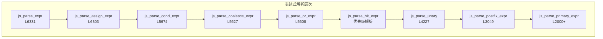
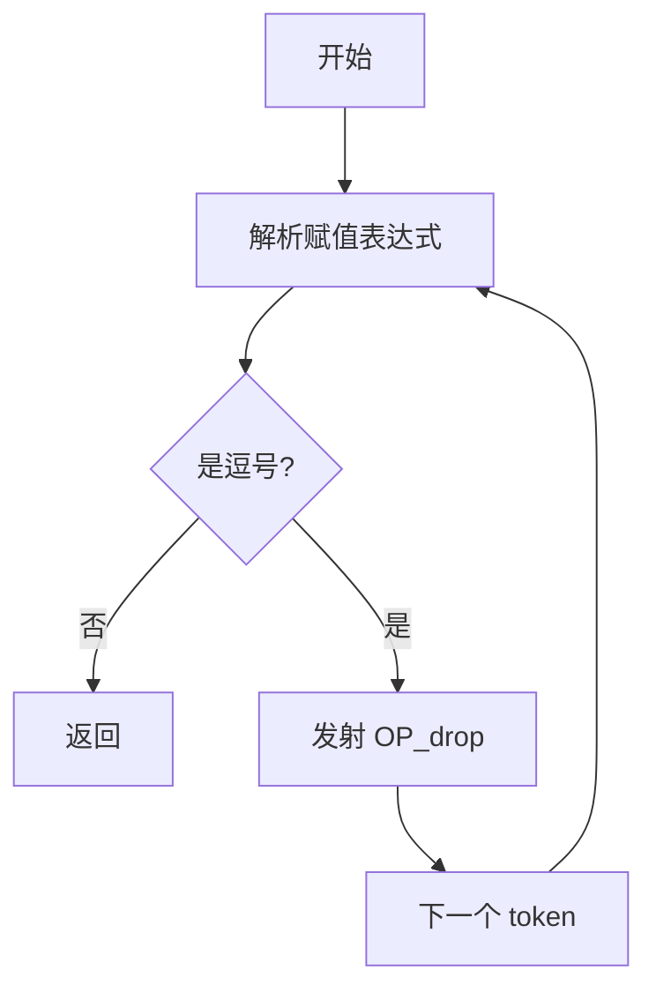
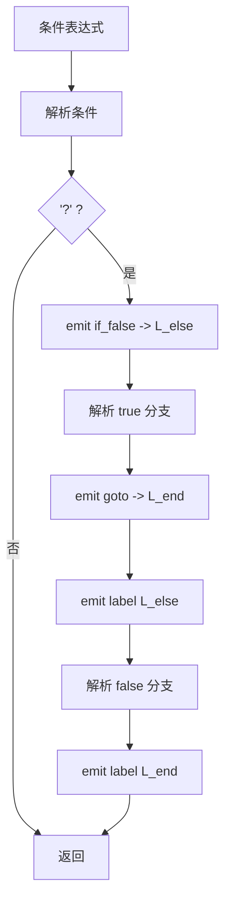
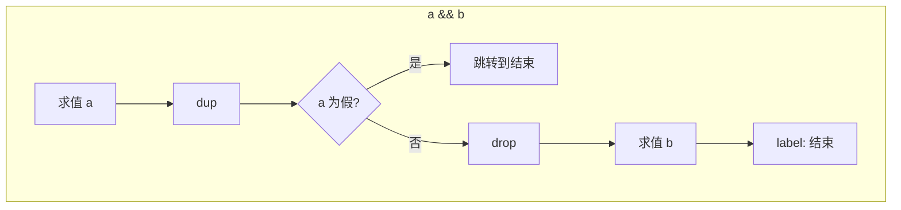
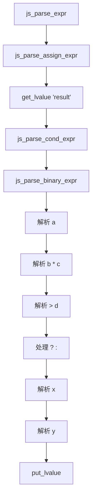

# 表达式解析函数详解

> **文档版本**: 基于 QuickJS 2025-04-26  
> **源码 Commit**: `70e83ae71b637592f2c4ad4171fc9db66782c027`  
> **源文件**: [parser.c](../../third_party/QuickJS/src/core/parser.c)

## 概述

表达式解析是 Phase 1 的核心部分，负责将 JavaScript 表达式语法转换为字节码。

## 1. 表达式解析层次



## 2. js_parse_expr 函数

**位置**: [parser.c L6331](../../third_party/QuickJS/src/core/parser.c#L6331)

### 2.1 函数签名

```c
static __exception int js_parse_expr(JSParseState* s);
```

### 2.2 实现

```c
static __exception int js_parse_expr(JSParseState* s) {
    return js_parse_expr2(s, PF_IN_ACCEPTED);
}

// L6308-L6329
static __exception int js_parse_expr2(JSParseState* s, int parse_flags) {
    BOOL comma = FALSE;
    for (;;) {
        if (js_parse_assign_expr2(s, parse_flags))
            return -1;
        if (comma) {
            // 防止逗号表达式的最后一个值被用作左值
            s->cur_func->last_opcode_pos = -1;
        }
        if (s->token.val != ',')
            break;
        comma = TRUE;
        if (next_token(s))
            return -1;
        emit_op(s, OP_drop);  // 丢弃逗号左边的值
    }
    return 0;
}
```

### 2.3 逗号表达式处理流程



### 2.4 字节码示例

```javascript
// 输入
x = 1, y = 2, z = 3

// 字节码
push_1
scope_put_var 'x'    // x = 1
drop                  // 丢弃
push_2
scope_put_var 'y'    // y = 2
drop                  // 丢弃
push_3
scope_put_var 'z'    // z = 3
// 栈顶是 z 的值
```

## 3. js_parse_assign_expr 函数

**位置**: [parser.c L6303](../../third_party/QuickJS/src/core/parser.c#L6303)

### 3.1 处理赋值运算符

```c
// L5703-L6301 (简化版)
static __exception int js_parse_assign_expr2(JSParseState* s, int parse_flags) {
    // 1. 检查是否是箭头函数
    if (s->token.val == '(') {
        // 可能是箭头函数参数
    }
    
    // 2. 解析条件表达式（左侧）
    if (js_parse_cond_expr(s, parse_flags))
        return -1;
    
    // 3. 检查赋值运算符
    int op = s->token.val;
    if (op == '=' || 
        (op >= TOK_MUL_ASSIGN && op <= TOK_POW_ASSIGN) ||
        op == TOK_LAND_ASSIGN || op == TOK_LOR_ASSIGN || 
        op == TOK_DOUBLE_QUESTION_MARK_ASSIGN) {
        
        // 4. 获取左值
        int opcode, scope, label;
        JSAtom name;
        if (get_lvalue(s, &opcode, &scope, &name, &label, NULL, FALSE, op) < 0)
            return -1;
        
        // 5. 解析右侧表达式
        if (next_token(s))
            return -1;
        if (js_parse_assign_expr2(s, parse_flags))
            return -1;
        
        // 6. 如果是复合赋值，发射相应运算
        if (op != '=') {
            emit_op(s, op_token_to_opcode(op));
        }
        
        // 7. 存储到左值
        put_lvalue(s, opcode, scope, name, label, PUT_LVALUE_NOKEEP, FALSE);
    }
    return 0;
}
```

### 3.2 赋值运算符映射

| 运算符 | Token | 操作码 |
|-------|-------|--------|
| `=` | `'='` | 直接存储 |
| `+=` | `TOK_PLUS_ASSIGN` | `OP_add` |
| `-=` | `TOK_MINUS_ASSIGN` | `OP_sub` |
| `*=` | `TOK_MUL_ASSIGN` | `OP_mul` |
| `/=` | `TOK_DIV_ASSIGN` | `OP_div` |
| `%=` | `TOK_MOD_ASSIGN` | `OP_mod` |
| `**=` | `TOK_POW_ASSIGN` | `OP_pow` |
| `&&=` | `TOK_LAND_ASSIGN` | 短路求值 |
| `\|\|=` | `TOK_LOR_ASSIGN` | 短路求值 |
| `??=` | `TOK_DOUBLE_QUESTION_MARK_ASSIGN` | 短路求值 |

### 3.3 get_lvalue 函数

**位置**: [parser.c L3891-L4031](../../third_party/QuickJS/src/core/parser.c#L3891)

```c
static int get_lvalue(
    JSParseState* s,
    int* popcode,       // 输出：操作码
    int* pscope,        // 输出：作用域
    JSAtom* pname,      // 输出：属性名
    int* plabel,        // 输出：标签
    int* pdepth,        // 输出：栈深度
    BOOL keep,          // 是否保留原值
    int tok             // 赋值运算符
);
```

### 3.4 put_lvalue 函数

**位置**: [parser.c L4043-L4148](../../third_party/QuickJS/src/core/parser.c#L4043)

处理不同类型的左值存储：

```c
static void put_lvalue(
    JSParseState* s,
    int opcode,
    int scope,
    JSAtom name,
    int label,
    PutLValueEnum special,
    BOOL is_let
) {
    switch (opcode) {
        case OP_scope_get_var:
            emit_op(s, is_let ? OP_scope_put_var_init : OP_scope_put_var);
            emit_u32(s, name);
            emit_u16(s, scope);
            break;
        case OP_get_field:
            emit_op(s, OP_put_field);
            emit_u32(s, name);
            emit_ic(s, name);
            break;
        case OP_get_array_el:
            emit_op(s, OP_put_array_el);
            break;
        // ...
    }
}
```

## 4. js_parse_cond_expr 函数

**位置**: [parser.c L5674](../../third_party/QuickJS/src/core/parser.c#L5674)

### 4.1 三元运算符处理

```c
static __exception int js_parse_cond_expr(JSParseState* s, int parse_flags) {
    if (js_parse_coalesce_expr(s, parse_flags))
        return -1;
    
    if (s->token.val == '?') {
        int label_else, label_end;
        
        if (next_token(s))
            return -1;
        
        label_else = emit_goto(s, OP_if_false, -1);
        
        // 解析 true 分支
        if (js_parse_assign_expr(s))
            return -1;
        
        label_end = emit_goto(s, OP_goto, -1);
        
        if (js_parse_expect(s, ':'))
            return -1;
        
        emit_label(s, label_else);
        
        // 解析 false 分支
        if (js_parse_assign_expr2(s, parse_flags))
            return -1;
        
        emit_label(s, label_end);
    }
    return 0;
}
```

### 4.2 三元运算符流程图



### 4.3 字节码示例

```javascript
// 输入
x > 0 ? 'positive' : 'negative'

// 字节码
scope_get_var 'x'
push_0
gt
if_false L1        // 条件为假跳转
push_atom_value 'positive'
goto L2
L1:
push_atom_value 'negative'
L2:
```

## 5. js_parse_unary 函数

**位置**: [parser.c L4227](../../third_party/QuickJS/src/core/parser.c#L4227)

### 5.1 一元运算符处理

```c
static __exception int js_parse_unary(JSParseState* s, int parse_flags) {
    int op;
    
    switch (s->token.val) {
        case '+':
            if (next_token(s))
                return -1;
            if (js_parse_unary(s, PF_POW_FORBIDDEN))
                return -1;
            emit_op(s, OP_plus);  // ToNumber 转换
            break;
            
        case '-':
            if (next_token(s))
                return -1;
            if (js_parse_unary(s, PF_POW_FORBIDDEN))
                return -1;
            emit_op(s, OP_neg);
            break;
            
        case '!':
            if (next_token(s))
                return -1;
            if (js_parse_unary(s, PF_POW_FORBIDDEN))
                return -1;
            emit_op(s, OP_lnot);
            break;
            
        case '~':
            if (next_token(s))
                return -1;
            if (js_parse_unary(s, PF_POW_FORBIDDEN))
                return -1;
            emit_op(s, OP_not);
            break;
            
        case TOK_VOID:
            if (next_token(s))
                return -1;
            if (js_parse_unary(s, PF_POW_FORBIDDEN))
                return -1;
            emit_op(s, OP_drop);
            emit_op(s, OP_undefined);
            break;
            
        case TOK_TYPEOF:
            // 特殊处理，变量可能未定义
            // ...
            emit_op(s, OP_typeof);
            break;
            
        case TOK_DELETE:
            // 删除运算符
            // ...
            break;
            
        case TOK_AWAIT:
            if (s->cur_func->func_kind != JS_FUNC_ASYNC &&
                s->cur_func->func_kind != JS_FUNC_ASYNC_GENERATOR) {
                return js_parse_error(s, "await in non-async function");
            }
            if (next_token(s))
                return -1;
            if (js_parse_unary(s, PF_POW_FORBIDDEN))
                return -1;
            emit_op(s, OP_await);
            break;
            
        default:
            // 前缀 ++/--
            if (s->token.val == TOK_DEC || s->token.val == TOK_INC) {
                // ...
                emit_op(s, s->token.val == TOK_INC ? OP_inc : OP_dec);
            } else {
                return js_parse_postfix_expr(s, parse_flags);
            }
    }
    return 0;
}
```

### 5.2 一元运算符映射

| 运算符 | 操作码 | 说明 |
|-------|--------|------|
| `+` | `OP_plus` | ToNumber |
| `-` | `OP_neg` | 取负 |
| `!` | `OP_lnot` | 逻辑非 |
| `~` | `OP_not` | 按位取反 |
| `void` | `OP_drop` + `OP_undefined` | 返回 undefined |
| `typeof` | `OP_typeof` | 类型检查 |
| `delete` | `OP_delete_var` 等 | 删除属性 |
| `await` | `OP_await` | 异步等待 |
| `++` | `OP_inc` | 自增 |
| `--` | `OP_dec` | 自减 |

## 6. js_parse_postfix_expr 函数

**位置**: [parser.c L3049-L3890](../../third_party/QuickJS/src/core/parser.c#L3049)

### 6.1 后缀表达式结构

```mermaid
flowchart TD
    START[js_parse_postfix_expr] --> PRIMARY[解析主表达式]
    PRIMARY --> LOOP{后缀运算符}
    
    LOOP --> |'.'| FIELD[属性访问]
    LOOP --> |'['| ELEMENT[索引访问]
    LOOP --> |'('| CALL[函数调用]
    LOOP --> |'`'| TEMPLATE[模板字符串]
    LOOP --> |'?.'| OPTIONAL[可选链]
    LOOP --> |'++'/'--'| POSTFIX[后缀增减]
    LOOP --> |其他| END[结束]
    
    FIELD --> LOOP
    ELEMENT --> LOOP
    CALL --> LOOP
    TEMPLATE --> LOOP
    OPTIONAL --> LOOP
```

### 6.2 属性访问

```c
// obj.property
case '.':
    if (next_token(s))
        return -1;
    if (!token_is_ident(s->token.val)) {
        return js_parse_error(s, "expecting field name");
    }
    if (s->token.u.ident.atom == JS_ATOM_private_brand) {
        // 私有字段
        emit_op(s, OP_scope_get_private_field);
        emit_atom(s, s->token.u.ident.atom);
        emit_u16(s, s->cur_func->scope_level);
    } else {
        emit_op(s, OP_get_field);
        emit_atom(s, s->token.u.ident.atom);
        emit_ic(s, s->token.u.ident.atom);
    }
    break;
```

### 6.3 函数调用

```c
// func(args)
case '(':
    {
        int arg_count = 0;
        if (next_token(s))
            return -1;
        
        // 确定调用类型
        if (call_type == FUNC_CALL_NORMAL) {
            emit_op(s, OP_call);
        } else if (call_type == FUNC_CALL_METHOD) {
            emit_op(s, OP_call_method);
        } else if (call_type == FUNC_CALL_NEW) {
            emit_op(s, OP_call_constructor);
        }
        
        // 解析参数
        while (s->token.val != ')') {
            if (s->token.val == TOK_ELLIPSIS) {
                // 展开参数
                has_spread = TRUE;
            }
            if (js_parse_assign_expr(s))
                return -1;
            arg_count++;
            if (s->token.val != ',')
                break;
            if (next_token(s))
                return -1;
        }
        
        emit_u16(s, arg_count);
    }
    break;
```

### 6.4 可选链处理

```c
// obj?.property
case TOK_QUESTION_MARK_DOT:
    {
        int label_next = new_label(s);
        
        emit_op(s, OP_dup);
        emit_op(s, OP_is_undefined_or_null);
        emit_goto(s, OP_if_true, label_next);
        
        // 正常属性访问
        if (s->token.val == '(') {
            // 可选调用
        } else {
            // 可选属性
            emit_op(s, OP_get_field);
        }
        
        emit_label(s, label_next);
    }
    break;
```

## 7. 二元运算符解析

### 7.1 优先级爬升法

QuickJS 使用操作符优先级爬升（Pratt 解析）处理二元运算符：

```c
// L5460-L5606 (简化版)
static __exception int js_parse_binary_expr(JSParseState* s, int prec) {
    if (js_parse_unary(s, PF_POW_ALLOWED))
        return -1;
    
    while (op_prec[s->token.val] >= prec) {
        int op = s->token.val;
        int op_precedence = op_prec[op];
        
        if (next_token(s))
            return -1;
        
        // 右结合运算符（如 **）
        int next_prec = is_right_assoc(op) ? op_precedence : op_precedence + 1;
        
        if (js_parse_binary_expr(s, next_prec))
            return -1;
        
        // 发射运算操作码
        switch (op) {
            case '+': emit_op(s, OP_add); break;
            case '-': emit_op(s, OP_sub); break;
            case '*': emit_op(s, OP_mul); break;
            case '/': emit_op(s, OP_div); break;
            case '%': emit_op(s, OP_mod); break;
            case TOK_POW: emit_op(s, OP_pow); break;
            case '&': emit_op(s, OP_and); break;
            case '|': emit_op(s, OP_or); break;
            case '^': emit_op(s, OP_xor); break;
            case TOK_SHL: emit_op(s, OP_shl); break;
            case TOK_SAR: emit_op(s, OP_sar); break;
            case TOK_SHR: emit_op(s, OP_shr); break;
            case '<': emit_op(s, OP_lt); break;
            case '>': emit_op(s, OP_gt); break;
            case TOK_LTE: emit_op(s, OP_lte); break;
            case TOK_GTE: emit_op(s, OP_gte); break;
            case TOK_EQ: emit_op(s, OP_eq); break;
            case TOK_NEQ: emit_op(s, OP_neq); break;
            case TOK_STRICT_EQ: emit_op(s, OP_strict_eq); break;
            case TOK_STRICT_NEQ: emit_op(s, OP_strict_neq); break;
            case TOK_IN: emit_op(s, OP_in); break;
            case TOK_INSTANCEOF: emit_op(s, OP_instanceof); break;
        }
    }
    return 0;
}
```

### 7.2 运算符优先级

| 优先级 | 运算符 | 结合性 |
|-------|--------|--------|
| 14 | `**` | 右 |
| 13 | `*` `/` `%` | 左 |
| 12 | `+` `-` | 左 |
| 11 | `<<` `>>` `>>>` | 左 |
| 10 | `<` `>` `<=` `>=` `in` `instanceof` | 左 |
| 9 | `==` `!=` `===` `!==` | 左 |
| 8 | `&` | 左 |
| 7 | `^` | 左 |
| 6 | `\|` | 左 |
| 5 | `&&` | 左 |
| 4 | `\|\|` | 左 |
| 3 | `??` | 左 |
| 2 | `? :` | 右 |
| 1 | `=` 等赋值 | 右 |

## 8. 短路求值

### 8.1 逻辑与 (&&)

```c
// L5548-L5580
static __exception int js_parse_and_expr(JSParseState* s, int parse_flags) {
    if (js_parse_bit_expr(s, parse_flags))
        return -1;
    
    if (s->token.val == TOK_LAND) {
        int label_end = new_label(s);
        
        for (;;) {
            if (s->token.val != TOK_LAND)
                break;
            if (next_token(s))
                return -1;
            
            emit_op(s, OP_dup);
            emit_goto(s, OP_if_false, label_end);
            emit_op(s, OP_drop);
            
            if (js_parse_bit_expr(s, parse_flags))
                return -1;
        }
        
        emit_label(s, label_end);
    }
    return 0;
}
```

### 8.2 短路求值流程图



## 9. 完整示例

### 输入代码

```javascript
result = a + b * c > d ? x : y
```

### 解析流程



### 生成字节码

```
scope_get_var 'a'
scope_get_var 'b'
scope_get_var 'c'
mul
add
scope_get_var 'd'
gt
if_false L1
scope_get_var 'x'
goto L2
L1:
scope_get_var 'y'
L2:
scope_put_var 'result'
```

---

## 相关文档

- [语句解析函数](parse-stmt.md)
- [函数解析函数](parse-function.md)
- [表达式编译文档](../syntax-to-bytecode/expressions.md)
