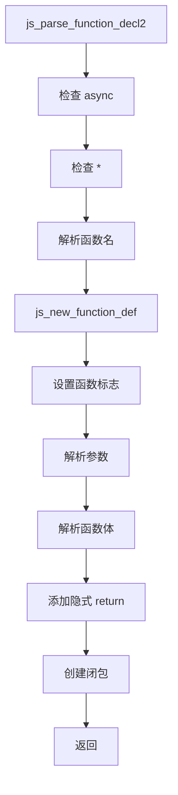
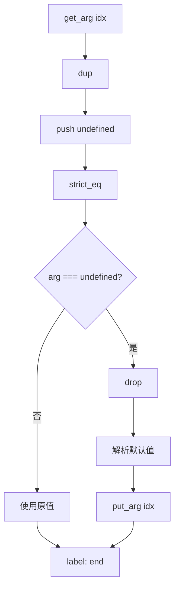
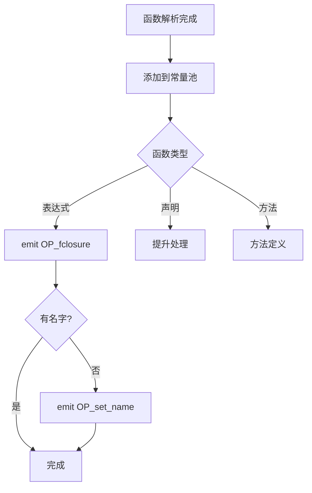
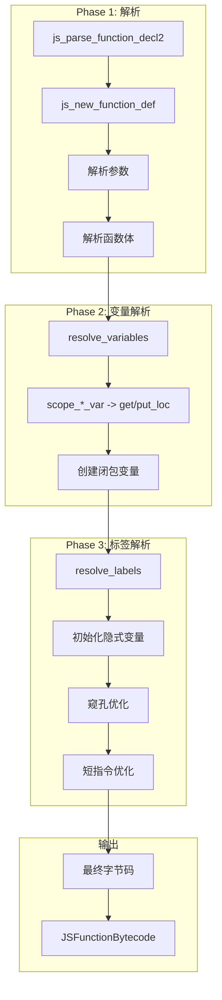

# 函数解析函数详解

> **文档版本**: 基于 QuickJS 2025-04-26  
> **源码 Commit**: `70e83ae71b637592f2c4ad4171fc9db66782c027`  
> **源文件**: [parser.c](../../third_party/QuickJS/src/core/parser.c)

## 概述

函数解析是编译过程中最复杂的部分，负责解析函数定义、参数、函数体，并生成相应的字节码和函数定义结构。

## 1. 核心函数

### 1.1 js_parse_function_decl2

**位置**: [parser.c L12979-L13500](../../third_party/QuickJS/src/core/parser.c#L12979)

这是函数解析的主入口，处理所有类型的函数声明和表达式。

```c
static __exception int js_parse_function_decl2(
    JSParseState* s,
    JSParseFunctionEnum func_type,    // 函数类型
    JSFunctionKindEnum func_kind,     // 函数种类
    JSAtom func_name,                 // 函数名
    const uint8_t* ptr,               // 源码位置
    JSParseExportEnum export_flag,    // 导出标志
    JSFunctionDef** pfd               // 输出函数定义
);
```

### 1.2 函数类型 (JSParseFunctionEnum)

| 类型 | 说明 |
|------|------|
| `JS_PARSE_FUNC_STATEMENT` | 函数声明 `function foo() {}` |
| `JS_PARSE_FUNC_VAR` | 块级函数声明（Annex B） |
| `JS_PARSE_FUNC_EXPR` | 函数表达式 `const f = function() {}` |
| `JS_PARSE_FUNC_ARROW` | 箭头函数 `() => {}` |
| `JS_PARSE_FUNC_METHOD` | 方法 `{ foo() {} }` |
| `JS_PARSE_FUNC_GETTER` | getter `{ get foo() {} }` |
| `JS_PARSE_FUNC_SETTER` | setter `{ set foo(v) {} }` |
| `JS_PARSE_FUNC_CLASS_CONSTRUCTOR` | 类构造函数 |
| `JS_PARSE_FUNC_DERIVED_CLASS_CONSTRUCTOR` | 派生类构造函数 |
| `JS_PARSE_FUNC_CLASS_STATIC_INIT` | 静态初始化块 |

### 1.3 函数种类 (JSFunctionKindEnum)

| 种类 | 说明 |
|------|------|
| `JS_FUNC_NORMAL` | 普通函数 |
| `JS_FUNC_GENERATOR` | 生成器 `function*` |
| `JS_FUNC_ASYNC` | 异步函数 `async function` |
| `JS_FUNC_ASYNC_GENERATOR` | 异步生成器 `async function*` |

## 2. 函数解析流程



## 3. js_new_function_def

**位置**: [parser.c L8242-L8350](../../third_party/QuickJS/src/core/parser.c#L8242)

创建新的函数定义结构：

```c
static JSFunctionDef* js_new_function_def(
    JSContext* ctx,
    JSFunctionDef* parent,    // 父函数
    BOOL is_eval,             // 是否是 eval
    BOOL is_func_expr,        // 是否是函数表达式
    const char* filename,     // 文件名
    const uint8_t* ptr,       // 源码位置
    JSGetLineColumnCache* cache
);
```

### 3.1 JSFunctionDef 结构

```c
typedef struct JSFunctionDef {
    JSContext* ctx;
    struct JSFunctionDef* parent;  // 父函数（用于闭包）
    
    // 函数基本信息
    JSAtom func_name;
    JSFunctionKindEnum func_kind;
    JSParseFunctionEnum func_type;
    int js_mode;                   // 严格模式等
    
    // 变量信息
    JSVarDef* vars;               // 本地变量
    int var_count;
    int var_size;
    
    JSVarDef* args;               // 参数
    int arg_count;
    int arg_size;
    int defined_arg_count;
    
    // 闭包变量
    JSClosureVar* closure_var;
    int closure_var_count;
    int closure_var_size;
    
    // 字节码
    DynBuf byte_code;             // 字节码缓冲区
    int last_opcode_pos;          // 上一个操作码位置
    
    // 标签
    LabelSlot* label_slots;
    int label_count;
    int label_size;
    
    // 作用域
    JSVarScope* scopes;
    int scope_level;
    int scope_first;
    int body_scope;
    
    // 标志
    BOOL has_this_binding : 1;
    BOOL has_arguments_binding : 1;
    BOOL has_home_object : 1;
    BOOL is_derived_class_constructor : 1;
    BOOL super_call_allowed : 1;
    BOOL super_allowed : 1;
    BOOL new_target_allowed : 1;
    BOOL arguments_allowed : 1;
    
    // ... 更多字段
} JSFunctionDef;
```

## 4. 参数解析

### 4.1 简单参数

```c
// L13150-L13180
if (s->token.val == TOK_IDENT) {
    name = s->token.u.ident.atom;
    idx = add_arg(ctx, fd, name);
    if (next_token(s))
        goto fail;
    
    if (!has_opt_arg) {
        fd->defined_arg_count++;
    }
}
```

### 4.2 默认参数

```c
// L13200-L13240
if (s->token.val == '=') {
    fd->has_simple_parameter_list = FALSE;
    has_opt_arg = TRUE;
    
    if (next_token(s))
        goto fail;
    
    int label = new_label(s);
    
    emit_op(s, OP_get_arg);
    emit_u16(s, idx);
    emit_op(s, OP_dup);
    emit_op(s, OP_undefined);
    emit_op(s, OP_strict_eq);
    emit_goto(s, OP_if_false, label);
    emit_op(s, OP_drop);
    
    // 解析默认值表达式
    if (js_parse_assign_expr(s))
        goto fail;
    
    emit_op(s, OP_dup);
    emit_op(s, OP_put_arg);
    emit_u16(s, idx);
    emit_label(s, label);
}
```

### 4.3 默认参数流程图



### 4.4 剩余参数

```c
// L13185-L13200
if (s->token.val == TOK_ELLIPSIS) {
    fd->has_simple_parameter_list = FALSE;
    rest = TRUE;
    if (next_token(s))
        goto fail;
}

// 处理剩余参数
if (rest) {
    emit_op(s, OP_rest);
    emit_u16(s, idx);
    emit_op(s, OP_put_arg);
    emit_u16(s, idx);
}
```

### 4.5 解构参数

```c
// L13160-L13175
if (s->token.val == '[' || s->token.val == '{') {
    fd->has_simple_parameter_list = FALSE;
    
    if (rest) {
        emit_op(s, OP_rest);
        emit_u16(s, fd->arg_count);
    } else {
        idx = add_arg(ctx, fd, JS_ATOM_NULL);
        emit_op(s, OP_get_arg);
        emit_u16(s, idx);
    }
    
    // 解析解构模式
    has_initializer = js_parse_destructuring_element(
        s, TOK_VAR, 1, TRUE, -1, TRUE, FALSE);
}
```

## 5. 函数体解析

### 5.1 进入函数体

```c
// L13330-L13350
fd->in_function_body = TRUE;
push_scope(s);           // 进入函数体作用域
fd->body_scope = fd->scope_level;

// 生成器：参数后 yield
if (func_kind == JS_FUNC_GENERATOR || 
    func_kind == JS_FUNC_ASYNC_GENERATOR) {
    emit_op(s, OP_initial_yield);
}
```

### 5.2 箭头函数简写

```c
// L13355-L13375
if (s->token.val == TOK_ARROW && func_type == JS_PARSE_FUNC_ARROW) {
    if (next_token(s))
        goto fail;
    
    if (s->token.val != '{') {
        // 表达式体：() => expr
        if (js_parse_assign_expr(s))
            goto fail;
        
        if (func_kind != JS_FUNC_NORMAL)
            emit_op(s, OP_return_async);
        else
            emit_op(s, OP_return);
        goto done;
    }
}
```

### 5.3 块体解析

```c
// L13380-L13410
if (js_parse_expect(s, '{'))
    goto fail;

if (js_parse_directives(s))  // 处理 "use strict"
    goto fail;

while (s->token.val != '}') {
    if (js_parse_source_element(s))
        goto fail;
}

// 添加隐式 return
if (js_is_live_code(s)) {
    emit_return(s, FALSE);
}
```

## 6. 闭包创建

### 6.1 emit OP_fclosure

```c
// L13440-L13460
int idx;
JSAtom func_name = fd->func_name;

idx = cpool_add(s, JS_NULL);
fd->parent_cpool_idx = idx;

if (is_expr) {
    if (func_type != JS_PARSE_FUNC_CLASS_CONSTRUCTOR &&
        func_type != JS_PARSE_FUNC_DERIVED_CLASS_CONSTRUCTOR) {
        emit_op(s, OP_fclosure);
        emit_u32(s, idx);
        
        if (func_name == JS_ATOM_NULL) {
            emit_op(s, OP_set_name);
            emit_u32(s, JS_ATOM_NULL);
        }
    }
}
```

### 6.2 闭包创建流程图



## 7. 特殊函数处理

### 7.1 构造函数

```c
// L13140-L13150
if (func_type == JS_PARSE_FUNC_CLASS_CONSTRUCTOR ||
    func_type == JS_PARSE_FUNC_DERIVED_CLASS_CONSTRUCTOR) {
    emit_op(s, OP_check_ctor);  // 检查是否通过 new 调用
}

if (func_type == JS_PARSE_FUNC_CLASS_CONSTRUCTOR) {
    emit_class_field_init(s);   // 初始化类字段
}
```

### 7.2 派生类构造函数

派生类构造函数中 `this` 初始为未初始化状态：

```c
// resolve_labels 中 L11190-L11198
if (s->this_var_idx >= 0) {
    if (s->is_derived_class_constructor) {
        emit_op(s, OP_set_loc_uninitialized);
        emit_u16(s, s->this_var_idx);
    } else {
        emit_op(s, OP_push_this);
        emit_op(s, OP_put_loc);
        emit_u16(s, s->this_var_idx);
    }
}
```

### 7.3 生成器初始化

```c
// L13333
if (func_kind == JS_FUNC_GENERATOR || 
    func_kind == JS_FUNC_ASYNC_GENERATOR) {
    emit_op(s, OP_initial_yield);
}
```

## 8. 字节码示例

### 8.1 普通函数

```javascript
// 输入
function add(a, b) {
    return a + b;
}

// 字节码
// 函数入口点
get_arg 0           // a
get_arg 1           // b
add
return
```

### 8.2 带默认参数

```javascript
// 输入
function greet(name = "World") {
    return "Hello, " + name;
}

// 字节码
get_arg 0           // name
dup
undefined
strict_eq
if_false L1
drop
push_atom_value "World"
dup
put_arg 0
L1:
scope_put_var_init 'name'

push_atom_value "Hello, "
scope_get_var 'name'
add
return
```

### 8.3 箭头函数

```javascript
// 输入
const double = x => x * 2;

// 外部函数字节码
fclosure [double]
set_name null      // 匿名函数设置名称
scope_put_var_init 'double'

// double 函数字节码
get_arg 0          // x
push_2
mul
return
```

### 8.4 生成器函数

```javascript
// 输入
function* counter() {
    yield 1;
    yield 2;
}

// 字节码
initial_yield       // 初始 yield
push_1
yield
drop
push_2
yield
drop
return_undef
```

### 8.5 异步函数

```javascript
// 输入
async function fetchData() {
    const data = await fetch(url);
    return data;
}

// 字节码
scope_get_var 'fetch'
scope_get_var 'url'
call 1
await               // 等待 Promise
scope_put_var_init 'data'
scope_get_var 'data'
return_async
```

## 9. 函数完整编译流程



---

## 相关文档

- [表达式解析函数](parse-expr.md)
- [语句解析函数](parse-stmt.md)
- [闭包处理](closure.md)
- [函数编译文档](../syntax-to-bytecode/functions.md)
