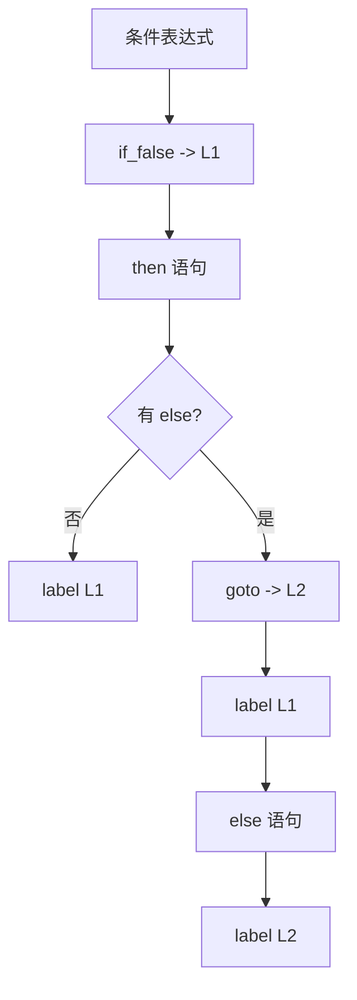
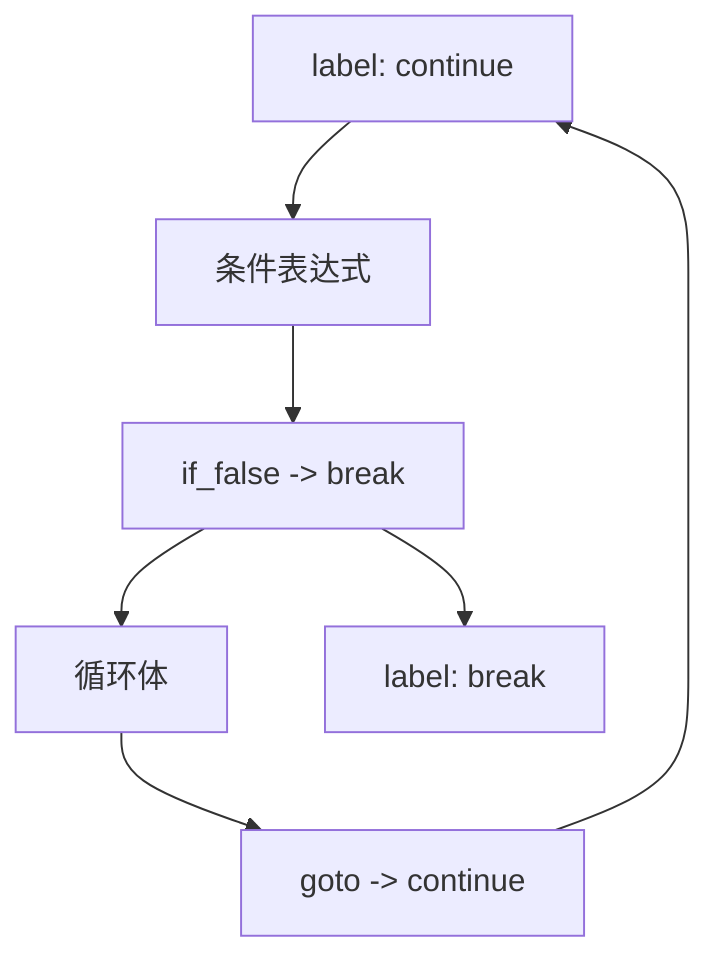
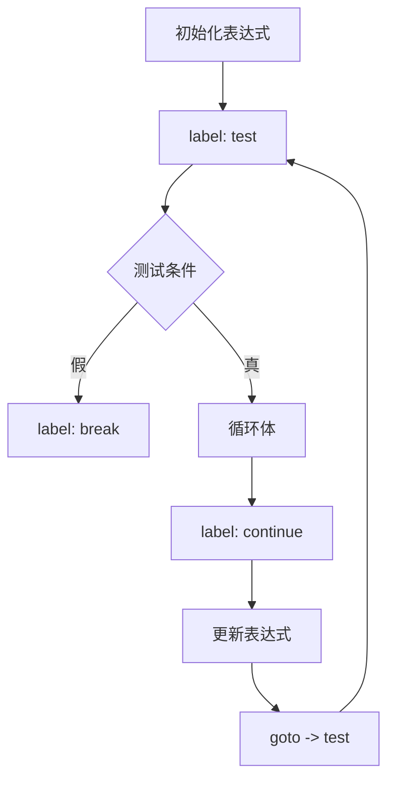
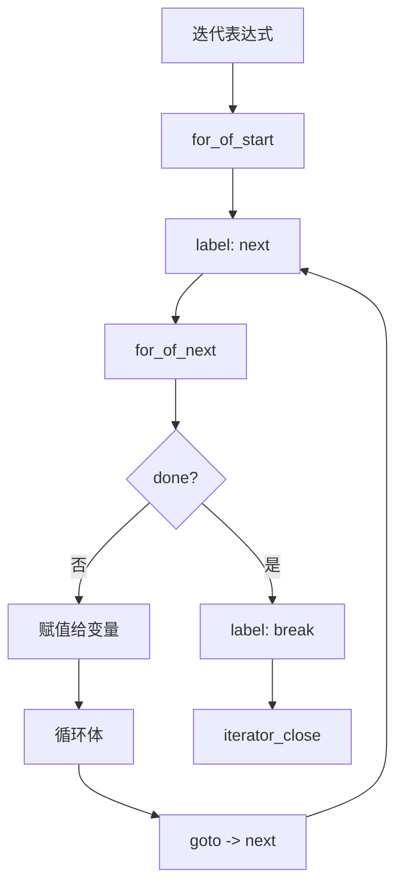
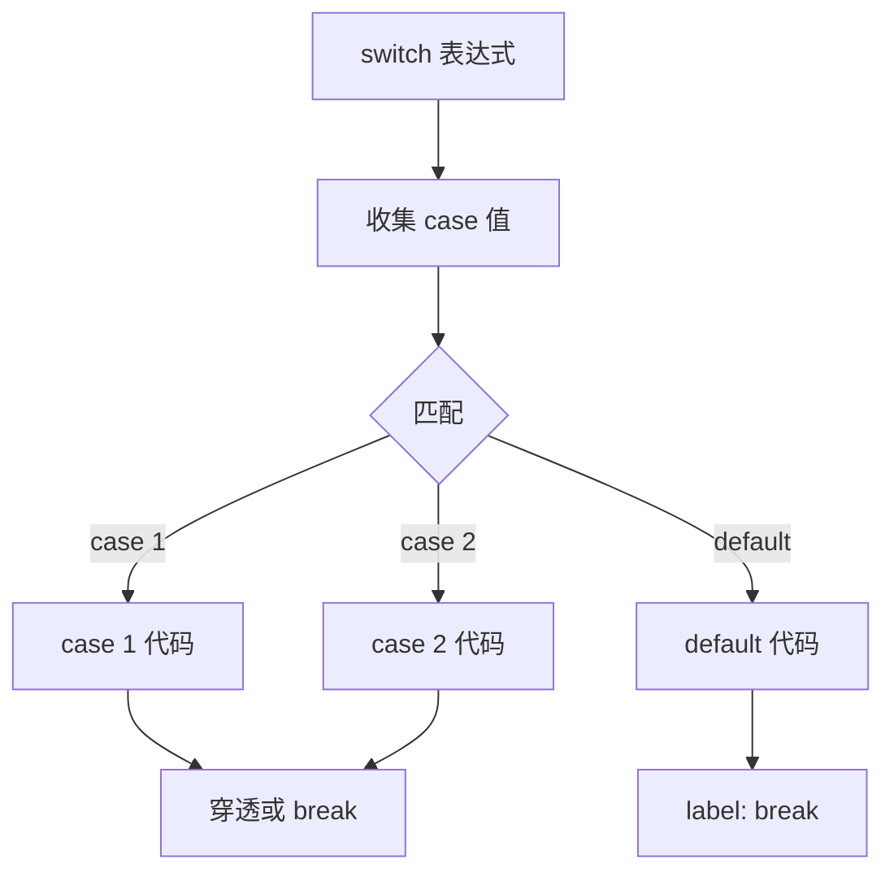
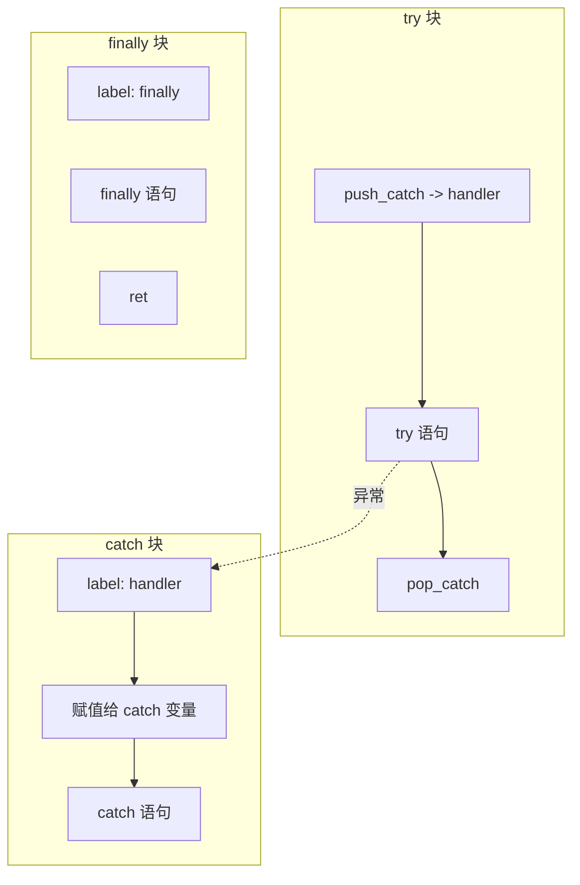

# 语句解析函数详解

> **文档版本**: 基于 QuickJS 2025-04-26  
> **源码 Commit**: `70e83ae71b637592f2c4ad4171fc9db66782c027`  
> **源文件**: [parser.c](../../third_party/QuickJS/src/core/parser.c)

## 概述

语句解析是 Phase 1 的重要组成部分，负责将 JavaScript 语句转换为字节码。

## 1. 核心函数

### 1.1 js_parse_statement_or_decl

**位置**: [parser.c L6941-L7700](../../third_party/QuickJS/src/core/parser.c#L6941)

```c
static __exception int js_parse_statement_or_decl(
    JSParseState* s,
    int decl_mask
);
```

### 1.2 语句类型分发

```mermaid
flowchart TD
    START[js_parse_statement_or_decl] --> LABEL{有标签?}
    LABEL --> |是| PARSE_LABEL[处理标签]
    LABEL --> |否| SWITCH{语句类型}
    PARSE_LABEL --> SWITCH
    
    SWITCH --> |'{'| BLOCK[js_parse_block]
    SWITCH --> |return| RETURN[处理 return]
    SWITCH --> |throw| THROW[处理 throw]
    SWITCH --> |var/let/const| VAR[js_parse_var]
    SWITCH --> |if| IF[处理 if]
    SWITCH --> |while| WHILE[处理 while]
    SWITCH --> |do| DO[处理 do-while]
    SWITCH --> |for| FOR[处理 for]
    SWITCH --> |switch| SWITCH_STMT[处理 switch]
    SWITCH --> |try| TRY[处理 try-catch]
    SWITCH --> |break/continue| BREAK[处理 break/continue]
    SWITCH --> |with| WITH[处理 with]
    SWITCH --> |function| FUNC[js_parse_function_decl]
    SWITCH --> |class| CLASS[js_parse_class]
    SWITCH --> |其他| EXPR[js_parse_expr]
```

## 2. 块语句

### 2.1 js_parse_block

**位置**: [parser.c L6509-L6527](../../third_party/QuickJS/src/core/parser.c#L6509)

```c
static __exception int js_parse_block(JSParseState* s) {
    if (js_parse_expect(s, '{'))
        return -1;
    if (s->token.val != '}') {
        push_scope(s);  // 创建新作用域
        for (;;) {
            if (js_parse_statement_or_decl(s, DECL_MASK_ALL))
                return -1;
            if (s->token.val == '}')
                break;
        }
        pop_scope(s);   // 关闭作用域
    }
    if (next_token(s))
        return -1;
    return 0;
}
```

### 2.2 块语句字节码

```javascript
// 输入
{
    let x = 1;
    let y = 2;
}

// 字节码
enter_scope 1        // 进入作用域
push_1
put_loc 0            // x = 1
push_2
put_loc 1            // y = 2
leave_scope 1        // 离开作用域
```

## 3. if 语句

**位置**: [parser.c L7048-L7077](../../third_party/QuickJS/src/core/parser.c#L7048)

### 3.1 实现

```c
case TOK_IF: {
    int label1, label2, mask;
    if (next_token(s))
        goto fail;
    
    push_scope(s);
    set_eval_ret_undefined(s);
    
    if (js_parse_expr_paren(s))  // 解析条件
        goto fail;
    
    label1 = emit_goto(s, OP_if_false, -1);
    
    // 解析 then 分支
    if (js_parse_statement_or_decl(s, mask))
        goto fail;
    
    if (s->token.val == TOK_ELSE) {
        label2 = emit_goto(s, OP_goto, -1);
        if (next_token(s))
            goto fail;
        
        emit_label(s, label1);
        
        // 解析 else 分支
        if (js_parse_statement_or_decl(s, mask))
            goto fail;
        
        label1 = label2;
    }
    emit_label(s, label1);
    pop_scope(s);
} break;
```

### 3.2 if-else 流程图



### 3.3 字节码示例

```javascript
// 输入
if (x > 0) {
    y = 1;
} else {
    y = 2;
}

// 字节码
scope_get_var 'x'
push_0
gt
if_false L1          // 条件为假跳转
push_1
scope_put_var 'y'
goto L2
L1:
push_2
scope_put_var 'y'
L2:
```

## 4. while 循环

**位置**: [parser.c L7078-L7103](../../third_party/QuickJS/src/core/parser.c#L7078)

### 4.1 实现

```c
case TOK_WHILE: {
    int label_cont, label_break;
    BlockEnv break_entry;
    
    label_cont = new_label(s);
    label_break = new_label(s);
    
    push_break_entry(
        s->cur_func, &break_entry, label_name, 
        label_break, label_cont, 0);
    
    if (next_token(s))
        goto fail;
    
    set_eval_ret_undefined(s);
    
    emit_label(s, label_cont);       // continue 目标
    
    if (js_parse_expr_paren(s))      // 解析条件
        goto fail;
    
    emit_goto(s, OP_if_false, label_break);
    
    if (js_parse_statement(s))       // 解析循环体
        goto fail;
    
    emit_goto(s, OP_goto, label_cont);
    
    emit_label(s, label_break);      // break 目标
    
    pop_break_entry(s->cur_func);
} break;
```

### 4.2 while 流程图



### 4.3 字节码示例

```javascript
// 输入
while (i < 10) {
    i++;
}

// 字节码
L1:                    // continue 目标
scope_get_var 'i'
push_10
lt
if_false L2           // 条件为假跳转到 break
scope_get_var 'i'
post_inc
scope_put_var 'i'
drop
goto L1               // 跳回 continue
L2:                    // break 目标
```

## 5. do-while 循环

**位置**: [parser.c L7104-L7140](../../third_party/QuickJS/src/core/parser.c#L7104)

### 5.1 实现

```c
case TOK_DO: {
    int label_cont, label_break, label1;
    BlockEnv break_entry;
    
    label_cont = new_label(s);
    label_break = new_label(s);
    label1 = new_label(s);           // 循环开始
    
    push_break_entry(
        s->cur_func, &break_entry, label_name, 
        label_break, label_cont, 0);
    
    if (next_token(s))
        goto fail;
    
    emit_label(s, label1);           // 循环开始
    
    set_eval_ret_undefined(s);
    
    if (js_parse_statement(s))       // 解析循环体
        goto fail;
    
    emit_label(s, label_cont);       // continue 目标
    
    if (js_parse_expect(s, TOK_WHILE))
        goto fail;
    
    if (js_parse_expr_paren(s))      // 解析条件
        goto fail;
    
    emit_goto(s, OP_if_true, label1);
    
    emit_label(s, label_break);      // break 目标
    
    pop_break_entry(s->cur_func);
} break;
```

### 5.2 字节码示例

```javascript
// 输入
do {
    i++;
} while (i < 10);

// 字节码
L1:                    // 循环开始
scope_get_var 'i'
post_inc
scope_put_var 'i'
drop
L2:                    // continue 目标
scope_get_var 'i'
push_10
lt
if_true L1            // 条件为真继续循环
L3:                    // break 目标
```

## 6. for 循环

**位置**: [parser.c L7141-L7300](../../third_party/QuickJS/src/core/parser.c#L7141)

### 6.1 for 循环结构



### 6.2 实现要点

```c
case TOK_FOR: {
    int label_cont, label_break, label_body, label_test;
    
    // 创建标签
    label_test = new_label(s);
    label_cont = new_label(s);
    label_break = new_label(s);
    label_body = new_label(s);
    
    push_scope(s);  // 为 let/const 创建作用域
    
    // 1. 初始化
    if (tok == TOK_VAR || tok == TOK_LET || tok == TOK_CONST) {
        js_parse_var(s, FALSE, tok, FALSE);
    } else if (s->token.val != ';') {
        js_parse_expr(s);
        emit_op(s, OP_drop);
    }
    
    // 2. 测试
    emit_label(s, label_test);
    if (s->token.val != ';') {
        js_parse_expr(s);
        emit_goto(s, OP_if_false, label_break);
    }
    emit_goto(s, OP_goto, label_body);
    
    // 3. 更新（跳过，稍后执行）
    emit_label(s, label_cont);
    if (s->token.val != ')') {
        js_parse_expr(s);
        emit_op(s, OP_drop);
    }
    emit_goto(s, OP_goto, label_test);
    
    // 4. 循环体
    emit_label(s, label_body);
    js_parse_statement(s);
    emit_goto(s, OP_goto, label_cont);
    
    emit_label(s, label_break);
    pop_scope(s);
}
```

### 6.3 字节码示例

```javascript
// 输入
for (let i = 0; i < 10; i++) {
    sum += i;
}

// 字节码
enter_scope 1        // let 作用域
push_0
put_loc 0            // i = 0

L_test:
get_loc 0
push_10
lt
if_false L_break
goto L_body

L_cont:              // continue 目标
get_loc 0
post_inc
put_loc 0
drop
goto L_test

L_body:
scope_get_var 'sum'
get_loc 0
add
scope_put_var 'sum'
goto L_cont

L_break:             // break 目标
leave_scope 1
```

## 7. for-in / for-of 循环

**位置**: [parser.c L6771-L6930](../../third_party/QuickJS/src/core/parser.c#L6771)

### 7.1 for-of 流程图



### 7.2 字节码示例

```javascript
// 输入
for (const item of array) {
    console.log(item);
}

// 字节码
scope_get_var 'array'
for_of_start             // 获取迭代器
L1:
for_of_next 0            // 获取下一个值
if_true L2               // done 则跳出
scope_put_var 'item'     // 赋值

scope_get_var 'console'
get_field 'log'
scope_get_var 'item'
call_method 1

goto L1
L2:
drop                      // 清理 undefined
iterator_close            // 关闭迭代器
```

## 8. switch 语句

**位置**: [parser.c L7301-L7450](../../third_party/QuickJS/src/core/parser.c#L7301)

### 8.1 switch 流程图



### 8.2 字节码示例

```javascript
// 输入
switch (x) {
    case 1: a(); break;
    case 2: b(); break;
    default: c();
}

// 字节码
scope_get_var 'x'
dup
push_1
strict_eq
if_true L_case1
dup
push_2
strict_eq
if_true L_case2
drop
goto L_default

L_case1:
drop
scope_get_var 'a'
call 0
goto L_break

L_case2:
drop
scope_get_var 'b'
call 0
goto L_break

L_default:
scope_get_var 'c'
call 0

L_break:
```

## 9. try-catch-finally

**位置**: [parser.c L7451-L7600](../../third_party/QuickJS/src/core/parser.c#L7451)

### 9.1 try-catch 流程图



### 9.2 字节码示例

```javascript
// 输入
try {
    riskyOperation();
} catch (e) {
    handleError(e);
} finally {
    cleanup();
}

// 字节码
catch L_catch, 0         // 设置异常处理器
# try 块
scope_get_var 'riskyOperation'
call 0
drop
goto L_finally          // 正常完成，跳到 finally

L_catch:                 // catch 处理器
put_loc 0               // e = exception
scope_get_var 'handleError'
get_loc 0
call 1
drop

L_finally:               // finally 块
scope_get_var 'cleanup'
call 0
drop
ret                      // gosub 返回点

L_end:
```

## 10. break/continue

**位置**: [parser.c L6361-L6408](../../third_party/QuickJS/src/core/parser.c#L6361)

### 10.1 emit_break 函数

```c
static __exception int emit_break(JSParseState* s, JSAtom name, int is_cont) {
    BlockEnv* top;
    int scope_level;
    
    scope_level = s->cur_func->scope_level;
    top = s->cur_func->top_break;
    
    while (top != NULL) {
        // 关闭中间的作用域
        close_scopes(s, scope_level, top->scope_level);
        scope_level = top->scope_level;
        
        // 找到目标
        if (is_cont && top->label_cont != -1 &&
            (name == JS_ATOM_NULL || top->label_name == name)) {
            emit_goto(s, OP_goto, top->label_cont);
            return 0;
        }
        if (!is_cont && top->label_break != -1 &&
            ((name == JS_ATOM_NULL && !top->is_regular_stmt) ||
             top->label_name == name)) {
            emit_goto(s, OP_goto, top->label_break);
            return 0;
        }
        
        // 处理迭代器关闭
        if (top->has_iterator) {
            emit_op(s, OP_iterator_close);
        }
        
        // 处理 finally
        if (top->label_finally != -1) {
            emit_op(s, OP_undefined);
            emit_goto(s, OP_gosub, top->label_finally);
            emit_op(s, OP_drop);
        }
        
        top = top->prev;
    }
    
    return js_parse_error(s, "break/continue not in loop");
}
```

### 10.2 带 finally 的 break

```javascript
// 输入
while (true) {
    try {
        break;
    } finally {
        cleanup();
    }
}

// 字节码
L_cont:
push_true
if_false L_break

catch L_finally, ...
undefined
goto L_break_inner   // break 想要跳出

L_finally:
scope_get_var 'cleanup'
call 0
drop
ret

L_break_inner:
gosub L_finally      // 先执行 finally
drop
goto L_break         // 然后跳出

L_break:
```

## 11. BlockEnv 结构

用于跟踪循环和 switch 语句的控制流：

```c
typedef struct BlockEnv {
    struct BlockEnv* prev;   // 父级 BlockEnv
    JSAtom label_name;       // 标签名
    int label_break;         // break 目标标签
    int label_cont;          // continue 目标标签
    int drop_count;          // 需要 drop 的栈元素数量
    int label_finally;       // finally 标签（-1 表示无）
    int scope_level;         // 作用域级别
    BOOL has_iterator;       // 是否有迭代器需要关闭
    BOOL is_regular_stmt;    // 是否是普通语句（非循环/switch）
} BlockEnv;
```

---

## 相关文档

- [表达式解析函数](parse-expr.md)
- [函数解析函数](parse-function.md)
- [语句编译文档](../syntax-to-bytecode/statements.md)
