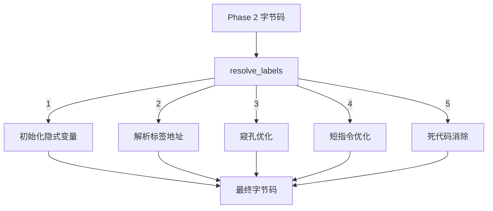
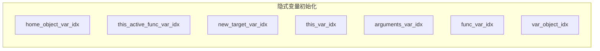
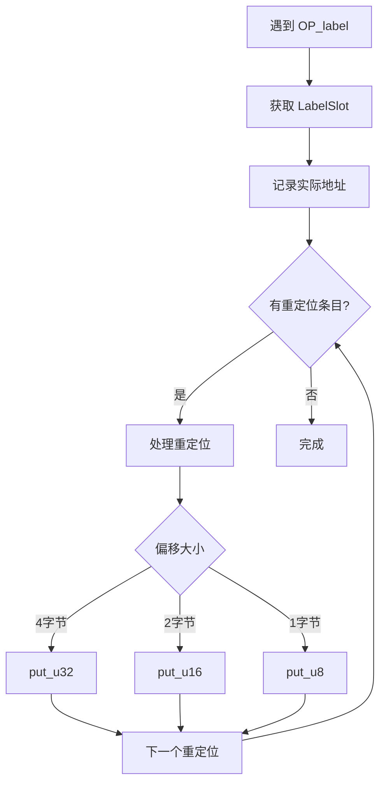
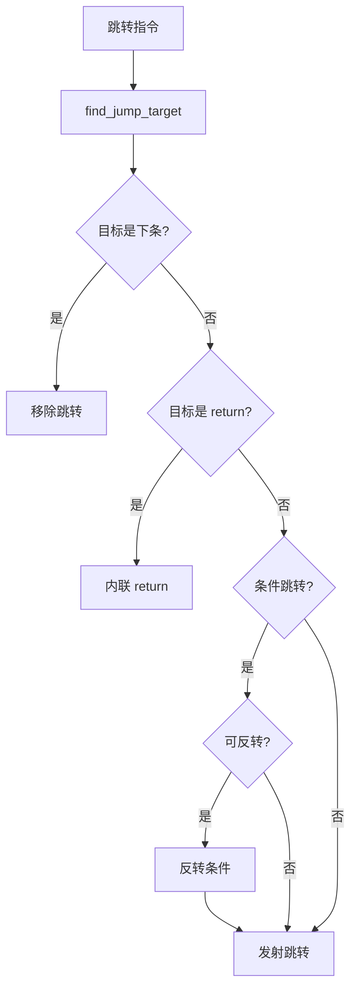
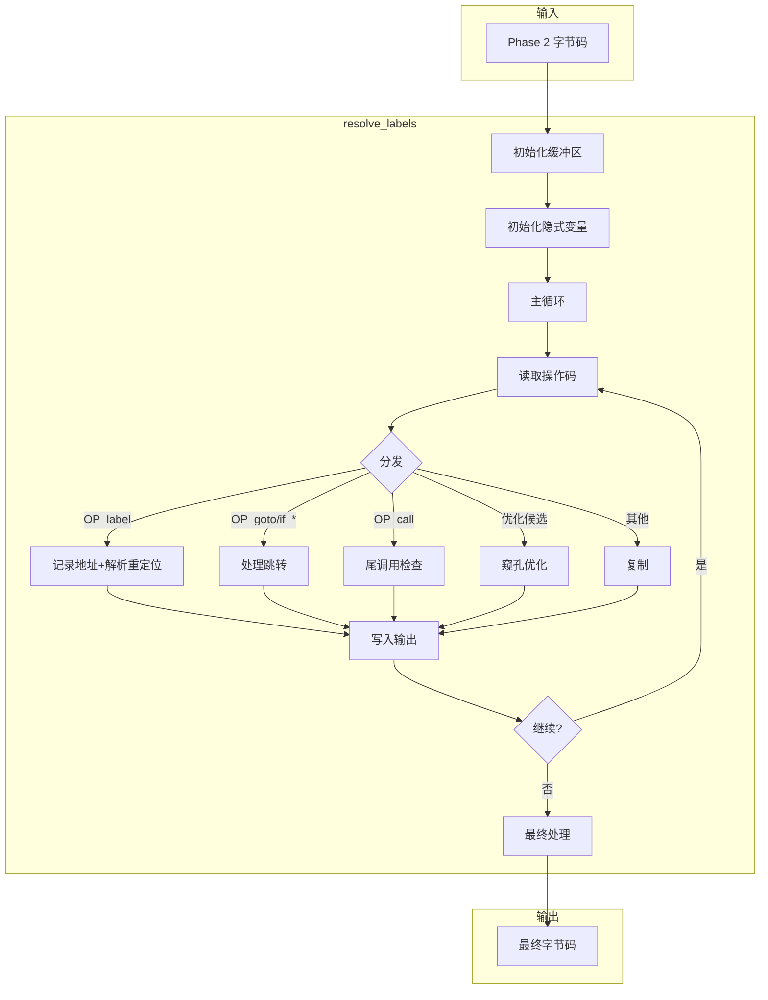

# resolve_labels 函数详解

> **文档版本**: 基于 QuickJS 2025-04-26  
> **源码 Commit**: `70e83ae71b637592f2c4ad4171fc9db66782c027`  
> **源文件**: [parser.c](../../third_party/QuickJS/src/core/parser.c)

## 概述

`resolve_labels` 是 Phase 3 的核心函数，负责解析标签跳转、应用窥孔优化、生成最终的可执行字节码。

**位置**: [parser.c L11139-L12078](../../third_party/QuickJS/src/core/parser.c#L11139)

## 1. 函数签名

```c
static __exception int resolve_labels(JSContext* ctx, JSFunctionDef* s);
```

**参数**:
- `ctx`: JavaScript 上下文
- `s`: 函数定义

**返回**: 0 成功，-1 失败

## 2. 主要职责



## 3. 函数初始化

### 3.1 变量声明

```c
// L11139-L11153
static __exception int resolve_labels(JSContext* ctx, JSFunctionDef* s) {
  int pos, pos_next, bc_len, op, op1, len, i, line_num;
  const uint8_t* bc_buf;
  DynBuf bc_out;
  LabelSlot *label_slots, *ls;
  RelocEntry *re, *re_next;
  CodeContext cc;
  int label;
#if SHORT_OPCODES
  JumpSlot* jp;
#endif

  label_slots = s->label_slots;
  line_num = s->source_pos;
```

### 3.2 缓冲区初始化

```c
// L11155-L11173
cc.bc_buf = bc_buf = s->byte_code.buf;
cc.bc_len = bc_len = s->byte_code.size;
js_dbuf_init(ctx, &bc_out);

#if SHORT_OPCODES
if (s->jump_size) {
    s->jump_slots = js_mallocz(s->ctx, sizeof(*s->jump_slots) * s->jump_size);
    if (s->jump_slots == NULL)
        return -1;
}
#endif

if (s->line_number_size && !s->strip_debug) {
    s->line_number_slots = js_mallocz(
        s->ctx, sizeof(*s->line_number_slots) * s->line_number_size);
    if (s->line_number_slots == NULL)
        return -1;
    s->line_number_last = s->source_pos;
    s->line_number_last_pc = 0;
}
```

## 4. 隐式变量初始化

函数开始时会初始化各种隐式变量：



### 4.1 home_object 初始化

```c
// L11175-L11179
if (s->home_object_var_idx >= 0) {
    dbuf_putc(&bc_out, OP_special_object);
    dbuf_putc(&bc_out, OP_SPECIAL_OBJECT_HOME_OBJECT);
    put_short_code(&bc_out, OP_put_loc, s->home_object_var_idx);
}
```

### 4.2 this.active_func 初始化

```c
// L11180-L11184
if (s->this_active_func_var_idx >= 0) {
    dbuf_putc(&bc_out, OP_special_object);
    dbuf_putc(&bc_out, OP_SPECIAL_OBJECT_THIS_FUNC);
    put_short_code(&bc_out, OP_put_loc, s->this_active_func_var_idx);
}
```

### 4.3 new.target 初始化

```c
// L11185-L11189
if (s->new_target_var_idx >= 0) {
    dbuf_putc(&bc_out, OP_special_object);
    dbuf_putc(&bc_out, OP_SPECIAL_OBJECT_NEW_TARGET);
    put_short_code(&bc_out, OP_put_loc, s->new_target_var_idx);
}
```

### 4.4 this 变量初始化

```c
// L11190-L11198
if (s->this_var_idx >= 0) {
    if (s->is_derived_class_constructor) {
        // 派生类构造函数中 this 初始为 uninitialized
        dbuf_putc(&bc_out, OP_set_loc_uninitialized);
        dbuf_put_u16(&bc_out, s->this_var_idx);
    } else {
        dbuf_putc(&bc_out, OP_push_this);
        put_short_code(&bc_out, OP_put_loc, s->this_var_idx);
    }
}
```

### 4.5 arguments 变量初始化

```c
// L11199-L11212
if (s->arguments_var_idx >= 0) {
    if ((s->js_mode & JS_MODE_STRICT) || !s->has_simple_parameter_list) {
        // 严格模式或复杂参数：普通 arguments
        dbuf_putc(&bc_out, OP_special_object);
        dbuf_putc(&bc_out, OP_SPECIAL_OBJECT_ARGUMENTS);
    } else {
        // 非严格模式：mapped arguments
        dbuf_putc(&bc_out, OP_special_object);
        dbuf_putc(&bc_out, OP_SPECIAL_OBJECT_MAPPED_ARGUMENTS);
    }
    if (s->arguments_arg_idx >= 0)
        put_short_code(&bc_out, OP_set_loc, s->arguments_arg_idx);
    put_short_code(&bc_out, OP_put_loc, s->arguments_var_idx);
}
```

## 5. 标签解析

### 5.1 OP_label 处理

```c
// L11247-L11270
case OP_label: {
    label = get_u32(bc_buf + pos + 1);
    JS_ASSERT_CONTEXT(ctx, label >= 0 && label < s->label_count);
    ls = &label_slots[label];
    JS_ASSERT_CONTEXT(ctx, ls->addr == -1);
    ls->addr = bc_out.size;  // 记录标签的实际地址
    
    /* 解析所有指向此标签的重定位条目 */
    for (re = ls->first_reloc; re != NULL; re = re_next) {
        int diff = ls->addr - re->addr;
        re_next = re->next;
        switch (re->size) {
            case 4:
                put_u32(bc_out.buf + re->addr, diff);
                break;
            case 2:
                JS_ASSERT_CONTEXT(ctx, diff == (int16_t)diff);
                put_u16(bc_out.buf + re->addr, diff);
                break;
            case 1:
                JS_ASSERT_CONTEXT(ctx, diff == (int8_t)diff);
                put_u8(bc_out.buf + re->addr, diff);
                break;
        }
        js_free(ctx, re);
    }
    ls->first_reloc = NULL;
} break;
```

### 5.2 标签解析流程图



## 6. 跳转指令处理

### 6.1 goto 优化

```c
// L11291-L11328
case OP_goto:
    label = get_u32(bc_buf + pos + 1);
has_goto:
    if (OPTIMIZE) {
        int line1 = -1;
        // 跟随跳转链找到最终目标
        label = find_jump_target(s, label, &op1, &line1);
        
        // 跳转到下一条指令：移除跳转
        if (code_has_label(&cc, pos_next, label)) {
            update_label(s, label, -1);
            break;
        }
        
        // 跳转到 return/throw：用 return/throw 替换
        if (op1 == OP_return || op1 == OP_return_undef || op1 == OP_throw) {
            update_label(s, label, -1);
            add_pc2line_info(s, bc_out.size, line_num);
            dbuf_putc(&bc_out, op1);
            pos_next = skip_dead_code(s, bc_buf, bc_len, pos_next, &line_num);
            break;
        }
    }
    goto has_label;
```

### 6.2 条件跳转优化

```c
// L11336-L11365
case OP_if_true:
case OP_if_false:
    label = get_u32(bc_buf + pos + 1);
    if (OPTIMIZE) {
        label = find_jump_target(s, label, &op1, NULL);
        
        // if_false/if_true(l1) label(l1) -> drop label(l1)
        if (code_has_label(&cc, pos_next, label)) {
            update_label(s, label, -1);
            dbuf_putc(&bc_out, OP_drop);
            break;
        }
        
        // if_false(l1) goto(l2) label(l1) -> if_true(l2) label(l1)
        if (code_match(&cc, pos_next, OP_goto, -1)) {
            int pos1 = cc.pos;
            int line1 = cc.line_num;
            if (code_has_label(&cc, pos1, label)) {
                if (line1 != -1) line_num = line1;
                pos_next = pos1;
                update_label(s, label, -1);
                label = cc.label;
                op ^= OP_if_true ^ OP_if_false;  // 反转条件
            }
        }
    }
    goto has_label;
```

### 6.3 跳转优化流程图



## 7. 短指令优化

### 7.1 短跳转

```c
// L11400-L11440
#if SHORT_OPCODES
if (ls->addr == -1) {
    int diff = ls->pos2 - pos - 1;
    // 8位偏移
    if (diff < 128 && (op == OP_if_false || op == OP_if_true || op == OP_goto)) {
        jp->size = 1;
        jp->op = OP_if_false8 + (op - OP_if_false);
        dbuf_putc(&bc_out, OP_if_false8 + (op - OP_if_false));
        dbuf_putc(&bc_out, 0);
        if (!add_reloc(ctx, ls, bc_out.size - 1, 1))
            goto fail;
        break;
    }
    // 16位偏移
    if (diff < 32768 && op == OP_goto) {
        jp->size = 2;
        jp->op = OP_goto16;
        dbuf_putc(&bc_out, OP_goto16);
        dbuf_put_u16(&bc_out, 0);
        if (!add_reloc(ctx, ls, bc_out.size - 2, 2))
            goto fail;
        break;
    }
}
#endif
```

### 7.2 短变量操作

```c
// L11591-L11608
case OP_push_const:
case OP_fclosure:
    if (OPTIMIZE) {
        int idx = get_u32(bc_buf + pos + 1);
        if (idx < 256) {
            add_pc2line_info(s, bc_out.size, line_num);
            dbuf_putc(&bc_out, OP_push_const8 + op - OP_push_const);
            dbuf_putc(&bc_out, idx);
            break;
        }
    }
    goto no_change;
```

### 7.3 put_short_code 函数

```c
static void put_short_code(DynBuf* bc_out, int op, int idx) {
    if (idx < 4) {
        switch (op) {
            case OP_get_loc:
                dbuf_putc(bc_out, OP_get_loc0 + idx);
                return;
            case OP_put_loc:
                dbuf_putc(bc_out, OP_put_loc0 + idx);
                return;
            case OP_set_loc:
                dbuf_putc(bc_out, OP_set_loc0 + idx);
                return;
            case OP_get_arg:
                dbuf_putc(bc_out, OP_get_arg0 + idx);
                return;
            case OP_put_arg:
                dbuf_putc(bc_out, OP_put_arg0 + idx);
                return;
            case OP_set_arg:
                dbuf_putc(bc_out, OP_set_arg0 + idx);
                return;
            case OP_get_var_ref:
                dbuf_putc(bc_out, OP_get_var_ref0 + idx);
                return;
            case OP_put_var_ref:
                dbuf_putc(bc_out, OP_put_var_ref0 + idx);
                return;
            case OP_set_var_ref:
                dbuf_putc(bc_out, OP_set_var_ref0 + idx);
                return;
            case OP_call:
                dbuf_putc(bc_out, OP_call0 + idx);
                return;
        }
    }
    if (idx < 256) {
        switch (op) {
            case OP_get_loc:
            case OP_put_loc:
            case OP_set_loc:
            case OP_get_arg:
            case OP_put_arg:
            case OP_set_arg:
            case OP_get_var_ref:
            case OP_put_var_ref:
            case OP_set_var_ref:
            case OP_call:
                dbuf_putc(bc_out, op + 1);  // 8位变体
                dbuf_putc(bc_out, idx);
                return;
        }
    }
    // 默认16位
    dbuf_putc(bc_out, op);
    dbuf_put_u16(bc_out, idx);
}
```

## 8. 窥孔优化

### 8.1 尾调用优化

```c
// L11271-L11289
case OP_call:
case OP_call_method: {
    int argc;
    argc = get_u16(bc_buf + pos + 1);
    // 检测 call ... return 模式
    if (code_match(&cc, pos_next, OP_return, -1)) {
        if (cc.line_num >= 0)
            line_num = cc.line_num;
        add_pc2line_info(s, bc_out.size, line_num);
        // 替换为尾调用
        put_short_code(&bc_out, op + 1, argc);  // call_tc / call_method_tc
        pos_next = skip_dead_code(s, bc_buf, bc_len, cc.pos, &line_num);
        break;
    }
    add_pc2line_info(s, bc_out.size, line_num);
    put_short_code(&bc_out, op, argc);
    break;
}
```

### 8.2 常量测试优化

```c
// L11522-L11545
case OP_push_false:
case OP_push_true:
    if (OPTIMIZE) {
        val = (op == OP_push_true);
        if (code_match(&cc, pos_next, M2(OP_if_false, OP_if_true), -1)) {
        has_constant_test:
            if (val == cc.op - OP_if_false) {
                // true if_true(l1) -> goto l1
                // false if_false(l1) -> goto l1
                op = OP_goto;
                label = cc.label;
                goto has_goto;
            } else {
                // true if_false(l1) -> nop
                // false if_true(l1) -> nop
                pos_next = cc.pos;
                update_label(s, cc.label, -1);
                break;
            }
        }
    }
    goto no_change;
```

### 8.3 增量优化

```c
// L11800-L11838
case OP_get_loc:
    if (OPTIMIZE) {
        int idx = get_u16(bc_buf + pos + 1);
        if (idx >= 256)
            goto no_change;
        
        // get_loc(n) post_inc put_loc(n) drop -> inc_loc(n)
        if (code_match(&cc, pos_next, M2(OP_post_dec, OP_post_inc),
                       OP_put_loc, idx, OP_drop, -1) ||
            code_match(&cc, pos_next, M2(OP_dec, OP_inc),
                       OP_dup, OP_put_loc, idx, OP_drop, -1)) {
            add_pc2line_info(s, bc_out.size, line_num);
            dbuf_putc(&bc_out, (cc.op == OP_inc || cc.op == OP_post_inc) 
                              ? OP_inc_loc : OP_dec_loc);
            dbuf_putc(&bc_out, idx);
            pos_next = cc.pos;
            break;
        }
    }
    goto no_change;
```

### 8.4 类型检查优化

```c
// L11975-L12025
#if SHORT_OPCODES
case OP_typeof:
    if (OPTIMIZE) {
        // typeof(x) === "undefined" -> is_undefined
        if (code_match(&cc, pos_next, OP_push_atom_value,
                      M4(OP_strict_eq, OP_strict_neq, OP_eq, OP_neq), -1)) {
            int op1 = (cc.op == OP_strict_eq || cc.op == OP_eq) 
                      ? OP_strict_eq : OP_strict_neq;
            int op2 = -1;
            switch (cc.atom) {
                case JS_ATOM_undefined:
                    op2 = OP_typeof_is_undefined;
                    break;
                case JS_ATOM_function:
                    op2 = OP_typeof_is_function;
                    break;
            }
            if (op2 >= 0 && op1 == OP_strict_eq) {
                add_pc2line_info(s, bc_out.size, line_num);
                dbuf_putc(&bc_out, op2);
                JS_FreeAtom(ctx, cc.atom);
                pos_next = cc.pos;
                break;
            }
        }
    }
    goto no_change;
#endif
```

## 9. 优化模式汇总

| 模式 | 输入 | 输出 | 节省 |
|-----|------|------|-----|
| 尾调用 | `call; return` | `call_tc` | 1 指令 |
| 常量分支 | `push_true; if_true(l)` | `goto l` | 1 指令 |
| 增量 | `get_loc(n); inc; dup; put_loc(n); drop` | `inc_loc(n)` | 4 指令 |
| 短变量 | `get_loc 0` | `get_loc0` | 2 字节 |
| 短跳转 | `goto (near)` | `goto8` / `goto16` | 2-3 字节 |
| typeof | `typeof; push "undefined"; ===` | `typeof_is_undefined` | 2 指令 |
| null 检查 | `null; ===` | `is_null` | 1 指令 |
| 属性长度 | `get_field "length"` | `get_length` | 3 字节 |

## 10. 完整流程图



## 11. 示例

### 输入（Phase 2）

```javascript
function test(x) {
    if (x) {
        return x + 1;
    }
    return 0;
}
```

```
// Phase 2 字节码
label L0:
get_arg 0
if_false L1
get_arg 0
push_1
add
return
label L1:
push_0
return
```

### 输出（Phase 3）

```
// 初始化隐式变量
// (无，此函数不需要)

// 优化后的字节码
get_arg0              // 短指令
if_false8 +5          // 短跳转
get_arg0
push_1
add
return
push_0
return
```

---

## 相关文档

- [resolve_variables 函数](resolve-variables.md)
- [编译阶段](../compilation-phases.md)
- [操作码参考](../opcode-reference.md)
