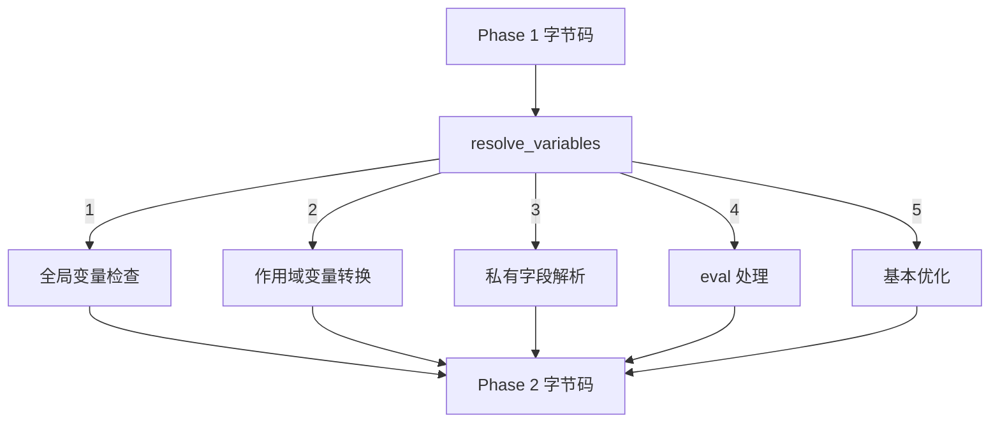
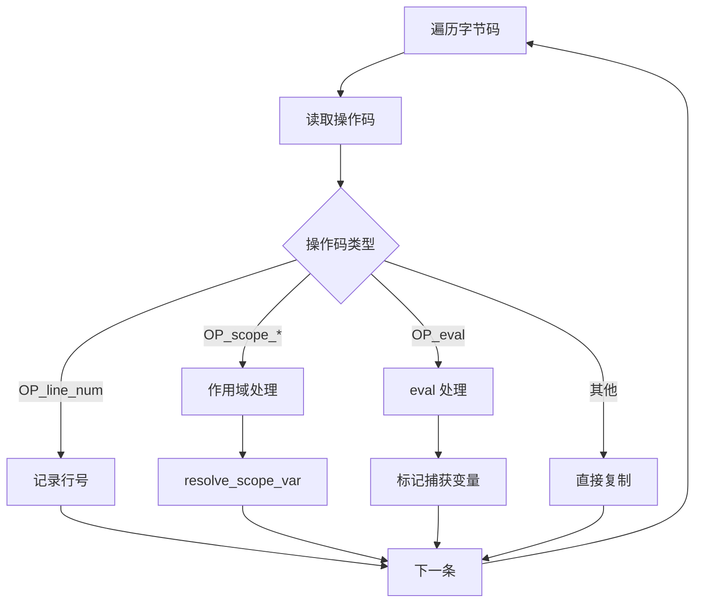
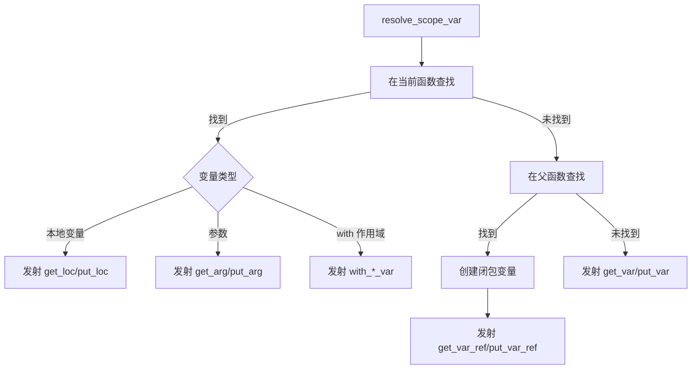
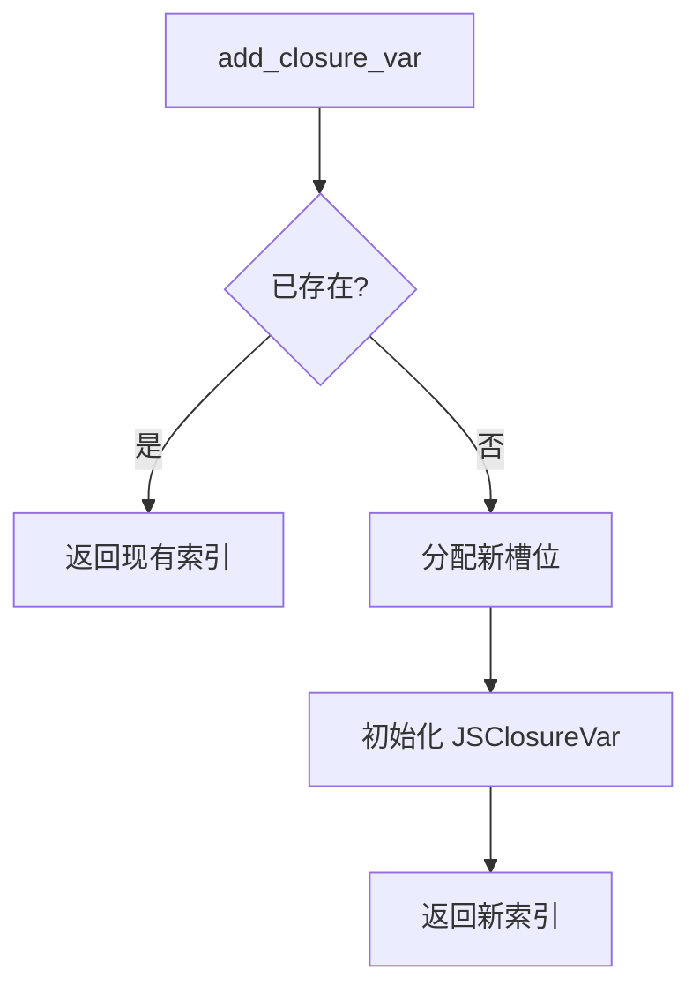
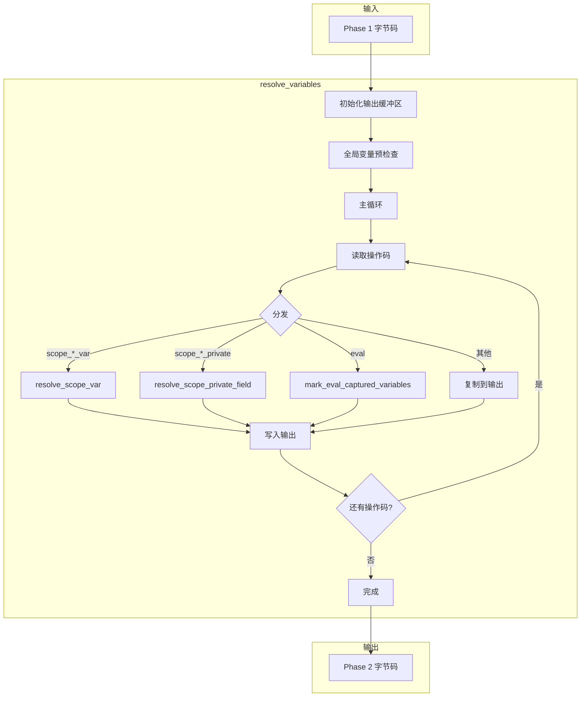

# resolve_variables 函数详解

> **文档版本**: 基于 QuickJS 2025-04-26  
> **源码 Commit**: `70e83ae71b637592f2c4ad4171fc9db66782c027`  
> **源文件**: [parser.c](../../third_party/QuickJS/src/core/parser.c)

## 概述

`resolve_variables` 是 Phase 2 的核心函数，负责将临时的作用域操作码转换为具体的变量访问操作码。

**位置**: [parser.c L10495-L11137](../../third_party/QuickJS/src/core/parser.c#L10495)

## 1. 函数签名

```c
static __exception int resolve_variables(JSContext* ctx, JSFunctionDef* s);
```

**参数**:
- `ctx`: JavaScript 上下文
- `s`: 函数定义

**返回**: 0 成功，-1 失败

## 2. 主要职责



## 3. 函数流程

### 3.1 初始化

```c
// L10495-L10506
static __exception int resolve_variables(JSContext* ctx, JSFunctionDef* s) {
  int pos, pos_next, bc_len, op, len, i, idx, line_num;
  uint8_t* bc_buf;
  JSAtom var_name;
  DynBuf bc_out;
  CodeContext cc;
  int scope;

  cc.bc_buf = bc_buf = s->byte_code.buf;
  cc.bc_len = bc_len = s->byte_code.size;
  js_dbuf_init(ctx, &bc_out);  // 新的输出缓冲区
```

### 3.2 全局变量预检查

```c
// L10508-L10545
// 检查全局变量是否可以定义
for (i = 0; i < s->global_var_count; i++) {
    JSGlobalVar* hf = &s->global_vars[i];
    int flags;

    // 检查是否与闭包变量冲突
    for (idx = 0; idx < s->closure_var_count; idx++) {
        JSClosureVar* cv = &s->closure_var[idx];
        if (cv->var_name == hf->var_name) {
            if (s->eval_type == JS_EVAL_TYPE_DIRECT && cv->is_lexical) {
                // 词法变量被 var 重新声明
                dbuf_putc(&bc_out, OP_throw_error);
                dbuf_put_u32(&bc_out, JS_DupAtom(ctx, hf->var_name));
                dbuf_putc(&bc_out, JS_THROW_VAR_REDECL);
            }
            goto next;
        }
    }

    // 发射检查指令
    dbuf_putc(&bc_out, OP_check_define_var);
    dbuf_put_u32(&bc_out, JS_DupAtom(ctx, hf->var_name));
    flags = 0;
    if (hf->is_lexical)
        flags |= DEFINE_GLOBAL_LEX_VAR;
    if (hf->cpool_idx >= 0)
        flags |= DEFINE_GLOBAL_FUNC_VAR;
    dbuf_putc(&bc_out, flags);
next:;
}
```

### 3.3 主循环 - 操作码处理



### 3.4 作用域变量处理

```c
// L10571-L10605
case OP_scope_get_var_checkthis:
case OP_scope_get_var_undef:
case OP_scope_get_var:
case OP_scope_put_var:
case OP_scope_delete_var:
case OP_scope_get_ref:
case OP_scope_put_var_init:
    var_name = get_u32(bc_buf + pos + 1);
    scope = get_u16(bc_buf + pos + 5);
    pos_next = resolve_scope_var(
        ctx, s, var_name, scope, op, &bc_out, NULL, NULL, pos_next);
    JS_FreeAtom(ctx, var_name);
    break;
```

### 3.5 私有字段处理

```c
// L10615-L10625
case OP_scope_get_private_field:
case OP_scope_get_private_field2:
case OP_scope_put_private_field:
case OP_scope_in_private_field: {
    int ret;
    var_name = get_u32(bc_buf + pos + 1);
    scope = get_u16(bc_buf + pos + 5);
    ret = resolve_scope_private_field(ctx, s, var_name, scope, op, &bc_out);
    if (ret < 0)
        goto fail;
    JS_FreeAtom(ctx, var_name);
} break;
```

## 4. resolve_scope_var 函数

**位置**: [parser.c L9177-L9600](../../third_party/QuickJS/src/core/parser.c#L9177)

### 4.1 函数签名

```c
static int resolve_scope_var(
    JSContext *ctx,
    JSFunctionDef *s,
    JSAtom var_name,
    int scope,
    int op,
    DynBuf *bc,
    uint8_t *bc_buf,
    LabelSlot *ls,
    int pos_next
);
```

### 4.2 变量查找流程



### 4.3 变量查找实现

```c
// L9200-L9350 (简化版)
static int resolve_scope_var(...) {
    // 1. 在当前作用域链中查找
    for (scope_idx = scope; scope_idx >= 0; scope_idx--) {
        // 查找本地变量
        for (var_idx = 0; var_idx < s->var_count; var_idx++) {
            if (s->vars[var_idx].var_name == var_name &&
                s->vars[var_idx].scope_level == scope_idx) {
                // 找到本地变量
                goto found_local;
            }
        }
        
        // 查找参数
        for (arg_idx = 0; arg_idx < s->arg_count; arg_idx++) {
            if (s->args[arg_idx].var_name == var_name) {
                // 找到参数
                goto found_arg;
            }
        }
    }
    
    // 2. 在父函数中查找
    if (s->parent) {
        var_idx = find_var_in_parent(s->parent, var_name);
        if (var_idx >= 0) {
            // 创建闭包变量
            closure_idx = add_closure_var(ctx, s, ...);
            goto found_closure;
        }
    }
    
    // 3. 全局变量
    goto global_var;
}
```

### 4.4 操作码转换表

| 输入操作码 | 本地变量 | 参数 | 闭包变量 | 全局变量 |
|-----------|---------|------|---------|---------|
| `scope_get_var` | `get_loc` | `get_arg` | `get_var_ref` | `get_var` |
| `scope_put_var` | `put_loc` | `put_arg` | `put_var_ref` | `put_var` |
| `scope_get_var_undef` | `get_loc` | `get_arg` | `get_var_ref` | `get_var_undef` |
| `scope_delete_var` | `push_false` | `push_false` | `push_false` | `delete_var` |

### 4.5 TDZ 处理

```c
// 对于 let/const 变量，使用 check 变体
if (var->is_lexical) {
    switch (op) {
        case OP_scope_get_var:
            emit_op(bc, OP_get_loc_check);
            break;
        case OP_scope_put_var:
            emit_op(bc, OP_put_loc_check);
            break;
        case OP_scope_put_var_init:
            emit_op(bc, OP_put_loc_check_init);
            break;
    }
}
```

## 5. add_closure_var 函数

**位置**: [parser.c L8839-L8920](../../third_party/QuickJS/src/core/parser.c#L8839)

### 5.1 函数签名

```c
static int add_closure_var(
    JSContext *ctx,
    JSFunctionDef *s,
    BOOL is_local,
    BOOL is_arg,
    int var_idx,
    JSAtom var_name,
    BOOL is_const,
    BOOL is_lexical,
    JSVarKindEnum var_kind
);
```

### 5.2 功能

创建闭包变量条目，记录如何从父作用域访问变量。



### 5.3 JSClosureVar 结构

```c
typedef struct JSClosureVar {
    uint8_t is_local : 1;    // 1=本地变量, 0=父级闭包变量
    uint8_t is_arg : 1;      // 是否为参数
    uint8_t is_const : 1;    // 是否为 const
    uint8_t is_lexical : 1;  // 是否为 let/const
    uint8_t var_kind : 4;    // 变量类型
    uint16_t var_idx;        // 在父级中的索引
    JSAtom var_name;         // 变量名
} JSClosureVar;
```

## 6. 优化处理

### 6.1 gosub 空 finally 优化

```c
// L10630-L10645
case OP_gosub:
    s->jump_size++;
    if (OPTIMIZE) {
        int label;
        LabelSlot* ls;
        
        label = get_u32(bc_buf + pos + 1);
        ls = &s->label_slots[label];
        // 如果 finally 块只有 ret，移除 gosub
        if (code_match(&cc, ls->pos, OP_ret, -1)) {
            ls->ref_count--;
            break;  // 跳过，不发射
        }
    }
    goto no_change;
```

### 6.2 insert3 优化

```c
// L10660+
case OP_insert3:
    if (OPTIMIZE) {
        // 特定模式优化
        // ...
    }
    goto no_change;
```

## 7. 完整流程图



## 8. 示例

### 输入（Phase 1）

```javascript
function outer() {
    let x = 1;
    return function inner() {
        return x;
    };
}
```

```
// outer 函数
enter_scope 0
push_1
scope_put_var 'x', scope=0
fclosure <inner>
leave_scope 0
return

// inner 函数
scope_get_var 'x', scope=0
return
```

### 输出（Phase 2）

```
// outer 函数
push_1
put_loc 0              // x 是本地变量
fclosure <inner>
close_loc 0            // x 被闭包捕获
return

// inner 函数
get_var_ref 0          // x 是闭包变量
return
```

---

## 相关文档

- [resolve_labels 函数](resolve-labels.md)
- [闭包处理](closure.md)
- [编译阶段](../compilation-phases.md)
