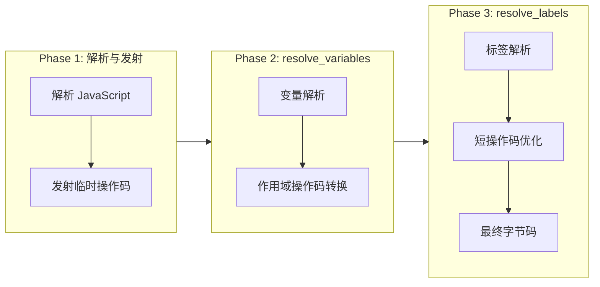
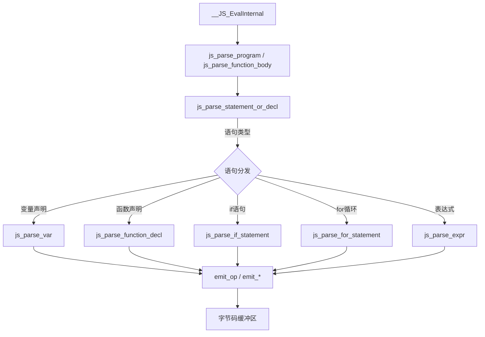
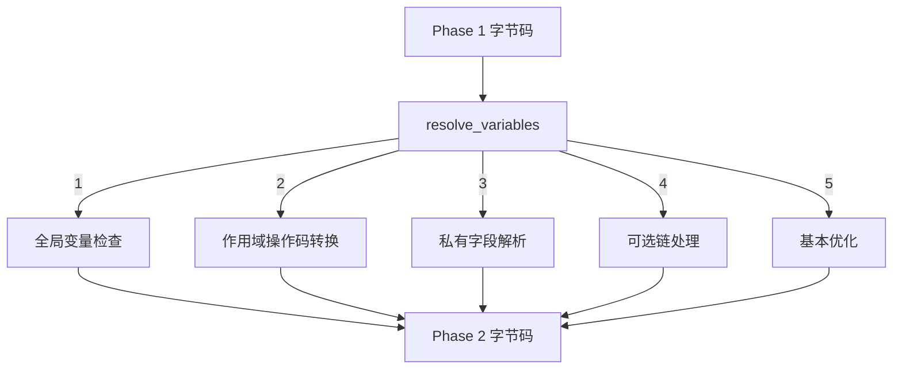
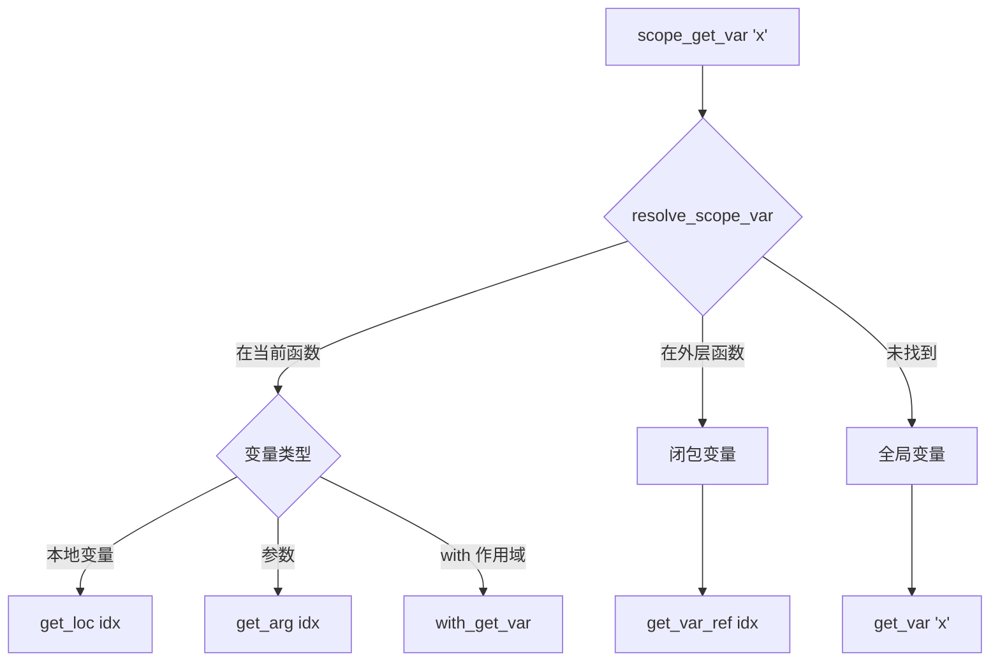
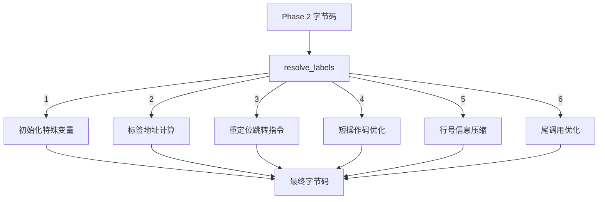
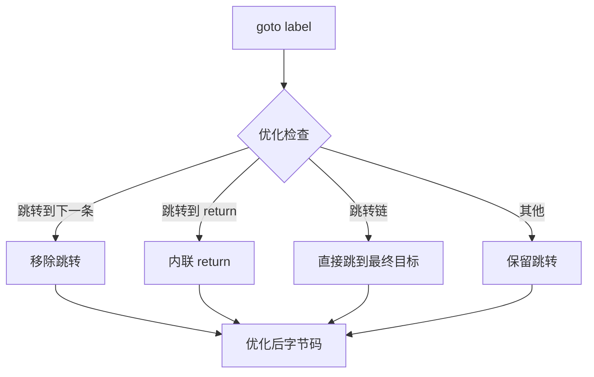

# QuickJS 编译阶段详解

> **文档版本**: 基于 QuickJS 2025-04-26  
> **源码 Commit**: `70e83ae71b637592f2c4ad4171fc9db66782c027`  
> **主要源文件**: [parser.c](../../third_party/QuickJS/src/core/parser.c)

## 概述

QuickJS 的编译过程分为 **三个阶段**：



| 阶段 | 函数 | 行号 | 主要职责 |
|------|------|------|----------|
| Phase 1 | 各解析函数 | 分布于整个 parser.c | 解析源码，发射初始字节码 |
| Phase 2 | `resolve_variables` | L10495-L11137 | 变量解析，作用域操作码转换 |
| Phase 3 | `resolve_labels` | L11139-L12078 | 标签解析，跳转优化，短操作码 |

---

## Phase 1: 解析与字节码发射

### 1.1 概述

Phase 1 是一遍式（single-pass）解析，在解析 JavaScript 源码的同时发射字节码。此阶段使用临时操作码（`def`）来延迟某些决策。

### 1.2 入口函数

```c
// parser.c L12500+
JSValue __JS_EvalInternal(JSContext *ctx, JSValueConst this_obj,
                          const char *input, size_t input_len,
                          const char *filename, int flags, int scope_idx);
```

### 1.3 解析流程



### 1.4 字节码发射函数

| 函数 | 行号 | 说明 |
|------|------|------|
| `emit_op(s, op)` | ~L1100 | 发射单字节操作码 |
| `emit_u8(s, val)` | ~L1105 | 发射 8 位数据 |
| `emit_u16(s, val)` | ~L1110 | 发射 16 位数据 |
| `emit_u32(s, val)` | ~L1115 | 发射 32 位数据 |
| `emit_atom(s, atom)` | ~L1120 | 发射原子字符串引用 |
| `emit_label(s, label)` | ~L1130 | 发射标签引用 |

### 1.5 临时操作码使用

Phase 1 发射的临时操作码：

```javascript
// 源码
function example() {
    let x = 1;
    return x + y;  // y 是全局变量
}
```

**Phase 1 输出**:
```
enter_scope 0                    // 进入块作用域
push_i32 1                       // 压入 1
scope_put_var 'x', scope=0       // 设置变量（位置待定）
scope_get_var 'x', scope=0       // 获取变量（位置待定）
scope_get_var 'y', scope=0       // 获取变量（位置待定）
add                              // 加法
return                           // 返回
leave_scope 0                    // 离开块作用域
```

### 1.6 标签管理

控制流结构使用标签进行跳转：

```c
// 创建新标签
int label = new_label(s);

// 发射跳转指令
emit_goto(s, OP_goto, label);

// 发射标签位置
emit_label(s, label);
```

**示例 - if 语句**:
```javascript
if (cond) {
    a();
} else {
    b();
}
```

**Phase 1 输出**:
```
<条件计算>
if_false L_else          // 条件假跳转到 else
<a() 调用>
goto L_end               // 跳过 else
label L_else:
<b() 调用>
label L_end:
```

---

## Phase 2: resolve_variables

### 2.1 概述

`resolve_variables` 函数遍历 Phase 1 生成的字节码，将临时的作用域操作码转换为具体的变量访问操作码。

**源码位置**: [parser.c L10495-L11137](../../third_party/QuickJS/src/core/parser.c#L10495)

### 2.2 主要职责



### 2.3 变量解析流程



### 2.4 核心转换逻辑

```c
// parser.c L10495+
static __exception int resolve_variables(JSContext* ctx, JSFunctionDef* s) {
    // ...
    for (pos = 0; pos < bc_len; pos = pos_next) {
        op = bc_buf[pos];
        switch (op) {
            case OP_scope_get_var:
            case OP_scope_put_var:
            case OP_scope_get_var_undef:
            // ...
                var_name = get_u32(bc_buf + pos + 1);
                scope = get_u16(bc_buf + pos + 5);
                // 调用 resolve_scope_var 进行变量解析
                pos_next = resolve_scope_var(ctx, s, var_name, scope, op, 
                                             &bc_out, NULL, NULL, pos_next);
                break;
            // ...
        }
    }
}
```

### 2.5 resolve_scope_var 函数

这是变量解析的核心函数：

```c
// parser.c L10200+
static int resolve_scope_var(JSContext *ctx, JSFunctionDef *s,
                             JSAtom var_name, int scope, int op,
                             DynBuf *bc, ...);
```

**查找顺序**:
1. 当前作用域的变量
2. 外层作用域（块级）
3. 外层函数（闭包）
4. 全局作用域

### 2.6 闭包变量捕获

当变量在外层函数中找到时，需要创建闭包变量：

```c
// 标记变量被捕获
add_closure_var(ctx, s, is_local, is_arg, idx, var_name, ...);
```

**示例**:
```javascript
function outer() {
    let x = 1;
    return function inner() {
        return x;  // x 被 inner 捕获
    };
}
```

**Phase 2 处理**:
- `inner` 函数中的 `scope_get_var 'x'` 转换为 `get_var_ref 0`
- `outer` 函数在 `inner` 定义处添加 `close_loc` 操作

### 2.7 私有字段解析

```c
// parser.c L10400+
case OP_scope_get_private_field:
case OP_scope_put_private_field:
    ret = resolve_scope_private_field(ctx, s, var_name, scope, op, &bc_out);
    break;
```

私有字段需要品牌检查（brand check）：
```javascript
class Foo {
    #x = 1;
    getX() { return this.#x; }
}
```

**Phase 2 转换**:
```
// 输入
scope_get_private_field '#x'

// 输出
check_brand           // 检查 this 是否有正确的品牌
get_private_field     // 获取私有字段
```

### 2.8 可选链处理

```c
case OP_get_field_opt_chain:
case OP_get_array_el_opt_chain:
    // 展开为条件跳转
    break;
```

**示例**:
```javascript
obj?.foo
```

**Phase 2 转换**:
```
// 输入
get_field_opt_chain 'foo'

// 输出
dup
is_undefined_or_null
if_true L_end
get_field 'foo'
goto L_done
label L_end:
drop
undefined
label L_done:
```

---

## Phase 3: resolve_labels

### 3.1 概述

`resolve_labels` 是编译的最后阶段，负责：
- 解析标签为实际偏移量
- 应用短操作码优化
- 生成最终字节码

**源码位置**: [parser.c L11139-L12078](../../third_party/QuickJS/src/core/parser.c#L11139)

### 3.2 主要职责



### 3.3 特殊变量初始化

Phase 3 开始时插入特殊变量初始化代码：

```c
// parser.c L11178+
// 初始化 home_object（super 访问用）
if (s->home_object_var_idx >= 0) {
    dbuf_putc(&bc_out, OP_special_object);
    dbuf_putc(&bc_out, OP_SPECIAL_OBJECT_HOME_OBJECT);
    put_short_code(&bc_out, OP_put_loc, s->home_object_var_idx);
}

// 初始化 this.active_func
if (s->this_active_func_var_idx >= 0) { ... }

// 初始化 new.target
if (s->new_target_var_idx >= 0) { ... }

// 初始化 this（派生类构造函数中为未初始化状态）
if (s->this_var_idx >= 0) { ... }

// 初始化 arguments
if (s->arguments_var_idx >= 0) { ... }
```

### 3.4 标签解析

```c
// parser.c L11251+
case OP_label: {
    label = get_u32(bc_buf + pos + 1);
    ls = &label_slots[label];
    ls->addr = bc_out.size;  // 记录标签实际地址
    
    // 解析重定位条目
    for (re = ls->first_reloc; re != NULL; re = re_next) {
        int diff = ls->addr - re->addr;
        switch (re->size) {
            case 4: put_u32(bc_out.buf + re->addr, diff); break;
            case 2: put_u16(bc_out.buf + re->addr, diff); break;
            case 1: put_u8(bc_out.buf + re->addr, diff); break;
        }
    }
} break;
```

### 3.5 跳转优化



**跳转链优化**:
```c
// parser.c L11306+
label = find_jump_target(s, label, &op1, &line1);
if (code_has_label(&cc, pos_next, label)) {
    // 跳转到下一条指令，移除
    update_label(s, label, -1);
    break;
}
if (op1 == OP_return || op1 == OP_return_undef || op1 == OP_throw) {
    // 跳转到 return/throw，内联
    update_label(s, label, -1);
    dbuf_putc(&bc_out, op1);
    break;
}
```

### 3.6 尾调用优化

```c
// parser.c L11281+
case OP_call:
case OP_call_method: {
    argc = get_u16(bc_buf + pos + 1);
    if (code_match(&cc, pos_next, OP_return, -1)) {
        // call 后紧跟 return，转换为尾调用
        put_short_code(&bc_out, op + 1, argc);  // tail_call
        pos_next = skip_dead_code(...);
        break;
    }
    put_short_code(&bc_out, op, argc);
    break;
}
```

**示例**:
```javascript
function factorial(n, acc = 1) {
    if (n <= 1) return acc;
    return factorial(n - 1, n * acc);  // 尾调用
}
```

**优化前**:
```
call 2
return
```

**优化后**:
```
tail_call 2   // 直接尾调用，无需保存栈帧
```

### 3.7 短操作码优化

```c
// put_short_code 函数
static void put_short_code(DynBuf *bc, int op, int idx) {
#if SHORT_OPCODES
    if (idx < 4) {
        // 使用无操作数的短版本
        // 如 get_loc0, get_loc1, get_loc2, get_loc3
        dbuf_putc(bc, OP_get_loc0 + idx);
    } else if (idx < 256) {
        // 使用 8 位索引版本
        dbuf_putc(bc, OP_get_loc8);
        dbuf_putc(bc, idx);
    } else {
        // 使用完整版本
        dbuf_putc(bc, OP_get_loc);
        dbuf_put_u16(bc, idx);
    }
#else
    dbuf_putc(bc, op);
    dbuf_put_u16(bc, idx);
#endif
}
```

**优化效果**:

| 操作 | 优化前 | 优化后 | 节省 |
|------|--------|--------|------|
| `get_loc 0` | 3 字节 | 1 字节 (`get_loc0`) | 2 字节 |
| `push_i32 0` | 5 字节 | 1 字节 (`push_0`) | 4 字节 |
| `goto +10` | 5 字节 | 2 字节 (`goto8`) | 3 字节 |

### 3.8 行号信息压缩

```c
// parser.c L11175+
if (s->line_number_size && !s->strip_debug) {
    s->line_number_slots = js_mallocz(...);
    // 行号信息存储在独立的压缩表中
}

// 记录 PC 到行号的映射
static void add_pc2line_info(JSFunctionDef *s, uint32_t pc, int line_num) {
    // 增量编码存储
}
```

行号信息使用增量编码压缩，存储在 `JSFunctionBytecode.debug` 中。

### 3.9 死代码消除

```c
// parser.c L11292+
case OP_return:
case OP_return_undef:
case OP_throw:
    // return/throw 后的代码是死代码
    pos_next = skip_dead_code(s, bc_buf, bc_len, pos_next, &line_num);
    break;
```

**示例**:
```javascript
function f() {
    return 1;
    console.log("unreachable");  // 死代码
}
```

**优化后**: `console.log` 调用被移除

---

## 完整编译示例

### 输入代码

```javascript
function counter() {
    let count = 0;
    return function() {
        return ++count;
    };
}
```

### Phase 1 输出

```
// outer: counter()
enter_scope 0
push_0
scope_put_var 'count', scope=0
fclosure <inner>
return
leave_scope 0

// inner: anonymous function
scope_get_var 'count', scope=0
inc
scope_put_var 'count', scope=0
scope_get_var 'count', scope=0
return
```

### Phase 2 输出

```
// outer: counter()
push_0
put_loc 0                    // count 是本地变量
fclosure <inner>
close_loc 0                  // count 被闭包捕获
return

// inner: anonymous function
get_var_ref 0                // count 是闭包变量
inc
set_var_ref 0                // 赋值并保留值
return
```

### Phase 3 输出（最终字节码）

```
// outer: counter()
push_0                       // 1 字节
put_loc0                     // 1 字节 (短操作码)
fclosure8 0                  // 2 字节 (短操作码)
close_loc 0                  // 3 字节
return                       // 1 字节

// inner: anonymous function
get_var_ref0                 // 1 字节 (短操作码)
inc                          // 1 字节
set_var_ref0                 // 1 字节 (短操作码)
return                       // 1 字节
```

---

## 相关函数索引

| 函数 | 行号 | 阶段 | 说明 |
|------|------|------|------|
| `js_parse_program` | ~L12400 | Phase 1 | 解析入口 |
| `js_parse_statement_or_decl` | ~L6000 | Phase 1 | 语句解析 |
| `js_parse_expr` | ~L3500 | Phase 1 | 表达式解析 |
| `emit_op` | ~L1100 | Phase 1 | 发射操作码 |
| `resolve_variables` | L10495 | Phase 2 | 变量解析 |
| `resolve_scope_var` | ~L10200 | Phase 2 | 作用域变量解析 |
| `resolve_labels` | L11139 | Phase 3 | 标签解析 |
| `put_short_code` | ~L1000 | Phase 3 | 短操作码优化 |

---

## 相关文档

- [架构概述](architecture.md) - QuickJS 整体架构
- [操作码参考](opcode-reference.md) - 完整操作码列表
- [操作码分类](opcode-categories.md) - 运行时 vs 临时操作码
- [字节码函数分析](bytecode-functions/README.md) - 详细函数分析
