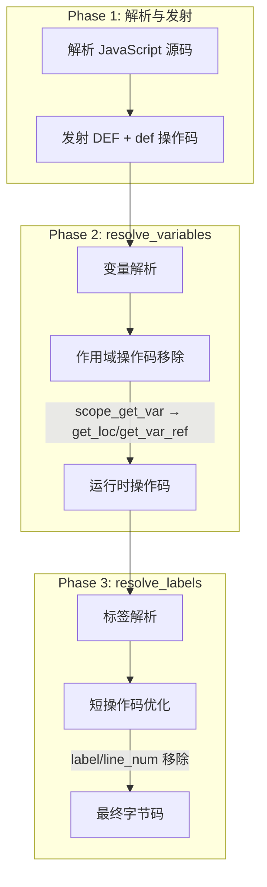
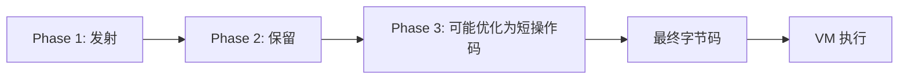
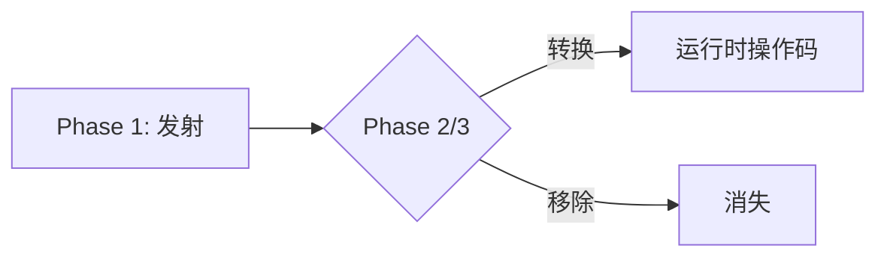
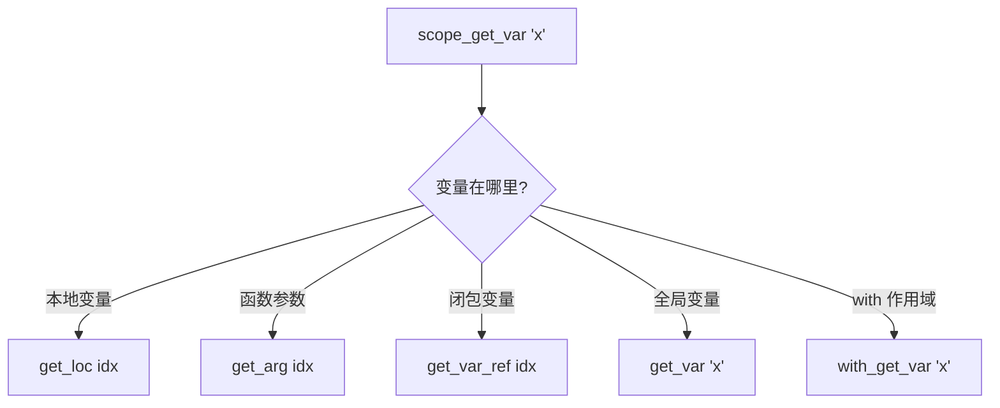
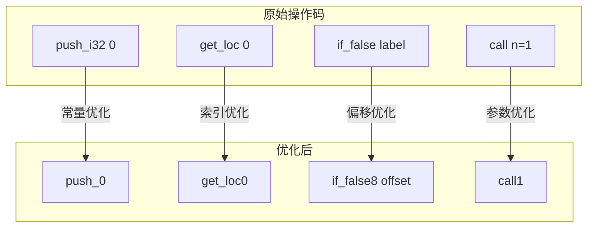

# QuickJS 操作码分类

> **文档版本**: 基于 QuickJS 2025-04-26  
> **源码 Commit**: `70e83ae71b637592f2c4ad4171fc9db66782c027`

## 概述

QuickJS 操作码分为两大类：

1. **运行时操作码 (`DEF`)**: 保留在最终字节码中，由虚拟机 `JS_CallInternal` 执行
2. **临时操作码 (`def`)**: 仅在编译阶段使用，在字节码生成完成前被移除



---

## 1. 运行时操作码 (DEF)

使用 `DEF` 宏定义的操作码会保留在最终字节码中，由虚拟机解释执行。

### 1.1 生命周期



### 1.2 特征

| 特征 | 说明 |
|------|------|
| **定义方式** | `DEF(id, size, n_pop, n_push, format)` |
| **生成时机** | Phase 1 解析阶段 |
| **生命周期** | 保留到运行时 |
| **执行位置** | `function.c` 中的 `JS_CallInternal` |

### 1.3 分类

#### A. 核心运算操作码

最基础的运算操作，直接对应 JavaScript 运算符。

```javascript
// add, sub, mul, div, mod, pow
1 + 2;     // → add
3 * 4;     // → mul

// shl, sar, shr, and, or, xor
a << 2;    // → shl
a & b;     // → and

// lt, lte, gt, gte, eq, neq, strict_eq, strict_neq
a < b;     // → lt
a === b;   // → strict_eq
```

#### B. 值操作码

用于操作值栈。

```javascript
// push_i32, push_const, undefined, null, push_true, push_false
42;           // → push_i32
null;         // → null
true;         // → push_true

// drop, dup, swap, rot3l, rot3r, etc.
// 这些通常由编译器自动生成，用于栈操作
```

#### C. 变量访问操作码

访问各种类型的变量。

```javascript
// 全局变量: get_var, put_var
console.log(x);  // → get_var 'x'
x = 10;          // → put_var 'x'

// 本地变量: get_loc, put_loc, set_loc
function f() {
    let a = 1;   // → put_loc 0
    return a;    // → get_loc 0
}

// 闭包变量: get_var_ref, put_var_ref
function outer() {
    let x = 1;
    return function inner() {
        return x;  // → get_var_ref 0 (闭包捕获)
    };
}
```

#### D. 属性访问操作码

对象属性的读写。

```javascript
// get_field, put_field, get_array_el, put_array_el
obj.foo;        // → get_field 'foo'
obj.foo = 1;    // → put_field 'foo'
arr[0];         // → get_array_el
arr[0] = 1;     // → put_array_el
```

#### E. 控制流操作码

条件判断和跳转。

```javascript
// if_false, if_true, goto
if (cond) { ... }  // → if_false <else_label>

// catch, gosub, ret
try { ... } catch(e) { ... }  // → catch <handler>
```

#### F. 函数调用操作码

函数调用和返回。

```javascript
// call, call_method, return
fn();           // → call
obj.method();   // → call_method
return value;   // → return
```

---

## 2. 临时操作码 (def)

使用小写 `def` 宏定义的操作码仅在编译阶段使用，最终会被转换或移除。

### 2.1 生命周期



### 2.2 特征

| 特征 | 说明 |
|------|------|
| **定义方式** | `def(id, size, n_pop, n_push, format)` |
| **生成时机** | Phase 1 解析阶段 |
| **生命周期** | Phase 2 或 Phase 3 移除 |
| **目的** | 延迟决策，简化第一遍解析 |

### 2.3 分类详解

#### A. 作用域管理操作码 (Phase 2 移除)

这些操作码用于标记作用域边界，在 `resolve_variables` 阶段处理后移除。

| 操作码 | 用途 | 转换为 |
|--------|------|--------|
| `enter_scope` | 进入块作用域 | 移除（信息已处理） |
| `leave_scope` | 离开块作用域 | 可能生成 `close_loc` |

```javascript
{
    let x = 1;  // enter_scope + ... + leave_scope
}
// Phase 2 后: enter_scope/leave_scope 移除
// 如果 x 被闭包捕获，leave_scope → close_loc
```

#### B. 作用域变量操作码 (Phase 2 移除)

解析阶段无法确定变量位置，使用这些临时操作码延迟决策。

| 操作码 | 用途 | 可能转换为 |
|--------|------|-----------|
| `scope_get_var` | 获取作用域变量 | `get_loc` / `get_arg` / `get_var_ref` / `get_var` |
| `scope_put_var` | 设置作用域变量 | `put_loc` / `put_arg` / `put_var_ref` / `put_var` |
| `scope_get_var_undef` | 获取变量或 undefined | `get_loc` / `get_var_undef` |
| `scope_delete_var` | 删除变量 | `delete_var` / 常量 true/false |
| `scope_make_ref` | 创建变量引用 | `make_loc_ref` / `make_arg_ref` / `make_var_ref` |
| `scope_get_ref` | 获取变量引用 | 对应的引用操作码 |
| `scope_put_var_init` | 初始化变量 | `put_loc_check_init` / `put_var_init` |
| `scope_get_var_checkthis` | 获取 this（派生类） | `get_loc_checkthis` |

**转换流程图**:



**示例**:

```javascript
function outer() {
    let x = 1;
    
    function inner() {
        return x;  // Phase 1: scope_get_var 'x'
                   // Phase 2: → get_var_ref 0 (闭包捕获)
    }
    
    return x;      // Phase 1: scope_get_var 'x'
                   // Phase 2: → get_loc 0 (本地变量)
}
```

#### C. 私有字段作用域操作码 (Phase 2 移除)

用于类私有字段的作用域解析。

| 操作码 | 用途 | 转换为 |
|--------|------|--------|
| `scope_get_private_field` | 获取私有字段 | `get_private_field` + 品牌检查 |
| `scope_get_private_field2` | 获取私有字段（保留对象） | `get_private_field` 变体 |
| `scope_put_private_field` | 设置私有字段 | `put_private_field` + 品牌检查 |
| `scope_in_private_field` | 检查私有字段存在 | `private_in` + 品牌解析 |

```javascript
class Foo {
    #x = 1;
    
    getX() {
        return this.#x;  // Phase 1: scope_get_private_field '#x'
                         // Phase 2: → check_brand + get_private_field
    }
}
```

#### D. 可选链操作码 (Phase 2 移除)

处理 `?.` 可选链操作符。

| 操作码 | 用途 | 转换为 |
|--------|------|--------|
| `get_field_opt_chain` | `obj?.prop` | 条件跳转 + `get_field` |
| `get_array_el_opt_chain` | `obj?.[key]` | 条件跳转 + `get_array_el` |

```javascript
obj?.foo;    // Phase 1: get_field_opt_chain 'foo'
             // Phase 2: → is_undefined_or_null + if_true + get_field

obj?.[key];  // Phase 1: get_array_el_opt_chain
             // Phase 2: → is_undefined_or_null + if_true + get_array_el
```

#### E. 标签操作码 (Phase 3 移除)

用于控制流跳转。

| 操作码 | 用途 | 处理方式 |
|--------|------|----------|
| `label` | 跳转目标标记 | Phase 3 移除，更新跳转偏移 |

```javascript
while (cond) {    // label L_continue:
    if (x) break; // goto L_break
}                 // label L_break:

// Phase 3: label 移除，if_false/goto 的偏移量更新为实际字节位置
```

#### F. 调试操作码 (Phase 3 移除)

| 操作码 | 用途 | 处理方式 |
|--------|------|----------|
| `line_num` | 行号信息 | Phase 3 移除，信息存入调试表 |

#### G. 其他临时操作码

| 操作码 | 用途 | 处理方式 |
|--------|------|----------|
| `set_class_name` | 设置类名 | Phase 2 处理后移除 |

---

## 3. 短操作码优化

在 `#if SHORT_OPCODES` 条件编译下，常用操作码有优化版本。

### 3.1 优化类型



### 3.2 优化列表

| 原操作码 | 优化版本 | 节省字节数 |
|----------|----------|-----------|
| `push_i32 -1~7` | `push_minus1` ~ `push_7` | 4 字节 |
| `push_i32 i8` | `push_i8` | 3 字节 |
| `push_i32 i16` | `push_i16` | 2 字节 |
| `push_const idx8` | `push_const8` | 3 字节 |
| `get_loc 0~3` | `get_loc0` ~ `get_loc3` | 2 字节 |
| `put_loc 0~3` | `put_loc0` ~ `put_loc3` | 2 字节 |
| `get_arg 0~3` | `get_arg0` ~ `get_arg3` | 2 字节 |
| `get_var_ref 0~3` | `get_var_ref0` ~ `get_var_ref3` | 2 字节 |
| `if_false label8` | `if_false8` | 3 字节 |
| `goto label8` | `goto8` | 3 字节 |
| `goto label16` | `goto16` | 2 字节 |
| `call n=0~3` | `call0` ~ `call3` | 2 字节 |

### 3.3 优化时机

短操作码优化在 Phase 3 (`resolve_labels`) 中进行：

```c
// parser.c: resolve_labels
// 1. 计算标签实际偏移
// 2. 如果偏移量小，使用短跳转指令
// 3. 如果常量/变量索引小，使用短访问指令
```

---

## 4. 操作码转换示例

### 4.1 变量访问转换

```javascript
// 源码
function example() {
    let local = 1;
    global = 2;
    
    return function() {
        return local + global;
    };
}
```

**Phase 1 输出**:
```
push_i32 1
scope_put_var 'local'
push_i32 2
scope_put_var 'global'
fclosure <inner>
return
```

**Phase 2 输出**:
```
push_i32 1
put_loc 0              // local 是本地变量
push_i32 2
put_var 'global'       // global 是全局变量
fclosure <inner>
close_loc 0            // local 被闭包捕获，需要关闭
return
```

### 4.2 控制流转换

```javascript
// 源码
for (let i = 0; i < 10; i++) {
    if (i === 5) break;
    console.log(i);
}
```

**Phase 1 输出**（简化）:
```
enter_scope
push_0
scope_put_var 'i'
label L_loop:
    scope_get_var 'i'
    push_i32 10
    lt
    if_false L_end
    
    scope_get_var 'i'
    push_5
    strict_eq
    if_false L_skip
    goto L_end
    
    label L_skip:
    scope_get_var 'console'
    get_field 'log'
    scope_get_var 'i'
    call_method 1
    drop
    
    scope_get_var 'i'
    inc
    scope_put_var 'i'
    goto L_loop
label L_end:
leave_scope
```

**Phase 2 输出**:
```
push_0
put_loc 0                // i
label L_loop:
    get_loc 0
    push_i32 10
    lt
    if_false L_end
    ...
    inc_loc 0            // 优化: i++ 直接操作本地变量
    goto L_loop
label L_end:
```

**Phase 3 输出**（最终字节码）:
```
push_0
put_loc0                 // 短操作码
get_loc0
push_i8 10               // 短操作码
lt
if_false8 +45            // 短跳转
...
inc_loc 0
goto8 -50                // 短跳转
```

---

## 5. 相关源码

| 功能 | 文件 | 函数 |
|------|------|------|
| 操作码定义 | `quickjs-opcode.h` | DEF/def 宏 |
| Phase 1 发射 | `parser.c` | `emit_op`, `emit_op_*` |
| Phase 2 变量解析 | `parser.c` | `resolve_variables` |
| Phase 3 标签解析 | `parser.c` | `resolve_labels` |
| 操作码执行 | `function.c` | `JS_CallInternal` |

---

## 相关文档

- [操作码参考](opcode-reference.md) - 完整操作码列表
- [宏系统](opcode-macro-system.md) - DEF/def 宏生成机制
- [编译阶段](compilation-phases.md) - 三阶段编译详解
