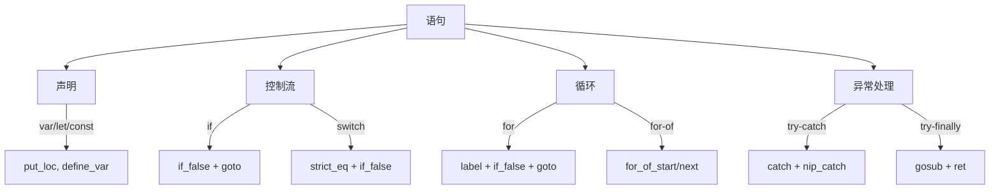
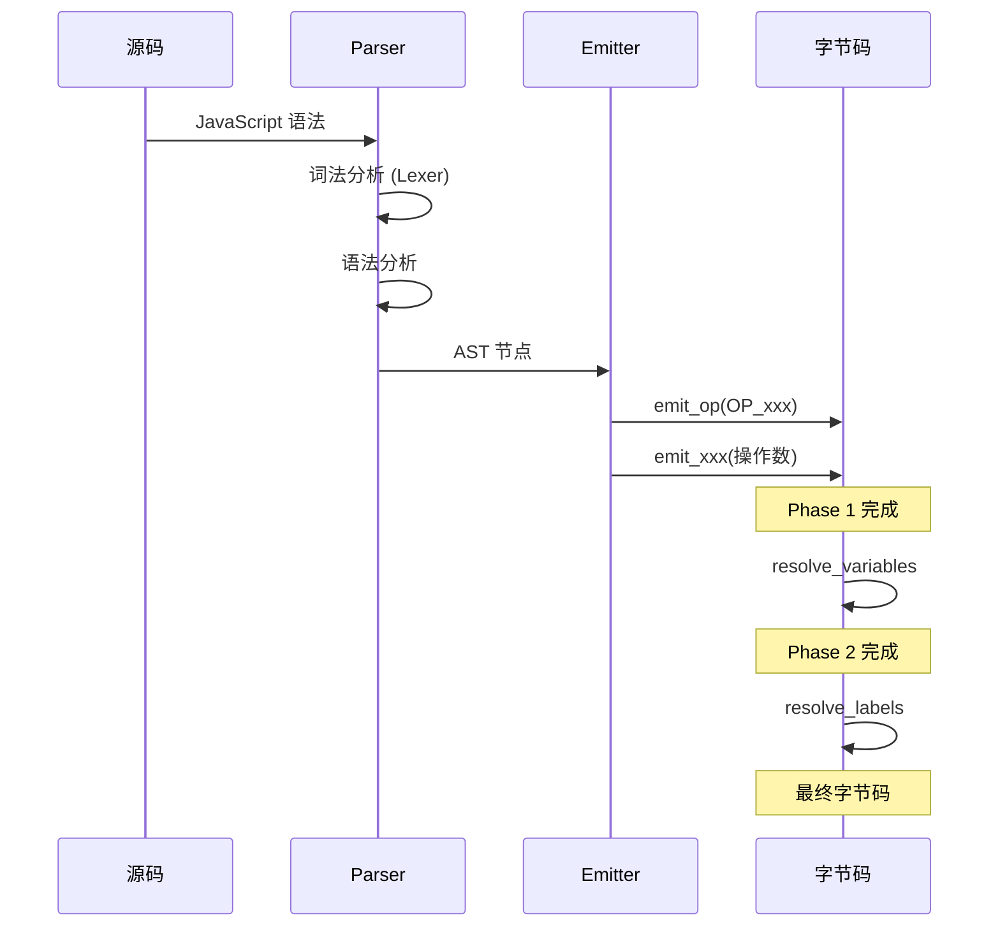

# 语法到字节码映射

> **文档版本**: 基于 QuickJS 2025-04-26  
> **源码 Commit**: `70e83ae71b637592f2c4ad4171fc9db66782c027`

## 概述

本目录详细说明 JavaScript 各种语法结构如何被编译为 QuickJS 字节码。每个文档包含：

- 语法说明
- 编译流程图
- 字节码生成规则
- JavaScript 示例及对应字节码

## 文档索引

| 文档 | 语法类别 | 主要内容 |
|------|----------|----------|
| [expressions.md](expressions.md) | 表达式 | 字面量、运算符、函数调用 |
| [statements.md](statements.md) | 语句 | 变量声明、赋值、控制流 |
| [functions.md](functions.md) | 函数 | 函数声明、箭头函数、生成器 |
| [classes.md](classes.md) | 类 | 类定义、继承、私有字段 |
| [modules.md](modules.md) | 模块 | import/export |
| [async.md](async.md) | 异步 | async/await、Promise |

## 快速参考

### 表达式类别

```mermaid
flowchart TD
    EXPR[表达式] --> PRIM[基本表达式]
    EXPR --> UNARY[一元运算]
    EXPR --> BINARY[二元运算]
    EXPR --> ASSIGN[赋值]
    EXPR --> CALL[调用]
    EXPR --> MEMBER[成员访问]
    
    PRIM --> |字面量| LIT["push_*, undefined, null"]
    PRIM --> |标识符| ID["get_var, get_loc, get_arg"]
    
    UNARY --> |!| LNOT[lnot]
    UNARY --> |~| NOT[not]
    UNARY --> |-| NEG[neg]
    UNARY --> |typeof| TYPEOF[typeof]
    
    BINARY --> |+| ADD[add]
    BINARY --> |===| STRICT_EQ[strict_eq]
    BINARY --> |&&| SHORT[短路求值]
    
    CALL --> |fn()| CALL_OP[call]
    CALL --> |obj.m()| CALL_METHOD[call_method]
    
    MEMBER --> |obj.x| GET_FIELD[get_field]
    MEMBER --> |arr[i]| GET_ARRAY_EL[get_array_el]
```

### 语句类别



## 编译流程概览



## 通用模式

### 1. 左值与右值

**右值（读取）**:
```javascript
x        // → get_loc / get_var / get_arg / get_var_ref
obj.x    // → get_field
arr[i]   // → get_array_el
```

**左值（写入）**:
```javascript
x = 1    // → put_loc / put_var / put_arg / put_var_ref
obj.x = 1 // → put_field
arr[i] = 1 // → put_array_el
```

### 2. 复合赋值

```javascript
x += 1
```

编译为：
```
get_loc 0        // 读取 x
push_1           // 压入 1
add              // 加法
set_loc 0        // 写入 x 并保留结果
```

### 3. 短路求值

```javascript
a && b
```

编译为：
```
<计算 a>
dup              // 复制结果
if_false L_end   // 如果假，跳到结束
drop             // 丢弃 a 的值
<计算 b>
label L_end:
```

### 4. 三元运算符

```javascript
cond ? a : b
```

编译为：
```
<计算 cond>
if_false L_else
<计算 a>
goto L_end
label L_else:
<计算 b>
label L_end:
```

## 相关文档

- [架构概述](../architecture.md)
- [编译阶段](../compilation-phases.md)
- [操作码参考](../opcode-reference.md)
