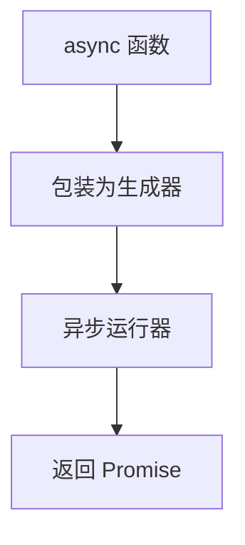
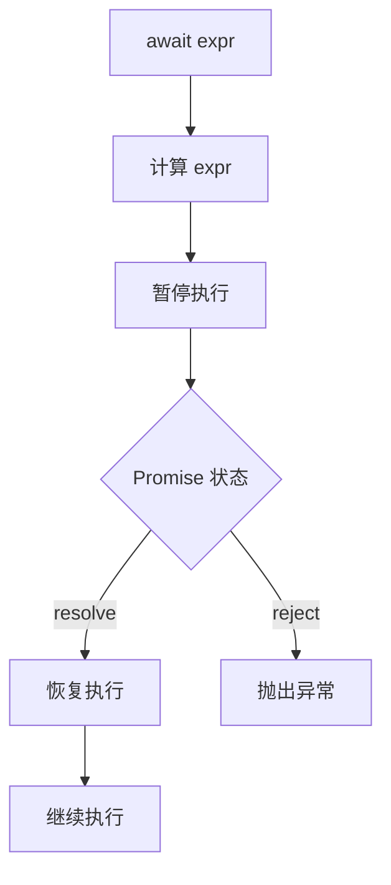
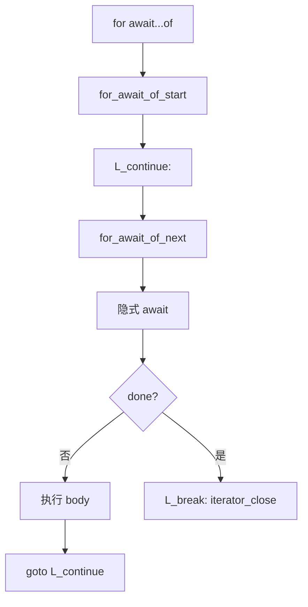
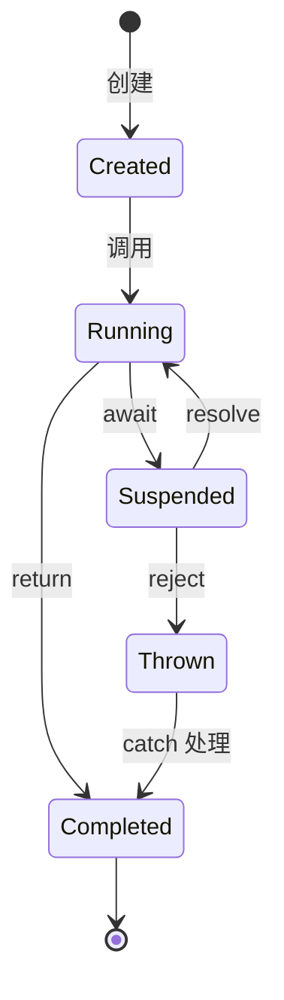
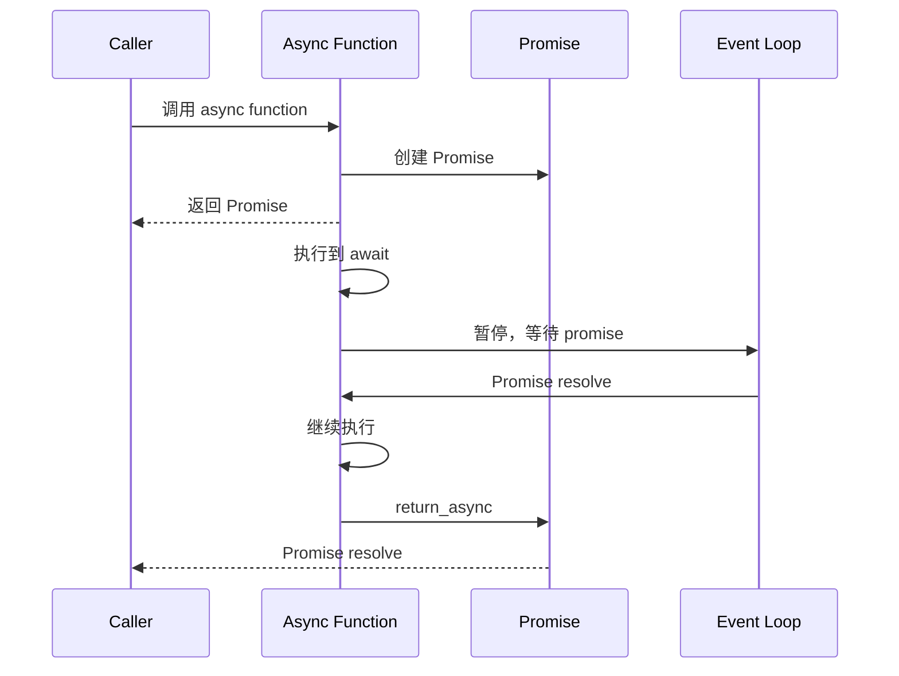

# 异步到字节码

> **文档版本**: 基于 QuickJS 2025-04-26  
> **源码 Commit**: `70e83ae71b637592f2c4ad4171fc9db66782c027`

## 概述

本文档详细说明 JavaScript 异步语法（async/await、Promise）如何编译为 QuickJS 字节码。

## 1. async 函数

```javascript
async function foo() {
    return 42;
}
```

### 1.1 编译原理



async 函数在内部被实现为生成器函数的包装，配合一个异步运行器来处理 Promise 的 resolve/reject。

### 1.2 字节码

```
// async function foo() { return 42; }
// 函数体
initial_yield          // 初始暂停点
push_i8 42
return_async           // 异步返回（resolve Promise）
```

### 1.3 错误处理

```javascript
async function foo() {
    throw new Error('oops');
}
```

**字节码**:
```
initial_yield
push_atom_value 'oops'
get_var 'Error'
swap
call_constructor 1
throw                  // 抛出异常（reject Promise）
```

---

## 2. await 表达式

```javascript
async function foo() {
    const result = await promise;
    return result;
}
```

### 2.1 编译流程



### 2.2 字节码

```
// const result = await promise
<计算 promise>
await                  // 操作码：暂停并等待 Promise
put_loc result         // 存储 resolved 值
```

### 2.3 连续 await

```javascript
async function foo() {
    const a = await p1;
    const b = await p2;
    return a + b;
}
```

**字节码**:
```
initial_yield

<计算 p1>
await
put_loc a

<计算 p2>
await
put_loc b

get_loc a
get_loc b
add
return_async
```

---

## 3. await 与 try-catch

```javascript
async function foo() {
    try {
        return await promise;
    } catch (e) {
        console.log(e);
    }
}
```

### 3.1 字节码

```
initial_yield
catch L_catch

<计算 promise>
await
return_async

L_catch:
put_loc e
get_var 'console'
get_field 'log'
get_loc e
call_method 1
drop
return_async           // 返回 undefined
```

---

## 4. async 箭头函数

```javascript
const foo = async (x) => {
    return await x * 2;
};
```

### 4.1 字节码

```
// 函数体
initial_yield
get_arg0               // x
await
push_2
mul
return_async
```

---

## 5. async 方法

```javascript
class Foo {
    async bar() {
        return await this.fetch();
    }
}
```

### 5.1 字节码

```
// bar 方法体
initial_yield
push_this
get_field 'fetch'
call_method 0
await
return_async
```

---

## 6. for-await-of

```javascript
async function process(asyncIterable) {
    for await (const item of asyncIterable) {
        console.log(item);
    }
}
```

### 6.1 编译流程



### 6.2 字节码

```
initial_yield

<计算 asyncIterable>
for_await_of_start     // 获取异步迭代器

L_continue:
for_await_of_next      // 栈: iter next catch -> iter next catch obj
                       // 隐含 await next()
iterator_get_value_done
if_true L_break
put_loc item

get_var 'console'
get_field 'log'
get_loc item
call_method 1
drop

goto L_continue

L_break:
iterator_close
return_async
```

---

## 7. 异步生成器

```javascript
async function* gen() {
    yield await fetch(url1);
    yield await fetch(url2);
}
```

### 7.1 编译特点

- 结合 async 和 generator 特性
- 支持 `yield` 和 `await`
- 返回异步迭代器

### 7.2 字节码

```
initial_yield

<计算 fetch(url1)>
await
yield

<计算 fetch(url2)>
await
yield

return_undef
```

### 7.3 异步 yield*

```javascript
async function* gen() {
    yield* asyncIterable;
}
```

**字节码**:
```
initial_yield
<计算 asyncIterable>
async_yield_star       // 异步委托
drop
return_undef
```

---

## 8. Promise 链式调用

虽然 Promise 本身不需要特殊语法，但理解其运行时行为有助于理解 async/await：

```javascript
promise
    .then(x => x * 2)
    .catch(e => console.log(e));
```

### 8.1 字节码

```
<计算 promise>
get_field2 'then'
<计算箭头函数>
call_method 1
get_field2 'catch'
<计算箭头函数>
call_method 1
```

---

## 9. 顶层 await

```javascript
// 模块中
const data = await fetch('./data.json');
export default data;
```

### 9.1 编译特点

- 模块成为异步模块
- 依赖该模块的模块需要等待

### 9.2 字节码

```
// 模块初始化函数
<计算 fetch('./data.json')>
await
put_loc data
get_loc data
put_loc *default*
```

---

## 10. 实现细节

### 10.1 异步函数状态机



### 10.2 相关操作码

| 操作码 | 说明 |
|--------|------|
| `initial_yield` | 异步/生成器函数初始暂停 |
| `await` | 等待 Promise |
| `return_async` | 异步返回（resolve） |
| `for_await_of_start` | 开始异步迭代 |
| `for_await_of_next` | 获取下一个异步值 |
| `async_yield_star` | 异步 yield* 委托 |

### 10.3 执行流程



---

## 11. 完整示例

```javascript
async function fetchUserData(userId) {
    try {
        const response = await fetch(`/api/user/${userId}`);
        if (!response.ok) {
            throw new Error('Failed to fetch');
        }
        const data = await response.json();
        return data;
    } catch (error) {
        console.error(error);
        return null;
    }
}
```

### 11.1 字节码

```
// 函数体
initial_yield

catch L_catch

// const response = await fetch(...)
get_var 'fetch'
push_atom_value '/api/user/'
get_arg0               // userId
add
call 1
await
put_loc response

// if (!response.ok)
get_loc response
get_field 'ok'
lnot
if_false L_ok

// throw new Error(...)
get_var 'Error'
push_atom_value 'Failed to fetch'
call_constructor 1
throw

L_ok:
// const data = await response.json()
get_loc response
get_field2 'json'
call_method 0
await
put_loc data

// return data
get_loc data
nip_catch
return_async

L_catch:
// catch (error)
put_loc error

// console.error(error)
get_var 'console'
get_field 'error'
get_loc error
call_method 1
drop

// return null
null
return_async
```

---

## 相关文档

- [函数到字节码](functions.md)
- [语句到字节码](statements.md)
- [操作码参考](../opcode-reference.md)
