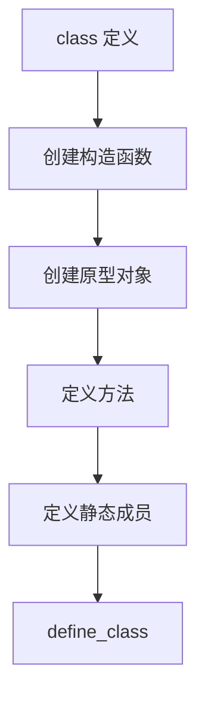
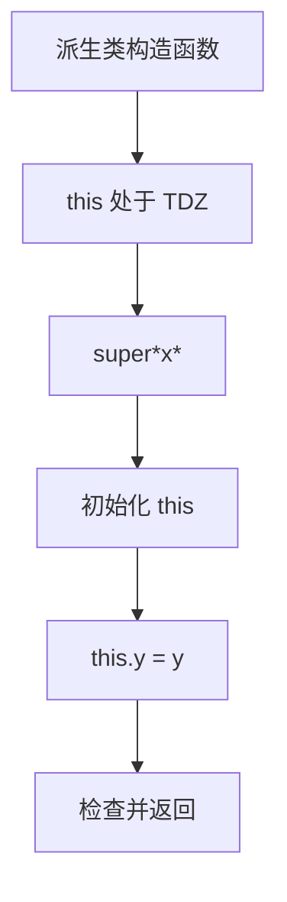
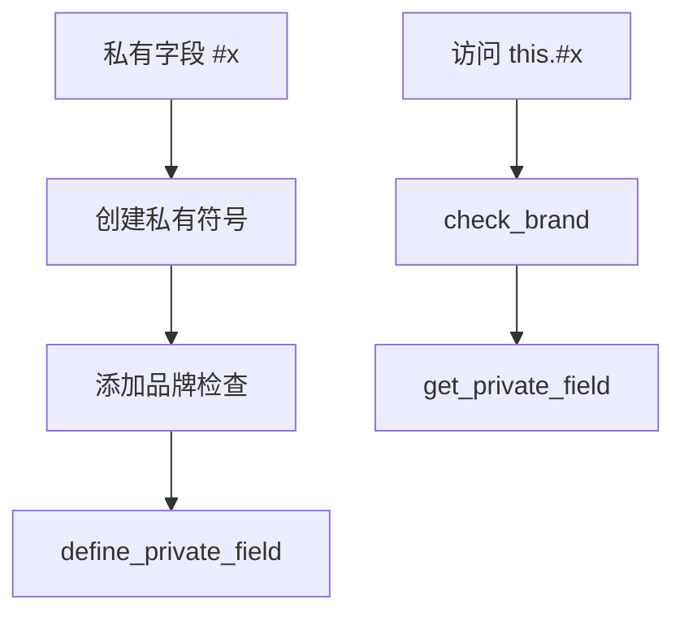

# 类到字节码

> **文档版本**: 基于 QuickJS 2025-04-26  
> **源码 Commit**: `70e83ae71b637592f2c4ad4171fc9db66782c027`

## 概述

本文档详细说明 JavaScript 类语法如何编译为 QuickJS 字节码。

## 1. 基本类定义

```javascript
class Foo {
    constructor(x) {
        this.x = x;
    }
    
    method() {
        return this.x;
    }
}
```

### 1.1 编译流程



### 1.2 字节码

```
// 1. 准备父类（无继承则为 undefined）
undefined              // parent

// 2. 创建构造函数闭包
fclosure ctor_idx

// 3. 定义类
define_class 'Foo', flags
// 栈: parent, ctor -> ctor, proto

// 4. 在原型上定义方法
dup                    // 复制 proto
fclosure method_idx
define_method 'method', 0
drop

// 5. 赋值给变量
put_loc Foo
```

### 1.3 构造函数字节码

```
// constructor(x) { this.x = x; }
push_this
get_arg0               // x
put_field 'x'
return_undef
```

---

## 2. 类继承

```javascript
class Bar extends Foo {
    constructor(x, y) {
        super(x);
        this.y = y;
    }
    
    method() {
        return super.method() + this.y;
    }
}
```

### 2.1 编译流程

```mermaid
flowchart TD
    EXTENDS[extends Foo] --> GET_PARENT[获取父类]
    GET_PARENT --> DEFINE[define_class]
    DEFINE --> CTOR[构造函数处理]
    CTOR --> SUPER_CALL[super() 调用]
    SUPER_CALL --> METHODS[方法定义]
```

### 2.2 字节码

```
// 1. 获取父类
get_var 'Foo'

// 2. 创建构造函数闭包
fclosure ctor_idx

// 3. 定义类
define_class 'Bar', DEFINE_CLASS_HAS_HERITAGE
// 栈: parent, ctor -> ctor, proto
```

### 2.3 派生类构造函数

```javascript
constructor(x, y) {
    super(x);
    this.y = y;
}
```



**字节码**:
```
// Phase 3 插入：this 初始化为未初始化状态
set_loc_uninitialized this_var

// super(x) 调用
get_loc new_target_var
get_super
get_arg0               // x
call_constructor 1

// 初始化 this
check_ctor_return      // 检查 super() 返回值
put_loc this_var       // 存储 this

// this.y = y
get_loc_checkthis this_var  // 检查 this 是否初始化
get_arg1               // y
put_field 'y'

// 返回
get_loc this_var
check_ctor_return      // 确保返回正确的值
return
```

### 2.4 super.method() 调用

```javascript
method() {
    return super.method() + this.y;
}
```

**字节码**:
```
// super.method()
get_loc this_var
get_loc home_object_var
get_super              // 获取父类原型
get_field2 'method'    // 栈: this, super_proto, method
call_method 0

// + this.y
get_loc this_var
get_field 'y'
add
return
```

---

## 3. 静态成员

```javascript
class Foo {
    static value = 42;
    static method() {
        return this.value;
    }
}
```

### 3.1 字节码

```
// 定义类后
// 栈: ctor, proto

// 静态字段
swap                   // 栈: proto, ctor
dup
push_i8 42
put_field 'value'

// 静态方法
dup
fclosure static_method_idx
define_method 'method', DEFINE_METHOD_STATIC

swap                   // 栈: ctor, proto
drop                   // 栈: ctor
put_loc Foo
```

---

## 4. 私有字段

```javascript
class Foo {
    #x = 1;
    
    getX() {
        return this.#x;
    }
    
    setX(v) {
        this.#x = v;
    }
}
```

### 4.1 私有字段实现



### 4.2 字节码

**构造函数（初始化私有字段）**:
```
push_this
add_brand              // 添加品牌到 this
push_this
private_symbol '#x'    // 获取私有符号
push_1                 // 初始值
define_private_field   // 定义私有字段
```

**getX 方法**:
```
// Phase 1
scope_get_private_field '#x'

// Phase 2 后
push_this
get_loc home_object_var
check_brand            // 验证 this 有正确的品牌
push_this
private_symbol '#x'
get_private_field      // 获取私有字段值
return
```

**setX 方法**:
```
push_this
get_loc home_object_var
check_brand
push_this
get_arg0               // v
private_symbol '#x'
put_private_field
return_undef
```

---

## 5. 私有方法

```javascript
class Foo {
    #privateMethod() {
        return 42;
    }
    
    publicMethod() {
        return this.#privateMethod();
    }
}
```

### 5.1 字节码

**类定义**:
```
// 私有方法存储在闭包中
fclosure private_method_idx
put_loc private_method_var
```

**调用私有方法**:
```
// this.#privateMethod()
push_this
get_loc home_object_var
check_brand            // 验证品牌
push_this
get_loc private_method_var  // 获取私有方法
call_method 0
```

---

## 6. 私有 getter/setter

```javascript
class Foo {
    #_x = 0;
    
    get #x() { return this.#_x; }
    set #x(v) { this.#_x = v; }
    
    inc() {
        this.#x++;
    }
}
```

### 6.1 字节码

**inc 方法（复合赋值）**:
```
// this.#x++

// 获取当前值
push_this
get_loc home_object_var
check_brand
push_this
get_loc private_getter_var
call_method 0

// 递增
post_inc

// 设置新值
... // 调用 setter

drop                   // 返回旧值
```

---

## 7. 计算属性名

```javascript
const key = 'method';
class Foo {
    [key]() {
        return 42;
    }
}
```

### 7.1 字节码

```
// 计算类名（如果是表达式）
// 保存计算的键

// 定义类
define_class_computed 'Foo', flags
// 栈: key, parent, ctor -> key, ctor, proto

// 定义计算属性方法
rot3l                  // 栈: ctor, proto, key
fclosure method_idx
define_method_computed 0

// 完成
swap
drop
put_loc Foo
```

---

## 8. 静态初始化块

```javascript
class Foo {
    static x;
    static {
        this.x = computeValue();
    }
}
```

### 8.1 字节码

```
// 静态初始化块作为匿名函数
// 在类定义完成后立即调用

// 定义类后
// 栈: ctor

dup                    // this = ctor
fclosure static_init_idx
call_method 0
drop                   // 丢弃返回值
```

---

## 9. 类表达式

```javascript
const Foo = class Bar {
    constructor() {
        console.log(Bar);  // 在内部可以引用
    }
};
```

### 9.1 字节码

**构造函数内部**:
```
// Bar 作为本地变量可用
get_var 'console'
get_field 'log'
get_loc func_var_idx   // Bar (本地变量)
call_method 1
drop
return_undef
```

---

## 10. new.target

```javascript
class Foo {
    constructor() {
        console.log(new.target);
    }
}
```

### 10.1 字节码

```
// Phase 3 在函数开头插入
special_object NEW_TARGET
put_loc new_target_var

// 函数体中
get_var 'console'
get_field 'log'
get_loc new_target_var
call_method 1
drop
```

---

## 11. 完整示例

```javascript
class Animal {
    #name;
    
    constructor(name) {
        this.#name = name;
    }
    
    speak() {
        console.log(`${this.#name} makes a sound`);
    }
}

class Dog extends Animal {
    constructor(name) {
        super(name);
    }
    
    speak() {
        console.log(`${this.name} barks`);
    }
}
```

### 11.1 Animal 类字节码

```
// 类定义
undefined              // 无父类
fclosure Animal_ctor_idx
define_class 'Animal', 0

// 定义 speak 方法
dup
fclosure speak_idx
define_method 'speak', 0
drop

put_loc Animal

// Animal 构造函数
push_this
add_brand              // 添加品牌

push_this
private_symbol '#name'
get_arg0               // name
define_private_field

return_undef

// speak 方法
get_var 'console'
get_field 'log'
// 模板字符串处理...
call_method 1
drop
return_undef
```

### 11.2 Dog 类字节码

```
// 类定义
get_loc Animal         // 父类
fclosure Dog_ctor_idx
define_class 'Dog', DEFINE_CLASS_HAS_HERITAGE

// 定义 speak 方法
dup
fclosure dog_speak_idx
define_method 'speak', 0
drop

put_loc Dog

// Dog 构造函数
set_loc_uninitialized this_var

get_loc new_target_var
get_super
get_arg0
call_constructor 1
check_ctor_return
put_loc this_var

return_undef
```

---

## 相关文档

- [函数到字节码](functions.md)
- [表达式到字节码](expressions.md)
- [操作码参考](../opcode-reference.md)
