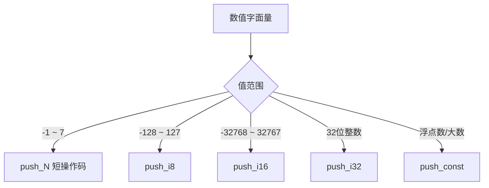
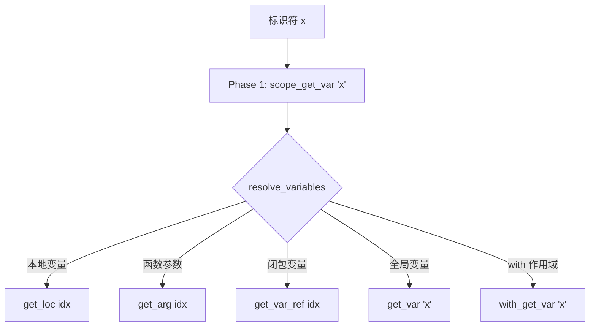
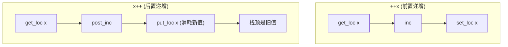
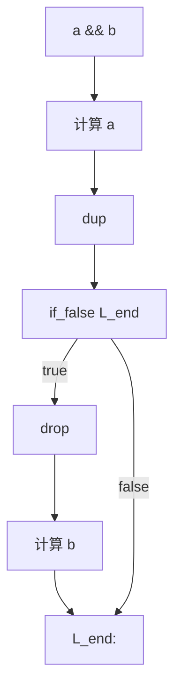
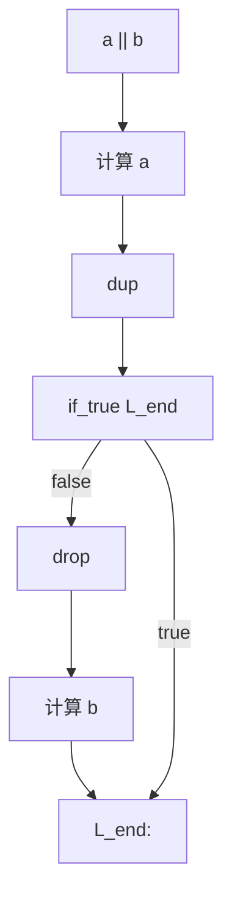
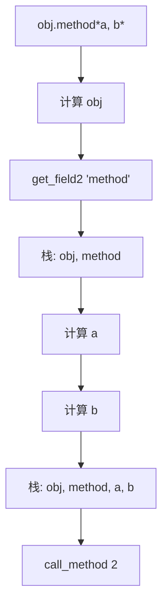
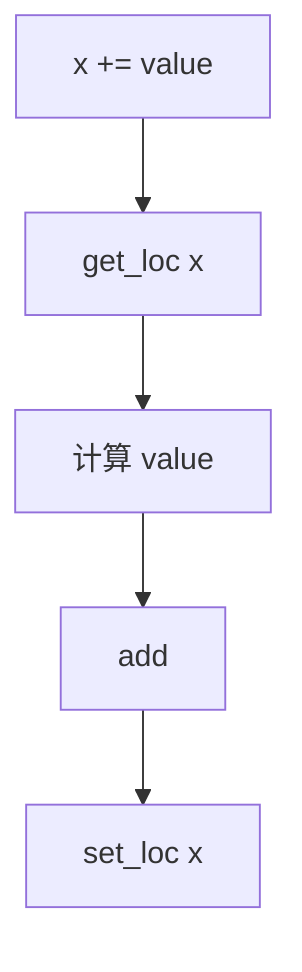
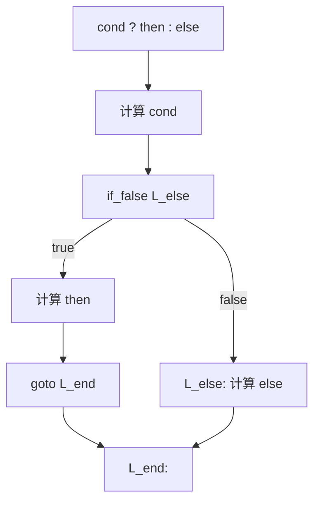

# 表达式到字节码

> **文档版本**: 基于 QuickJS 2025-04-26  
> **源码 Commit**: `70e83ae71b637592f2c4ad4171fc9db66782c027`

## 概述

本文档详细说明 JavaScript 表达式如何编译为 QuickJS 字节码。

## 1. 字面量表达式

### 1.1 数值字面量

| JavaScript | 字节码 | 说明 |
|------------|--------|------|
| `42` | `push_i32 42` | 32 位整数 |
| `0` | `push_0` | 短操作码优化 |
| `1` ~ `7` | `push_1` ~ `push_7` | 短操作码优化 |
| `-1` | `push_minus1` | 短操作码优化 |
| `128` | `push_i8 128` | 8 位范围优化 |
| `3.14` | `push_const idx` | 常量池中的浮点数 |
| `1n` | `push_bigint_i32 1` | BigInt |



**示例**:
```javascript
// 源码
let a = 0, b = 100, c = 3.14;
```

**字节码**:
```
push_0               // a = 0
put_loc0
push_i8 100          // b = 100
put_loc1
push_const 0         // c = 3.14 (常量池索引 0)
put_loc2
```

### 1.2 字符串字面量

| JavaScript | 字节码 | 说明 |
|------------|--------|------|
| `""` | `push_empty_string` | 空字符串优化 |
| `"hello"` | `push_atom_value atom_hello` | 原子字符串 |

**示例**:
```javascript
let s = "hello";
let empty = "";
```

**字节码**:
```
push_atom_value atom_hello
put_loc0
push_empty_string
put_loc1
```

### 1.3 其他字面量

| JavaScript | 字节码 |
|------------|--------|
| `undefined` | `undefined` |
| `null` | `null` |
| `true` | `push_true` |
| `false` | `push_false` |
| `{}` | `object` |
| `[]` | `array_from 0` |
| `/abc/g` | `regexp` |

---

## 2. 标识符表达式

### 2.1 变量访问



**示例**:
```javascript
function example(param) {
    let local = 1;
    global = 2;
    
    return function inner() {
        return local + param + global;
    };
}
```

**Phase 2 后的字节码**:
```
// example 函数
get_arg0             // param（参数，索引 0）
get_loc0             // local（本地变量，索引 0）
get_var 'global'     // global（全局变量）

// inner 函数
get_var_ref0         // local（闭包变量，索引 0）
get_var_ref1         // param（闭包变量，索引 1）
get_var 'global'     // global（全局变量）
```

### 2.2 特殊标识符

| 标识符 | 字节码 |
|--------|--------|
| `this` | `push_this` 或 `get_loc this_var_idx` |
| `arguments` | `get_loc arguments_var_idx` |
| `new.target` | `get_loc new_target_var_idx` |

---

## 3. 一元运算符

### 3.1 算术一元运算符

| JavaScript | 字节码 | 说明 |
|------------|--------|------|
| `-x` | `get x; neg` | 取负 |
| `+x` | `get x; plus` | 转换为数字 |
| `++x` | `get x; inc; set x` | 前置递增 |
| `x++` | `get x; post_inc; put x; drop` | 后置递增 |
| `--x` | `get x; dec; set x` | 前置递减 |
| `x--` | `get x; post_dec; put x; drop` | 后置递减 |



**示例**:
```javascript
let x = 5;
let a = ++x;  // a = 6, x = 6
let b = x++;  // b = 6, x = 7
```

**字节码**:
```
// ++x
get_loc0             // x
inc
set_loc0             // 返回新值
put_loc1             // a = result

// x++
get_loc0             // x
post_inc             // 栈: oldValue, newValue
put_loc0             // x = newValue
put_loc2             // b = oldValue
```

**本地变量优化**:
```javascript
for (let i = 0; i < 10; i++) { }
```

**优化后字节码**:
```
// i++ 在本地变量上
inc_loc 0            // 直接递增本地变量，无需栈操作
```

### 3.2 逻辑/位运算一元运算符

| JavaScript | 字节码 |
|------------|--------|
| `!x` | `get x; lnot` |
| `~x` | `get x; not` |

### 3.3 typeof 运算符

| JavaScript | 字节码 |
|------------|--------|
| `typeof x` | `get_var_undef 'x'; typeof` |
| `typeof obj.x` | `get obj; get_field 'x'; typeof` |

**注意**: `typeof` 对未定义变量不抛出错误，因此使用 `get_var_undef`。

**优化版本**:
```javascript
if (typeof x === 'undefined') { }
```

**字节码**:
```
get_var_undef 'x'
typeof_is_undefined  // 优化：直接返回布尔值
if_false L_else
```

### 3.4 delete 运算符

| JavaScript | 字节码 |
|------------|--------|
| `delete obj.x` | `get obj; push_atom 'x'; delete` |
| `delete obj[k]` | `get obj; get k; delete` |
| `delete x` | `delete_var 'x'` |

---

## 4. 二元运算符

### 4.1 算术运算符

| JavaScript | 字节码 |
|------------|--------|
| `a + b` | `get a; get b; add` |
| `a - b` | `get a; get b; sub` |
| `a * b` | `get a; get b; mul` |
| `a / b` | `get a; get b; div` |
| `a % b` | `get a; get b; mod` |
| `a ** b` | `get a; get b; pow` |

### 4.2 位运算符

| JavaScript | 字节码 |
|------------|--------|
| `a & b` | `get a; get b; and` |
| `a \| b` | `get a; get b; or` |
| `a ^ b` | `get a; get b; xor` |
| `a << b` | `get a; get b; shl` |
| `a >> b` | `get a; get b; sar` |
| `a >>> b` | `get a; get b; shr` |

### 4.3 比较运算符

| JavaScript | 字节码 |
|------------|--------|
| `a < b` | `get a; get b; lt` |
| `a <= b` | `get a; get b; lte` |
| `a > b` | `get a; get b; gt` |
| `a >= b` | `get a; get b; gte` |
| `a == b` | `get a; get b; eq` |
| `a != b` | `get a; get b; neq` |
| `a === b` | `get a; get b; strict_eq` |
| `a !== b` | `get a; get b; strict_neq` |
| `a instanceof b` | `get a; get b; instanceof` |
| `a in b` | `get a; get b; in` |

### 4.4 逻辑运算符（短路求值）

**逻辑与 `&&`**:


**字节码**:
```
<计算 a>
dup
if_false L_end
drop
<计算 b>
L_end:
```

**逻辑或 `||`**:


**空值合并 `??`**:
```javascript
a ?? b
```

**字节码**:
```
<计算 a>
dup
is_undefined_or_null
if_false L_end
drop
<计算 b>
L_end:
```

---

## 5. 成员访问表达式

### 5.1 点访问

```javascript
obj.foo
```

**字节码**:
```
<计算 obj>
get_field 'foo'
```

**保留对象版本（用于方法调用）**:
```javascript
obj.method()
```

**字节码**:
```
<计算 obj>
get_field2 'method'    // 栈: obj, method
call_method 0
```

### 5.2 索引访问

```javascript
arr[index]
```

**字节码**:
```
<计算 arr>
<计算 index>
get_array_el
```

### 5.3 可选链

```javascript
obj?.foo
obj?.[key]
obj?.method()
```

**Phase 1 字节码**:
```
get_field_opt_chain 'foo'
```

**Phase 2 展开后**:
```
dup
is_undefined_or_null
if_true L_short
get_field 'foo'
goto L_end
L_short:
drop
undefined
L_end:
```

---

## 6. 函数调用表达式

### 6.1 普通调用

```javascript
fn(a, b, c)
```

**字节码**:
```
<计算 fn>
<计算 a>
<计算 b>
<计算 c>
call 3
```

**短操作码优化**:
```javascript
fn()        // → call0
fn(x)       // → call1
fn(x, y)    // → call2
fn(x, y, z) // → call3
```

### 6.2 方法调用

```javascript
obj.method(a, b)
```



**字节码**:
```
<计算 obj>
get_field2 'method'
<计算 a>
<计算 b>
call_method 2
```

### 6.3 构造函数调用

```javascript
new Foo(a, b)
```

**字节码**:
```
<计算 Foo>
dup                    // new.target = Foo
<计算 a>
<计算 b>
call_constructor 2
```

### 6.4 展开调用

```javascript
fn(...args)
```

**字节码**:
```
<计算 fn>
undefined              // thisArg
<计算 args>
apply 0
```

---

## 7. 赋值表达式

### 7.1 简单赋值

```javascript
x = value
```

**字节码**:
```
<计算 value>
set_loc x              // 赋值并保留结果
```

### 7.2 复合赋值

```javascript
x += value
```



**字节码**:
```
get_loc x
<计算 value>
add
set_loc x
```

### 7.3 属性赋值

```javascript
obj.x = value
```

**字节码**:
```
<计算 obj>
<计算 value>
put_field 'x'
```

### 7.4 解构赋值

```javascript
[a, b] = arr
```

**字节码**:
```
<计算 arr>
for_of_start
for_of_next 0
put_loc a
for_of_next 0
put_loc b
iterator_close
```

---

## 8. 条件表达式

```javascript
cond ? then : else
```



**字节码**:
```
<计算 cond>
if_false L_else
<计算 then>
goto L_end
L_else:
<计算 else>
L_end:
```

---

## 9. 数组和对象表达式

### 9.1 数组字面量

```javascript
[1, 2, 3]
```

**字节码**:
```
push_1
push_2
push_3
array_from 3
```

**带展开**:
```javascript
[1, ...arr, 2]
```

**字节码**:
```
array_from 0           // 创建空数组
push_1
define_array_el        // 添加元素 1
<计算 arr>
append                 // 展开 arr
push_2
define_array_el        // 添加元素 2
```

### 9.2 对象字面量

```javascript
{ a: 1, b: 2 }
```

**字节码**:
```
object                 // 创建空对象
push_1
define_field 'a'
push_2
define_field 'b'
```

**计算属性名**:
```javascript
{ [key]: value }
```

**字节码**:
```
object
<计算 key>
<计算 value>
define_array_el
```

---

## 10. 其他表达式

### 10.1 逗号表达式

```javascript
a, b, c
```

**字节码**:
```
<计算 a>
drop
<计算 b>
drop
<计算 c>
```

### 10.2 分组表达式

```javascript
(a + b) * c
```

分组表达式不生成额外字节码，只影响运算优先级：

**字节码**:
```
<计算 a>
<计算 b>
add
<计算 c>
mul
```

---

## 相关文档

- [语句到字节码](statements.md)
- [函数到字节码](functions.md)
- [操作码参考](../opcode-reference.md)
