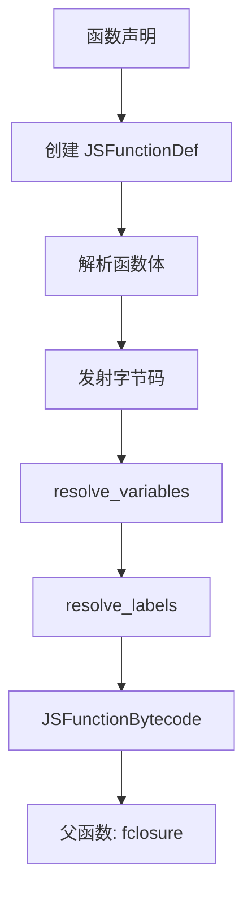
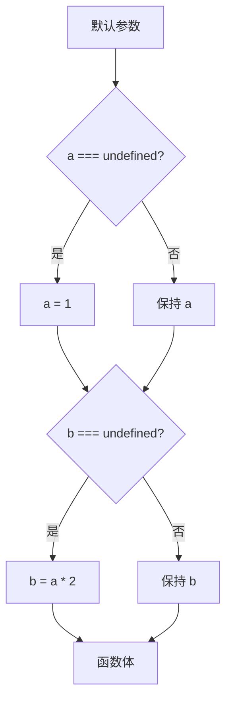
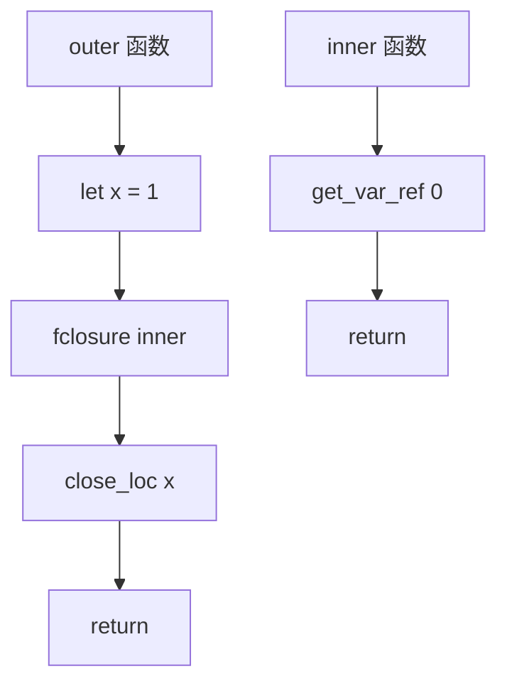
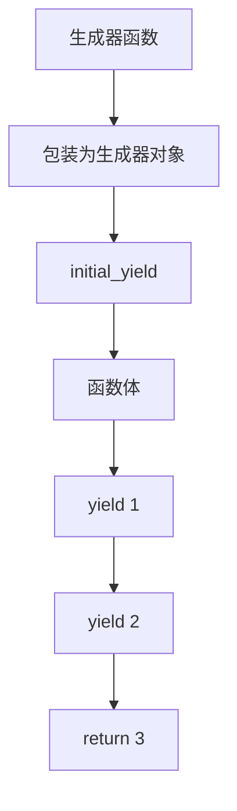
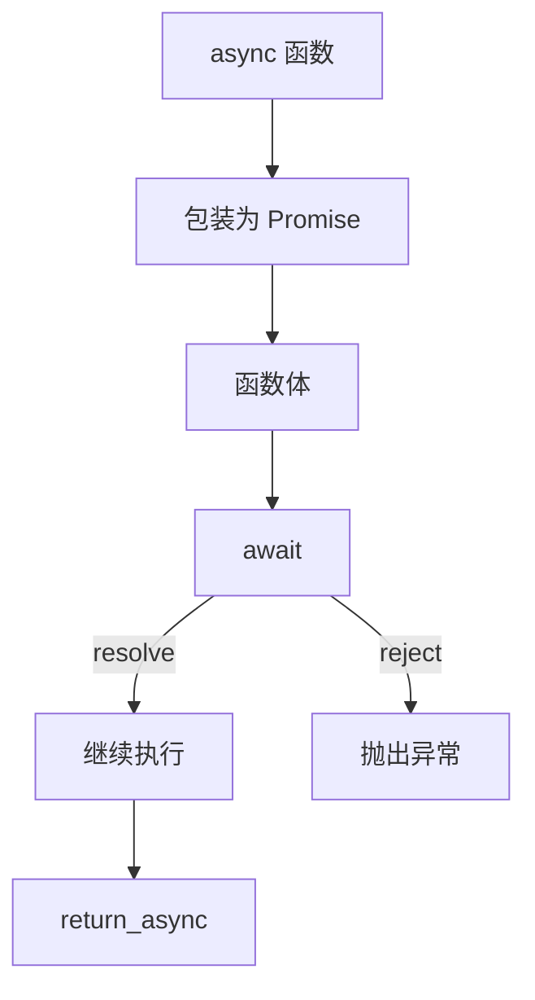
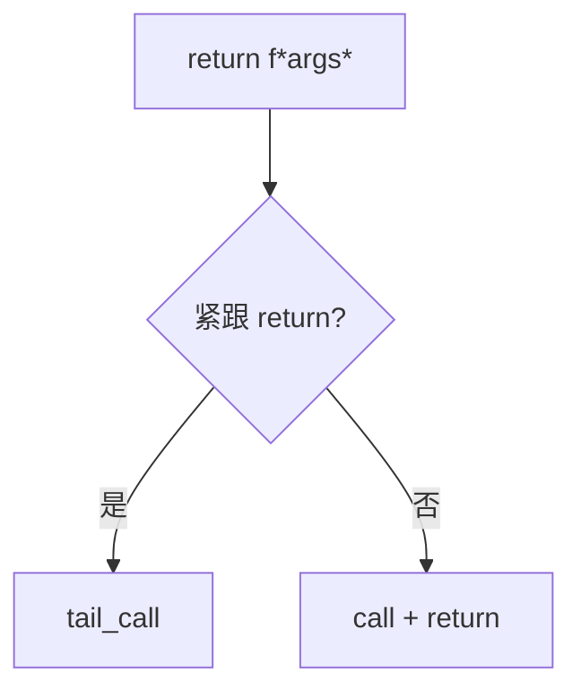

# 函数到字节码

> **文档版本**: 基于 QuickJS 2025-04-26  
> **源码 Commit**: `70e83ae71b637592f2c4ad4171fc9db66782c027`

## 概述

本文档详细说明 JavaScript 函数相关语法如何编译为 QuickJS 字节码。

## 1. 函数声明

```javascript
function foo(a, b) {
    return a + b;
}
```

### 1.1 编译流程



### 1.2 函数定义字节码

在父作用域中定义函数：

**字节码**:
```
fclosure idx           // 从常量池获取函数模板，创建闭包
define_func 'foo'      // 定义为 'foo'
```

### 1.3 函数体字节码

```
// foo 函数的字节码
get_arg0               // a
get_arg1               // b
add
return
```

---

## 2. 函数表达式

### 2.1 普通函数表达式

```javascript
const foo = function(a, b) {
    return a + b;
};
```

**字节码**:
```
fclosure idx           // 创建函数闭包
set_name 'foo'         // 设置函数名（可选）
put_loc foo            // 赋值给变量
```

### 2.2 命名函数表达式

```javascript
const foo = function bar(n) {
    if (n <= 1) return 1;
    return n * bar(n - 1);
};
```

**函数体字节码**:
```
// bar 函数
get_arg0               // n
push_1
lte
if_false L1
push_1
return
L1:
get_arg0               // n
get_loc func_var_idx   // bar (作为本地变量)
get_arg0               // n
push_1
sub
call 1
mul
return
```

---

## 3. 箭头函数

```javascript
const add = (a, b) => a + b;
```

### 3.1 特点

- 没有自己的 `this`，继承外层
- 没有 `arguments` 对象
- 不能作为构造函数
- 没有 `prototype` 属性

### 3.2 字节码

**表达式体**:
```javascript
const add = (a, b) => a + b;
```

**字节码**:
```
// add 函数体
get_arg0               // a
get_arg1               // b
add
return                 // 隐式返回
```

**块体**:
```javascript
const add = (a, b) => {
    return a + b;
};
```

**字节码**: 与普通函数相同。

---

## 4. 参数处理

### 4.1 简单参数

```javascript
function foo(a, b, c) { }
```

**参数访问**:
```
get_arg0               // a
get_arg1               // b
get_arg2               // c

// 或使用通用操作码
get_arg 4              // 参数索引 >= 4
```

### 4.2 默认参数

```javascript
function foo(a = 1, b = a * 2) {
    return a + b;
}
```



**字节码（函数开头）**:
```
// 检查 a
get_arg0
undefined
strict_eq
if_false L1
push_1
put_arg0               // a = 1
L1:

// 检查 b（注意：使用 a 的当前值）
get_arg1
undefined
strict_eq
if_false L2
get_arg0               // a
push_2
mul
put_arg1               // b = a * 2
L2:

// 函数体
get_arg0
get_arg1
add
return
```

### 4.3 Rest 参数

```javascript
function foo(a, ...rest) {
    return rest;
}
```

**字节码（函数开头）**:
```
rest 1                 // 从参数索引 1 开始创建 rest 数组
put_loc rest           // 存储到本地变量
```

### 4.4 解构参数

```javascript
function foo({ x, y }) {
    return x + y;
}
```

**字节码（函数开头）**:
```
get_arg0               // 获取第一个参数
dup
get_field 'x'
put_loc x
get_field 'y'
put_loc y
drop
```

---

## 5. 闭包

### 5.1 变量捕获

```javascript
function outer() {
    let x = 1;
    return function inner() {
        return x;
    };
}
```



**outer 函数字节码**:
```
push_1
put_loc0               // x
fclosure inner_idx
close_loc 0            // 关闭 x，转为闭包变量
return
```

**inner 函数字节码**:
```
get_var_ref0           // x (闭包变量)
return
```

### 5.2 闭包变量修改

```javascript
function counter() {
    let count = 0;
    return {
        inc: () => ++count,
        get: () => count
    };
}
```

**inc 函数字节码**:
```
get_var_ref0           // count
inc
set_var_ref0           // 写回并保留值
return
```

---

## 6. 生成器函数

```javascript
function* gen() {
    yield 1;
    yield 2;
    return 3;
}
```

### 6.1 编译流程



**字节码**:
```
initial_yield          // 初始暂停点
push_1
yield                  // 暂停并返回 1
drop
push_2
yield                  // 暂停并返回 2
drop
push_3
return                 // 完成
```

### 6.2 yield 表达式

```javascript
function* gen() {
    const x = yield 1;
    return x;
}
```

**字节码**:
```
initial_yield
push_1
yield                  // 栈: -> received_value, is_throw
drop                   // 丢弃 is_throw 标志
put_loc x              // 存储收到的值
get_loc x
return
```

### 6.3 yield* 委托

```javascript
function* gen() {
    yield* [1, 2, 3];
}
```

**字节码**:
```
initial_yield
push_1
push_2
push_3
array_from 3
yield_star             // 委托给可迭代对象
drop
return_undef
```

---

## 7. 异步函数

```javascript
async function foo() {
    const result = await fetch(url);
    return result;
}
```

### 7.1 编译流程



**字节码**:
```
// 实际实现是包装在生成器中
initial_yield          // 异步函数也使用类似机制
<计算 fetch(url)>
await                  // 等待 Promise
put_loc result
get_loc result
return_async           // 异步返回（resolve Promise）
```

### 7.2 await 表达式

```javascript
const x = await promise;
```

**字节码**:
```
<计算 promise>
await                  // 栈: promise -> resolved_value
put_loc x
```

---

## 8. 异步生成器

```javascript
async function* gen() {
    yield await fetch(url1);
    yield await fetch(url2);
}
```

**字节码**:
```
initial_yield

<计算 fetch(url1)>
await
yield

<计算 fetch(url2)>
await
yield

return_undef
```

---

## 9. 方法定义

### 9.1 普通方法

```javascript
const obj = {
    method(a, b) {
        return a + b;
    }
};
```

**对象字面量字节码**:
```
object
fclosure method_idx
define_method 'method', 0
```

### 9.2 Getter/Setter

```javascript
const obj = {
    get x() { return this._x; },
    set x(v) { this._x = v; }
};
```

**字节码**:
```
object
fclosure getter_idx
define_method 'x', DEFINE_METHOD_GETTER
fclosure setter_idx
define_method 'x', DEFINE_METHOD_SETTER
```

### 9.3 计算属性名方法

```javascript
const key = 'method';
const obj = {
    [key](a) { return a; }
};
```

**字节码**:
```
object
get_var 'key'
fclosure method_idx
define_method_computed 0
```

---

## 10. 特殊变量初始化

Phase 3 (`resolve_labels`) 在函数开头插入特殊变量初始化：

```c
// 伪代码：函数开头插入的初始化
if (需要 home_object) {
    special_object HOME_OBJECT
    put_loc home_object_var
}
if (需要 this.active_func) {
    special_object THIS_FUNC
    put_loc this_active_func_var
}
if (需要 new.target) {
    special_object NEW_TARGET
    put_loc new_target_var
}
if (需要 this 变量) {
    if (派生类构造函数) {
        set_loc_uninitialized this_var  // TDZ
    } else {
        push_this
        put_loc this_var
    }
}
if (需要 arguments) {
    special_object ARGUMENTS / MAPPED_ARGUMENTS
    put_loc arguments_var
}
```

---

## 11. 尾调用优化

```javascript
function factorial(n, acc = 1) {
    if (n <= 1) return acc;
    return factorial(n - 1, n * acc);  // 尾调用
}
```



**优化前**:
```
<准备参数>
call 2
return
```

**优化后**:
```
<准备参数>
tail_call 2            // 重用栈帧，直接跳转
```

---

## 相关文档

- [类到字节码](classes.md)
- [异步到字节码](async.md)
- [表达式到字节码](expressions.md)
- [操作码参考](../opcode-reference.md)
