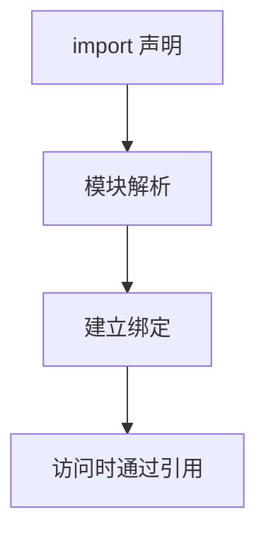
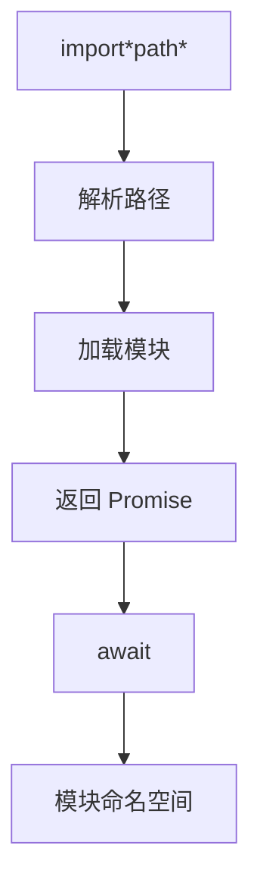
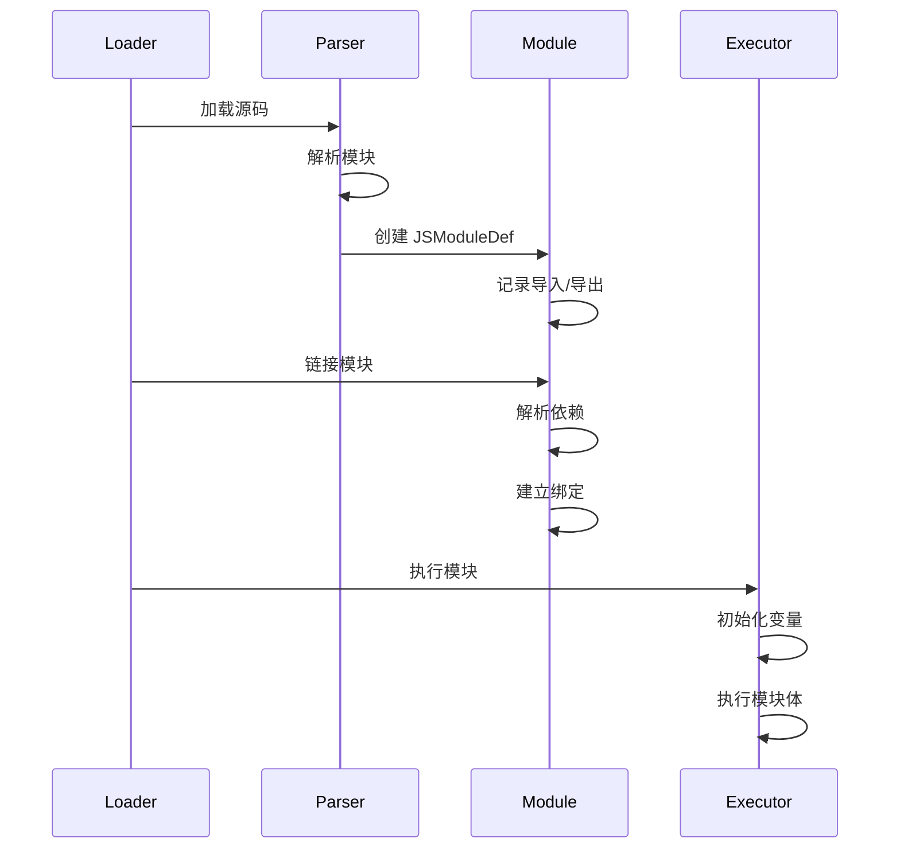

# 模块到字节码

> **文档版本**: 基于 QuickJS 2025-04-26  
> **源码 Commit**: `70e83ae71b637592f2c4ad4171fc9db66782c027`  
> **主要源文件**: [module.c](../../third_party/QuickJS/src/core/module.c)

## 概述

本文档详细说明 ES6 模块语法如何编译为 QuickJS 字节码。

## 1. 导出声明

### 1.1 命名导出

```javascript
export const x = 1;
export function foo() { }
export class Bar { }
```

**编译行为**:
- 导出变量在模块作用域中定义
- 导出信息记录在 `JSModuleDef` 中
- 不生成特殊字节码，仅记录元数据

**字节码**（与普通声明相同）:
```
// export const x = 1
push_1
put_loc x

// export function foo() { }
fclosure foo_idx
define_func 'foo'

// export class Bar { }
// ... 类定义字节码
```

### 1.2 导出列表

```javascript
const a = 1;
const b = 2;
export { a, b as c };
```

**编译行为**:
- 仅记录导出映射
- 不生成额外字节码

### 1.3 默认导出

```javascript
export default function() { }
export default class { }
export default expr;
```

**字节码**:
```
// export default expr
<计算 expr>
put_loc *default*      // 存储到特殊的 default 位置
```

### 1.4 重导出

```javascript
export { foo } from './module.js';
export * from './module.js';
export * as ns from './module.js';
```

**编译行为**:
- 在模块加载阶段处理
- 不生成运行时字节码

---

## 2. 导入声明

### 2.1 命名导入

```javascript
import { foo, bar as baz } from './module.js';
```



**编译行为**:
- 导入变量在编译时绑定
- 运行时通过模块引用访问
- 不可写（类似 const）

**字节码访问**:
```
// 使用 foo
get_var_ref idx        // 通过模块间接引用访问
```

### 2.2 默认导入

```javascript
import foo from './module.js';
```

**编译行为**: 等同于 `import { default as foo } from ...`

### 2.3 命名空间导入

```javascript
import * as ns from './module.js';
```

**编译行为**:
- 创建模块命名空间对象
- 所有导出作为属性

**字节码访问**:
```
// ns.foo
get_loc ns
get_field 'foo'
```

### 2.4 副作用导入

```javascript
import './module.js';
```

**编译行为**:
- 仅执行模块，无绑定创建

---

## 3. 动态导入

```javascript
const module = await import('./module.js');
```



**字节码**:
```
push_atom_value './module.js'
get_var 'import.meta'  // 用于解析相对路径
import                 // 动态导入操作码
await                  // 等待模块加载
put_loc module
```

---

## 4. import.meta

```javascript
console.log(import.meta.url);
```

**字节码**:
```
get_var 'console'
get_field 'log'
get_var 'import.meta'  // 特殊变量
get_field 'url'
call_method 1
drop
```

---

## 5. 模块初始化流程



---

## 6. 循环依赖处理

```javascript
// a.js
import { b } from './b.js';
export const a = 1;

// b.js
import { a } from './a.js';
export const b = a + 1;  // a 可能未初始化
```

**处理方式**:
- 导入变量是"活"绑定
- 访问时才读取值
- 可能遇到 TDZ 错误

---

## 7. 模块相关数据结构

### 7.1 JSModuleDef

```c
typedef struct JSModuleDef {
    JSAtom module_name;           // 模块名
    int req_module_entries_count; // 依赖模块数
    JSReqModuleEntry *req_module_entries; // 依赖列表
    
    int export_entries_count;     // 导出数
    JSExportEntry *export_entries;// 导出列表
    
    int star_export_entries_count;// * 导出数
    JSStarExportEntry *star_export_entries;
    
    int import_entries_count;     // 导入数
    JSImportEntry *import_entries;// 导入列表
    
    JSValue func_obj;             // 模块函数对象
    // ...
} JSModuleDef;
```

### 7.2 JSExportEntry

```c
typedef struct JSExportEntry {
    JSAtom export_name;    // 导出名
    JSAtom local_name;     // 本地名
    int var_idx;           // 变量索引
    // ...
} JSExportEntry;
```

---

## 8. 完整示例

### 8.1 math.js

```javascript
export const PI = 3.14159;

export function square(x) {
    return x * x;
}

export default function cube(x) {
    return x * x * x;
}
```

**字节码**:
```
// PI
push_const PI_VALUE
put_loc PI

// square
fclosure square_idx
define_func 'square'

// default (cube)
fclosure cube_idx
put_loc *default*
```

### 8.2 main.js

```javascript
import cube, { PI, square } from './math.js';

console.log(PI);
console.log(square(2));
console.log(cube(3));
```

**字节码**:
```
// console.log(PI)
get_var 'console'
get_field 'log'
get_var_ref PI_idx     // 通过模块引用访问
call_method 1
drop

// console.log(square(2))
get_var 'console'
get_field 'log'
get_var_ref square_idx
push_2
call 1
call_method 1
drop

// console.log(cube(3))
get_var 'console'
get_field 'log'
get_var_ref cube_idx
push_3
call 1
call_method 1
drop
```

---

## 9. 顶层 await

```javascript
// module.js
const data = await fetch('./data.json');
export default data;
```

**编译为异步模块**:
```
// 模块体包装为异步执行
<计算 fetch('./data.json')>
await
put_loc data
get_loc data
put_loc *default*
```

---

## 相关文档

- [函数到字节码](functions.md)
- [异步到字节码](async.md)
- [架构概述](../architecture.md)
