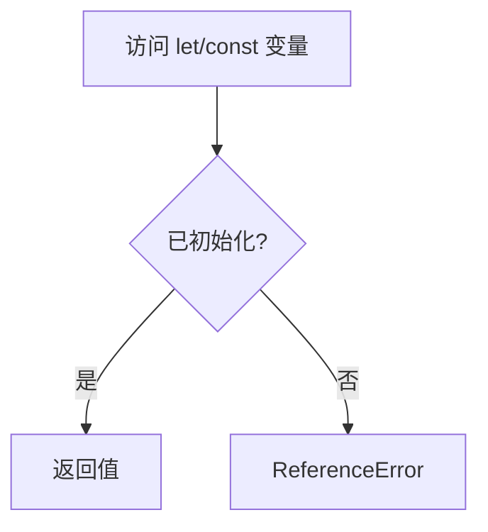
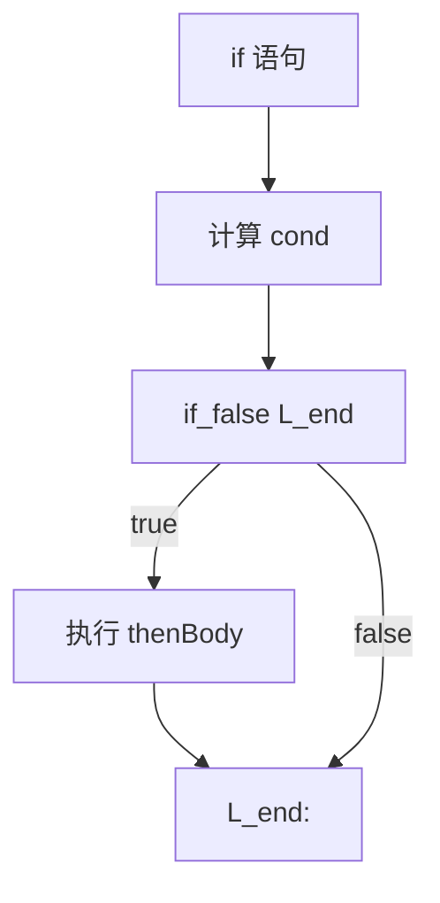
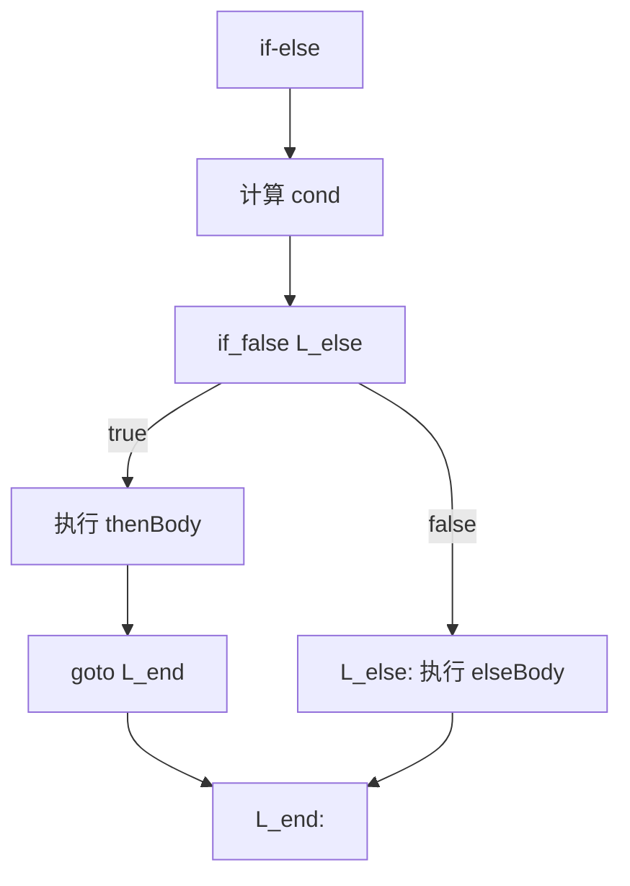
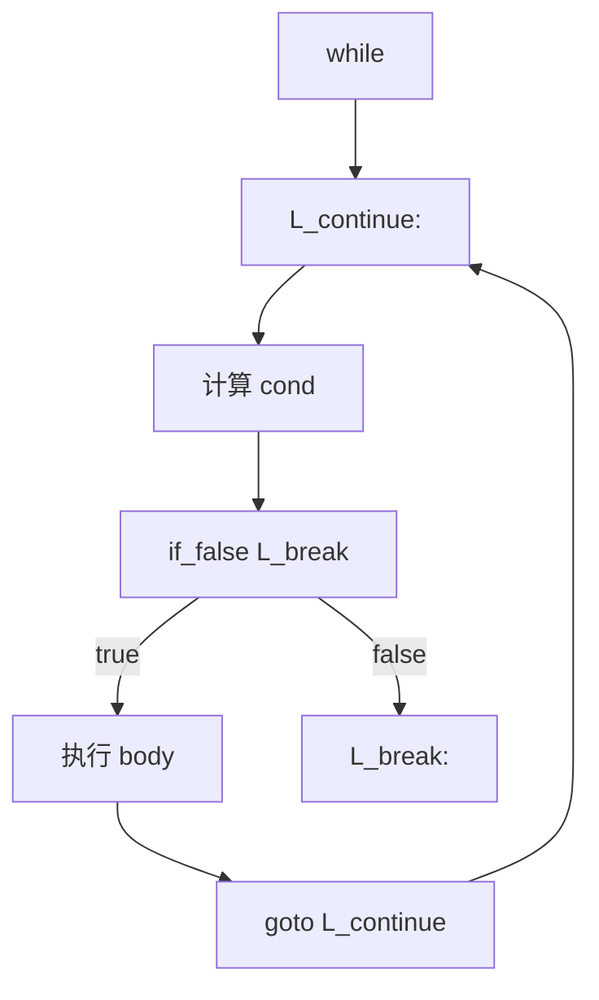
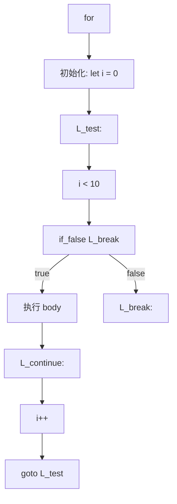
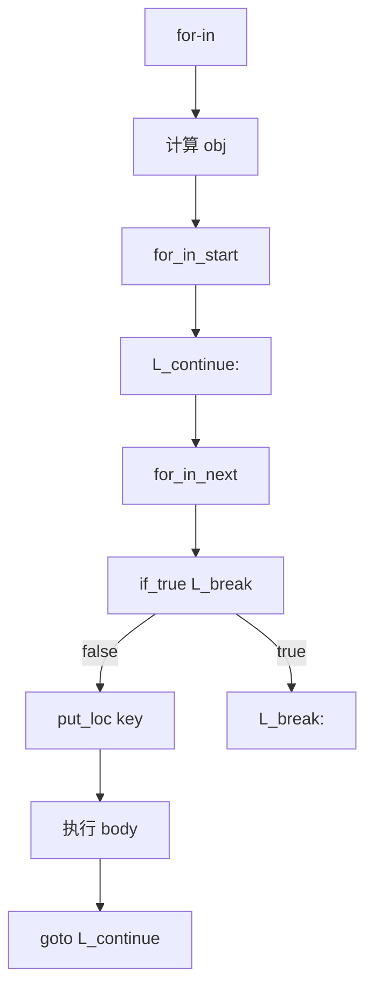
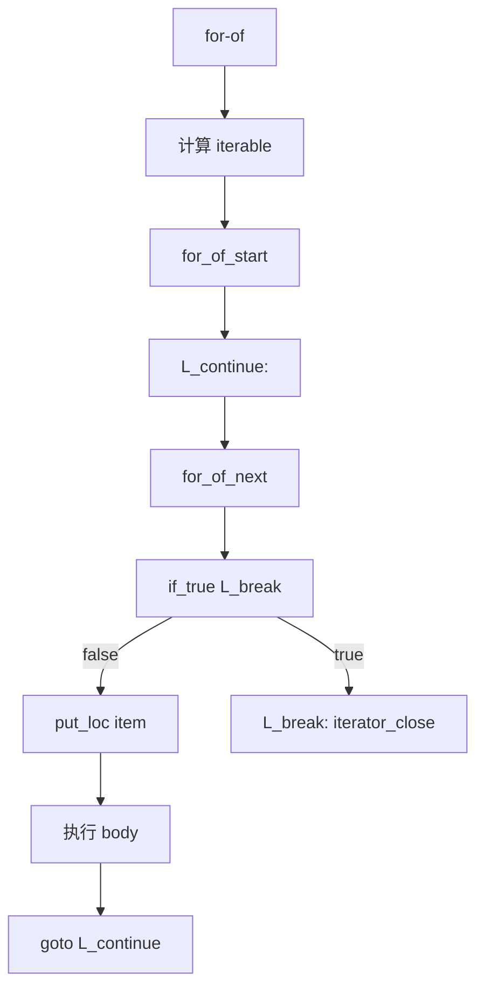
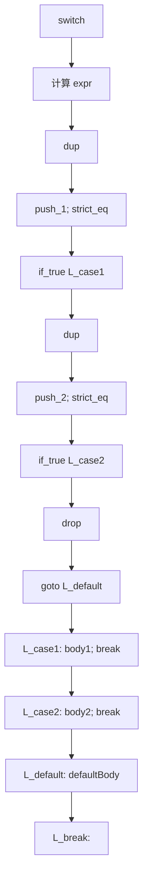
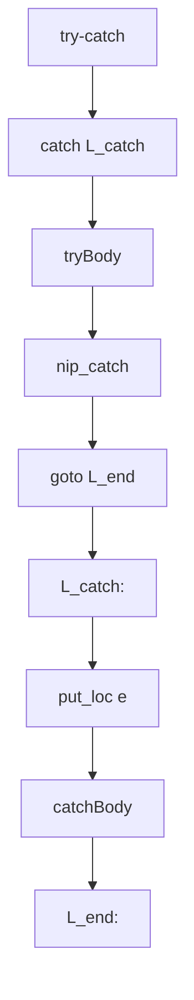
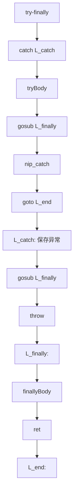

# 语句到字节码

> **文档版本**: 基于 QuickJS 2025-04-26  
> **源码 Commit**: `70e83ae71b637592f2c4ad4171fc9db66782c027`

## 概述

本文档详细说明 JavaScript 语句如何编译为 QuickJS 字节码。

## 1. 变量声明

### 1.1 var 声明

```javascript
var x = 1;
```

**字节码**:
```
push_1
put_loc x              // 或 put_var 'x'（全局）
```

**特点**:
- 函数作用域
- 变量提升
- 全局声明创建全局对象属性

### 1.2 let 声明

```javascript
let x = 1;
```

**字节码**:
```
// Phase 1
enter_scope 0
push_1
scope_put_var 'x', scope=0
leave_scope 0

// Phase 2 后
push_1
put_loc_check_init x   // 初始化检查
```

**特点**:
- 块作用域
- 存在 TDZ (Temporal Dead Zone)
- 使用 `_check_init` 变体

### 1.3 const 声明

```javascript
const x = 1;
```

**字节码**: 与 `let` 相同，但变量标记为只读。

### 1.4 TDZ 检查



**字节码**:
```
// 访问未初始化的 let 变量
get_loc_check x        // 检查是否初始化
```

---

## 2. 表达式语句

```javascript
expr;
```

**字节码**:
```
<计算 expr>
drop                   // 丢弃结果
```

**注意**: 如果表达式结果被使用，则不生成 `drop`。

---

## 3. 条件语句

### 3.1 if 语句

```javascript
if (cond) {
    thenBody;
}
```



**字节码**:
```
<计算 cond>
if_false L_end
<thenBody>
L_end:
```

### 3.2 if-else 语句

```javascript
if (cond) {
    thenBody;
} else {
    elseBody;
}
```



**字节码**:
```
<计算 cond>
if_false L_else
<thenBody>
goto L_end
L_else:
<elseBody>
L_end:
```

### 3.3 else-if 链

```javascript
if (a) {
    bodyA;
} else if (b) {
    bodyB;
} else {
    bodyC;
}
```

**字节码**:
```
<计算 a>
if_false L_elif
<bodyA>
goto L_end
L_elif:
<计算 b>
if_false L_else
<bodyB>
goto L_end
L_else:
<bodyC>
L_end:
```

---

## 4. 循环语句

### 4.1 while 循环

```javascript
while (cond) {
    body;
}
```



**字节码**:
```
L_continue:
<计算 cond>
if_false L_break
<body>
goto L_continue
L_break:
```

### 4.2 do-while 循环

```javascript
do {
    body;
} while (cond);
```

**字节码**:
```
L_continue:
<body>
<计算 cond>
if_true L_continue
L_break:
```

### 4.3 for 循环

```javascript
for (let i = 0; i < 10; i++) {
    body;
}
```



**字节码**:
```
// 初始化
push_0
put_loc i

L_test:
get_loc i
push_i8 10
lt
if_false L_break

<body>

L_continue:
inc_loc i              // 优化: 直接递增本地变量
goto L_test

L_break:
```

### 4.4 for-in 循环

```javascript
for (let key in obj) {
    body;
}
```



**字节码**:
```
<计算 obj>
for_in_start           // 创建属性迭代器

L_continue:
for_in_next            // 栈: iter -> iter key done
if_true L_break
put_loc key

<body>

goto L_continue

L_break:
drop                   // 丢弃迭代器
```

### 4.5 for-of 循环

```javascript
for (let item of iterable) {
    body;
}
```



**字节码**:
```
<计算 iterable>
for_of_start           // 栈: -> iter next catch_offset

L_continue:
for_of_next 0          // 栈: iter next catch -> iter next catch value done
if_true L_break
put_loc item

<body>

goto L_continue

L_break:
iterator_close
```

### 4.6 break 和 continue

```javascript
while (cond) {
    if (x) break;
    if (y) continue;
    body;
}
```

**字节码**:
```
L_continue:
<计算 cond>
if_false L_break

<计算 x>
if_false L1
goto L_break           // break
L1:

<计算 y>
if_false L2
goto L_continue        // continue
L2:

<body>
goto L_continue

L_break:
```

### 4.7 带标签的循环

```javascript
outer: for (let i = 0; i < 10; i++) {
    inner: for (let j = 0; j < 10; j++) {
        if (cond) break outer;
    }
}
```

**字节码**: 标签用于生成正确的 `goto` 目标。

---

## 5. switch 语句

```javascript
switch (expr) {
    case 1:
        body1;
        break;
    case 2:
        body2;
        break;
    default:
        defaultBody;
}
```



**字节码**:
```
<计算 expr>

// 条件分发
dup
push_1
strict_eq
if_true L_case1

dup
push_2
strict_eq
if_true L_case2

drop
goto L_default

// case 体
L_case1:
<body1>
goto L_break

L_case2:
<body2>
goto L_break

L_default:
<defaultBody>

L_break:
```

---

## 6. 异常处理

### 6.1 try-catch

```javascript
try {
    tryBody;
} catch (e) {
    catchBody;
}
```



**字节码**:
```
catch L_catch          // 设置异常处理器
<tryBody>
nip_catch              // 移除异常处理器
goto L_end

L_catch:
put_loc e              // 存储异常对象
<catchBody>

L_end:
```

### 6.2 try-finally

```javascript
try {
    tryBody;
} finally {
    finallyBody;
}
```



**字节码**:
```
catch L_catch
<tryBody>
gosub L_finally        // 执行 finally
nip_catch
goto L_end

L_catch:
gosub L_finally        // 异常时也执行 finally
throw                  // 重新抛出

L_finally:
<finallyBody>
ret                    // 从 finally 返回

L_end:
```

### 6.3 throw 语句

```javascript
throw error;
```

**字节码**:
```
<计算 error>
throw
```

---

## 7. 返回语句

### 7.1 return 语句

```javascript
return value;
```

**字节码**:
```
<计算 value>
return
```

### 7.2 隐式返回

```javascript
function f() {
    // 无 return
}
```

**字节码**:
```
return_undef
```

---

## 8. 块语句

```javascript
{
    let x = 1;
    body;
}
```

**Phase 1 字节码**:
```
enter_scope 0
push_1
scope_put_var 'x', scope=0
<body>
leave_scope 0
```

**Phase 2 后**:
```
push_1
put_loc_check_init x
<body>
// enter_scope/leave_scope 已移除
```

---

## 9. 标签语句

```javascript
label: {
    if (cond) break label;
    body;
}
```

**字节码**:
```
<计算 cond>
if_false L1
goto L_break
L1:
<body>
L_break:
```

---

## 10. with 语句

```javascript
with (obj) {
    x = 1;    // 可能是 obj.x 或全局 x
}
```

**字节码**:
```
<计算 obj>
to_object
push_1
with_put_var 'x', L_not_found, 0
drop
goto L_end

L_not_found:
put_var 'x'            // 全局变量
L_end:
```

**注意**: `with` 在严格模式下被禁止。

---

## 11. debugger 语句

```javascript
debugger;
```

**字节码**:
```
debugger
```

---

## 12. 空语句

```javascript
;
```

**字节码**: 不生成任何代码。

---

## 相关文档

- [表达式到字节码](expressions.md)
- [函数到字节码](functions.md)
- [类到字节码](classes.md)
- [操作码参考](../opcode-reference.md)
