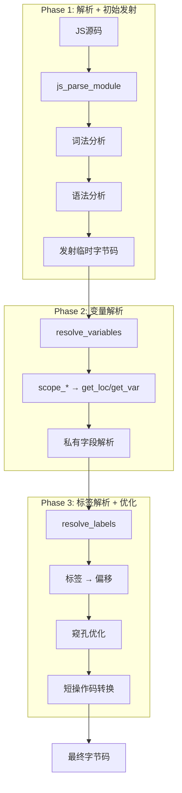
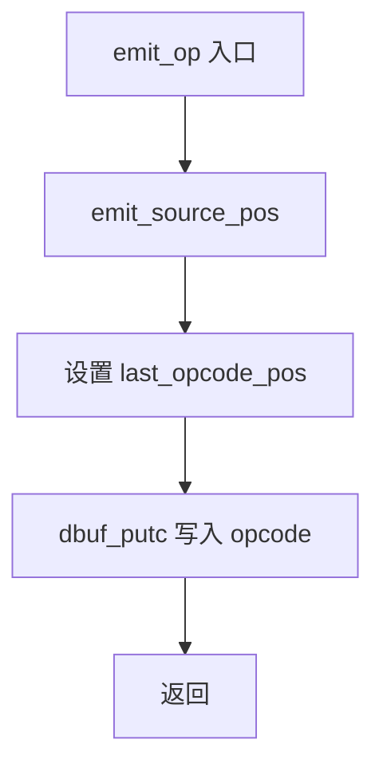

# Design: QuickJS Bytecode Internals Documentation

## Context

Vitamin-Q 需要将 TypeScript 代码编译为 QuickJS 字节码。QuickJS 是一个嵌入式 JavaScript 引擎，采用单遍编译（one-pass compilation）策略，直接从源码生成字节码，无中间 AST 表示。这种设计高效但增加了理解难度。

当前源码规模：
- `parser.c`: 13,783 行 - 解析 + 字节码发射
- `function.c`: 3,330 行 - 字节码执行主循环
- `bytecode.cpp`: 2,068 行 - 字节码序列化
- `module.c`: 2,084 行 - 模块系统
- `runtime.c`: 3,770 行 - 运行时基础设施
- `builtins/`: 24 个文件 - 内置对象实现

## Goals / Non-Goals

### Goals
1. 为 Vitamin-Q 开发者提供 QuickJS 字节码生成的完整参考文档
2. 覆盖从源码解析到字节码执行的全流程
3. 详细记录每个 opcode 的语义、栈效果和使用场景
4. 建立现代 JavaScript 语法到字节码的映射关系
5. 文档结构清晰，便于按需查阅

### Non-Goals
1. 不修改 QuickJS 源码
2. 不实现新功能
3. 不进行性能优化
4. 不编写测试用例（文档项目）

## Decisions

### 文档架构设计

采用分层文档结构，按编译/执行阶段划分：

```
docs/quickjs/
├── README.md                    # 导航与索引
├── architecture.md              # 整体架构
├── parser-internals.md          # 解析器内部
├── bytecode-emission.md         # 字节码发射
├── scope-resolution.md          # 作用域解析
├── bytecode-optimization.md     # 字节码优化
├── bytecode-execution.md        # 字节码执行
├── module-system.md             # 模块系统
├── builtins.md                  # 内置对象
├── opcode-reference.md          # Opcode 参考
├── opcode-categories.md         # 临时/运行时字节码分类
├── opcode-macro-system.md       # 字节码宏生成机制
└── syntax-to-bytecode/          # 完整语法映射（含流程图+示例）
    ├── expressions.md           # 表达式类
    ├── statements.md            # 语句类
    ├── functions.md             # 函数类
    ├── classes.md               # 类与对象类
    ├── modules.md               # 模块类
    └── destructuring.md         # 解构类
└── es2020-complete-example.md   # ES2020 完整覆盖示例
└── bytecode-functions/          # 字节码生成函数分析
    ├── parsing-functions.md     # 20+ 解析函数
    ├── emit-functions.md        # 15+ 发射函数
    ├── scope-functions.md       # 作用域函数
    ├── label-functions.md       # 标签函数
    ├── cpool-functions.md       # 常量池函数
    ├── resolve-functions.md     # 解析函数（重点）
    └── function-call-graph.md   # 函数调用关系图
```

**理由**：
- 分层设计便于按需阅读
- 每个文档聚焦一个主题
- 避免单一超大文档

### 函数分析策略

对 45+ `js_parse_*` 函数采用分类分析：

| 类别 | 函数示例 | 文档位置 |
|------|---------|---------|
| 词法分析 | `next_token`, `json_next_token` | parser-internals.md |
| 表达式解析 | `js_parse_expr`, `js_parse_unary` | parser-internals.md |
| 语句解析 | `js_parse_statement`, `js_parse_block` | parser-internals.md |
| 函数解析 | `js_parse_function_decl2` | parser-internals.md |
| 类解析 | `js_parse_class` | parser-internals.md |

对 20+ `emit_*` 函数按功能分类：

| 类别 | 函数示例 | 文档位置 |
|------|---------|---------|
| 基础发射 | `emit_op`, `emit_u8`, `emit_u16` | bytecode-emission.md |
| 标签管理 | `emit_label`, `emit_goto` | bytecode-emission.md |
| 常量池 | `emit_push_const`, `cpool_add` | bytecode-emission.md |
| 变量访问 | `emit_ic` | bytecode-emission.md |

### Opcode 分类方案

254 个 opcodes 按功能分类：

1. **栈操作** (15+): push/pop/dup/swap
2. **算术运算** (20+): add/sub/mul/div/mod
3. **比较运算** (15+): eq/neq/lt/gt/lte/gte
4. **控制流** (20+): goto/if_true/if_false
5. **变量访问** (30+): get_loc/put_loc/get_var
6. **对象操作** (40+): get_field/put_field/define_property
7. **函数调用** (20+): call/call_method/return
8. **特殊操作** (50+): for_in/for_of/await

### 临时字节码 vs 运行时字节码分类策略

QuickJS 使用两种宏定义字节码：

| 宏 | 类型 | 生命周期 | 示例 |
|----|------|---------|------|
| `DEF(...)` | 运行时字节码 | 保留到最终执行 | `push_i32`, `call`, `return` |
| `def(...)` | 临时字节码 | 编译阶段移除 | `enter_scope`, `label`, `scope_get_var` |

**编译阶段**：
- Phase 1（解析）：发射临时和运行时字节码
- Phase 2（`resolve_variables`）：移除 `scope_*` 临时码，转换为 `get_loc`/`get_var` 等
- Phase 3（`resolve_labels`）：移除 `label`，解析跳转偏移

**文档策略**：
- `opcode-categories.md`：分别列出运行时和临时字节码
- 为每个字节码记录：用途、栈效果、操作数格式、典型生成场景
- 标注临时字节码的移除阶段和转换目标

### 字节码宏生成机制文档策略

QuickJS 通过 X-Macro 技术从 `quickjs-opcode.h` 生成多种代码结构：

```c
// 第一次包含：生成枚举
#define DEF(id, size, n_pop, n_push, f) OP_##id,
enum OPCodeEnum { ... };

// 第二次包含：生成 opcode_info 数组
#define DEF(id, size, n_pop, n_push, f) { size, n_pop, n_push, f },
static const JSOpcode opcode_info[] = { ... };

// 第三次包含：生成分派表
#define DEF(id, size, n_pop, n_push, f) &&case_OP_##id,
static const void* dispatch_table[] = { ... };
```

**文档策略**：
- 详细解析 X-Macro 技术原理
- 图解编译期 vs 运行期的宏展开结果
- 解析 `DIRECT_DISPATCH` 和 `SHORT_OPCODES` 条件编译
- 提供添加新 opcode 的完整步骤

### 完整语法覆盖与文档格式策略

为覆盖所有 JavaScript 语法到字节码的映射，采用统一的文档格式：

```markdown
## 语法名称（如：if-else 语句）

### 语法形式
```js
if (condition) { ... } else { ... }
```

### 流程图
```mermaid
flowchart TD
    A[js_parse_statement] --> B{token == TOK_IF}
    B -->|Yes| C[next_token]
    C --> D[expect '(']
    D --> E[js_parse_expr]
    E --> F[expect ')']
    F --> G[emit_op: if_false]
    G --> H[js_parse_statement: then]
    H --> I{token == TOK_ELSE?}
    I -->|Yes| J[emit_op: goto]
    J --> K[emit_label: else_label]
    K --> L[js_parse_statement: else]
    L --> M[emit_label: end_label]
    I -->|No| M
```

### JavaScript 示例
```js
if (x > 0) {
    return 1;
} else {
    return -1;
}
```

### 生成的字节码
```
get_loc x           ; 加载变量 x
push_i32 0          ; 压入常量 0
gt                  ; 比较 x > 0
if_false L1         ; 条件为假跳转到 L1
push_i32 1          ; 压入 1
return              ; 返回
L1:
push_i32 -1         ; 压入 -1 (补码表示)
neg                 ; 取反得到 -1
return              ; 返回
```

### 源码引用
- 解析函数: `js_parse_statement` @ parser.c:XXXX
- 发射调用: `emit_goto(s, OP_if_false, ...)` @ parser.c:XXXX
```

**流程图工具**：使用 Mermaid 语法，可直接在 Markdown 中渲染

### ES2020 完整示例设计策略

为展示 ES2020 全部特性的完整编译流程，设计一个综合性示例：

**示例代码结构**（约 100-150 行）：
```js
// ES2020 Complete Example - es2020-demo.js

// 1. 可选链 + 空值合并
const name = user?.profile?.name ?? 'Anonymous';

// 2. BigInt
const bigNum = 9007199254740991n + 1n;

// 3. 动态 import
const module = await import('./utils.js');

// 4. 类私有字段 + 静态字段
class Counter {
  static #instances = 0;
  #count = 0;
  
  constructor() { Counter.#instances++; }
  #increment() { this.#count++; }
  get value() { return this.#count; }
}

// 5. 逻辑赋值
let x = null;
x ??= 10;  // 空值合并赋值
x ||= 20;  // 逻辑或赋值
x &&= 30;  // 逻辑与赋值

// 6. 可选 catch 绑定
try { throw new Error(); } catch { console.log('caught'); }

// 7. Promise.allSettled
const results = await Promise.allSettled([p1, p2]);

// ... 更多特性
```

**编译流程图结构**：



**分段详细流程图**：
- 每个 ES2020 特性单独一个详细流程图
- 标注解析函数名称和行号
- 显示临时字节码到运行时字节码的转换

### 函数分析文档格式策略

为所有涉及字节码生成的函数提供统一的文档格式：

```markdown
## 函数名称

### 基本信息
- **文件**: parser.c
- **行号**: L1796
- **签名**: `static void emit_op(JSParseState* s, uint8_t val)`
- **功能**: 发射单个操作码到字节码缓冲区

### 实现流程图


### 关键代码路径
| 行号 | 代码 | 说明 |
|------|------|------|
| L1800 | `fd->last_opcode_pos = bc->size` | 记录最后操作码位置 |
| L1802 | `dbuf_putc(bc, val)` | 写入操作码 |

### 调用关系
- **被调用者**: `js_parse_expr`, `js_parse_statement`, ...
- **调用**: `emit_source_pos`, `dbuf_putc`
```

**重点分析函数**:

| 函数 | 行号 | 规模 | 复杂度 |
|------|------|------|--------|
| `resolve_variables` | L10495 | ~650行 | 高 |
| `resolve_labels` | L11139 | ~1400行 | 高 |
| `js_parse_function_decl2` | L12979 | ~500行 | 高 |
| `js_parse_class` | L3230 | ~500行 | 高 |
| `js_parse_unary` | L5606 | ~300行 | 中 |

### 代码引用规范

文档中引用源码采用格式：
```
parser.c:1234
function.c:567-890
```

## Risks / Trade-offs

| 风险 | 影响 | 缓解措施 |
|------|------|---------|
| QuickJS 源码更新 | 文档可能过时 | 记录分析的 commit hash |
| 文档过于详细 | 难以维护 | 按需更新，聚焦核心逻辑 |
| 理解偏差 | 误导开发者 | 交叉验证，标注不确定处 |

## Open Questions

1. 是否需要为每个 opcode 提供 TypeScript 示例代码？
2. 是否需要生成图表（flowchart/sequence diagram）？
3. 文档语言是否统一使用中文？
